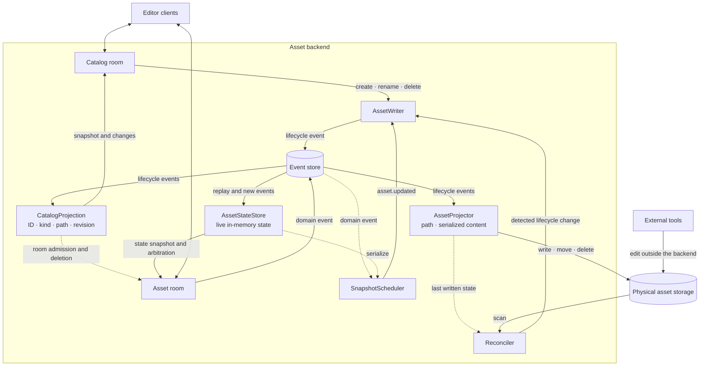
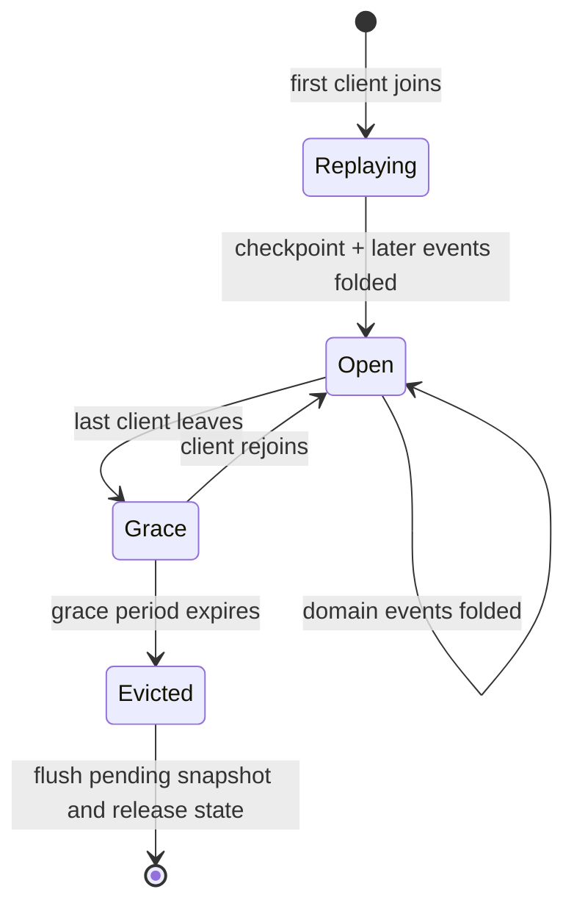
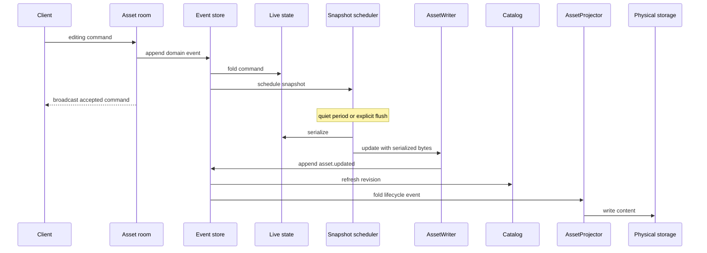
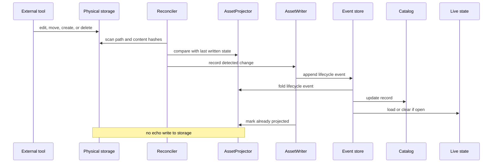

# Asset server architecture

The event store is the backend's history. The catalog, physical projection,
and live state are separate views of that history.

## Workspace map

The three views answer different questions:

| View | What it answers | Lifetime |
|---|---|---|
| Catalog | Which assets exist, and where are they? | Rebuilt when the backend starts, then kept current. |
| Physical projection | What path and bytes should storage contain? | Rebuilt when the backend starts, then kept in sync with the asset source. |
| Live state | What is the editable state of this open asset? | Replayed when its room opens and released after eviction. |

## Live state lifetime

## A room edit reaches storage

The room snapshot sent on join and the persisted snapshot serve different
paths. Only the persisted `asset.updated` event is a replay checkpoint.

## An external file change enters history

Details: [asset kinds](./docs/AssetKinds.md), [rooms](./docs/Rooms.md), and
[synchronization](./docs/Sync.md).
