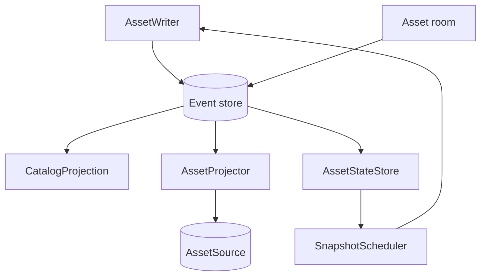
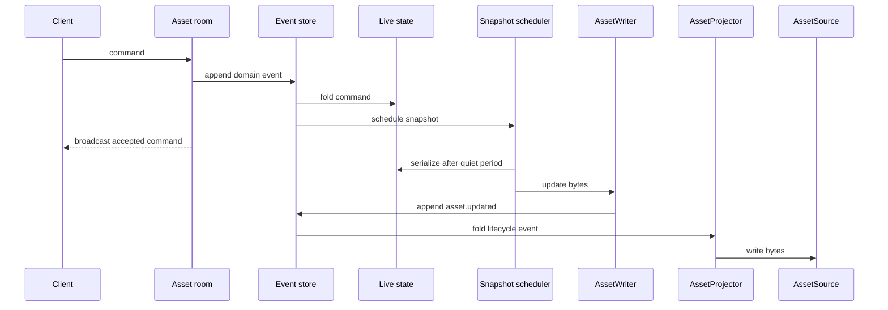

# Events and projections

The event store records lifecycle events (`asset.created`, `asset.updated`,
`asset.renamed`, `asset.deleted`) and kind-specific domain events. Each
consumer folds the events it needs.

## What each view holds

- **Catalog:** asset ID, kind, path, revision, and dependency edges. Lifecycle
  events change it; domain events do not.
- **Physical projection:** the path and content that `AssetSource` should
  contain. The projector follows lifecycle events and records its last
  processed position in `.jollypixel/state.json`.
- **Live state:** an editable kind's in-memory state. It is acquired when a
  room opens, rebuilt by replay, and released after room eviction.

`asset.created`, `asset.updated`, and `asset.deleted` are replay checkpoints.
The backend starts from the newest checkpoint for each asset. A rename is
folded after its preceding checkpoint.

## From edit to file

The room's join snapshot gives a client current state. The later
`asset.updated` event persists serialized content and becomes a replay
checkpoint. `backend.flush(assetId?)` waits for pending snapshots and
projection writes.

See [Sync](../docs/Sync.md) for payloads and failure behavior.
