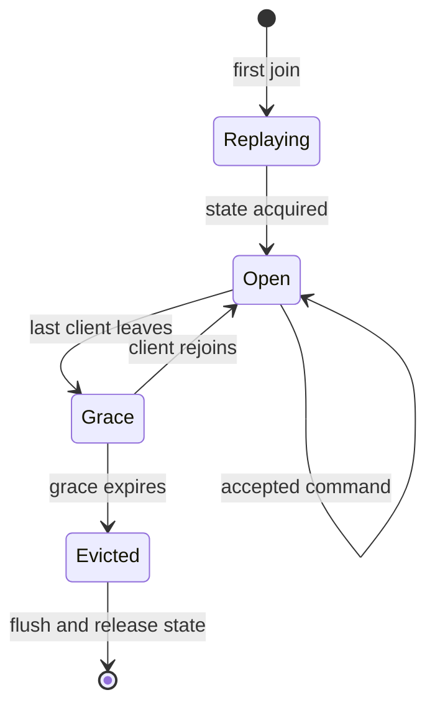
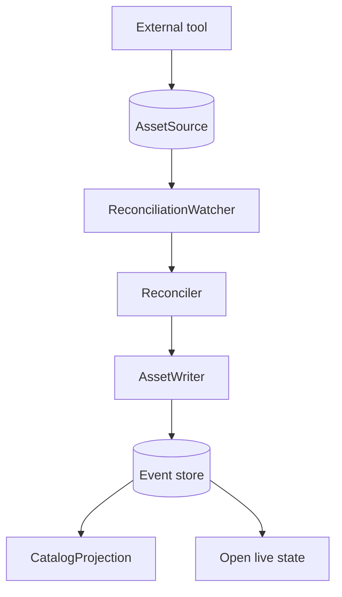

# Rooms and reconciliation

`backend.attach(server)` registers the `asset-catalog` room and a resolver
for editable assets. An asset room is admitted when its kind has
`commands.live` and the catalog contains that asset under the same kind.

## Room lifetime

The room validates and arbitrates a command, appends it, then commits and
broadcasts it. The event store folds the command into live state. A failed
append sends `rejected` to the sender and leaves the room state unchanged.
The [Asset kinds guide](../docs/AssetKinds.md#writing-an-editable-kind)
defines the handler's side of this contract.

## Changes outside the backend

An external tool can edit files in `AssetSource`. The watcher groups
notifications, and `Reconciler` compares scanned paths and hashes with the
last projected state.

The reconciler records detected creates, updates, renames, and deletions as
system lifecycle events. Unique matching content hashes identify renames;
ambiguous matches become a deletion and creation. A write already present
in the source is marked projected, so it is not written back as an echo.

See [Rooms](../docs/Rooms.md) for room messages and eviction, and
[Sync](../docs/Sync.md#reconciliation) for scan results.
