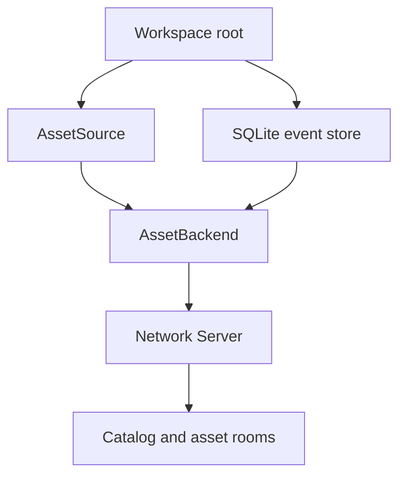

# Startup and ownership

`createAssetWorkspace()` builds a source, event store, backend, and network
server. Hosts with their own instances can pass them in.

## Startup order

1. `seedAssetSource()` writes missing starter files, if `seed` is set.
2. The workspace opens the event store. With `compactOnOpen: true`, it
   removes events superseded by each asset's latest lifecycle checkpoint.
3. `createAssetBackend()` loads projection state and starts the projector,
   live state store, and snapshot scheduler.
4. The backend scans physical storage when `reconcileOnStart` is enabled,
   loads the catalog, backfills missing dependency edges, and starts the
   watcher when `watch` is enabled.
5. The workspace registers host extensions, then attaches catalog and asset
   rooms to the server.

The backend writes `.jollypixel/.gitignore` and uses two files under the
source root:

- `assets.json` keeps path to ID mappings across checkouts. Commit it when
  IDs must remain stable without a local event log.
- `state.json` stores local projection positions and failures. It can be
  rebuilt from the event store.

The default event log lives at `.jollypixel/events.db`. A host can supply an
event store at another location.

## Shutdown

Close the server before the workspace. Evicting an asset room may flush its
snapshot. `workspace.close()` detaches the room resolver, closes the backend,
and closes the event store only if the workspace created it. It does not
close the server or source.

See [Workspace](../docs/Workspace.md) and
[AssetBackend](../docs/AssetBackend.md) for options and lifecycle methods.
