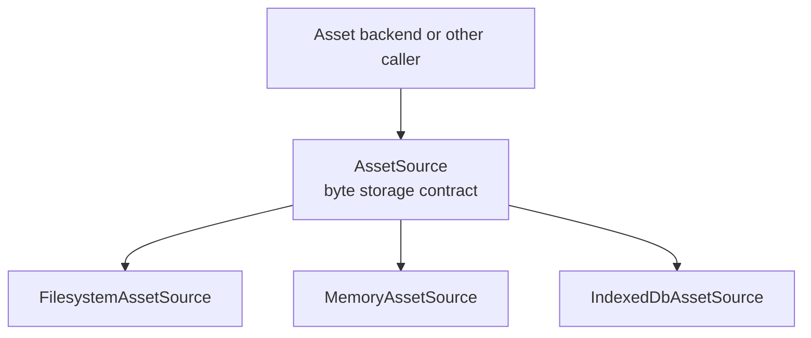
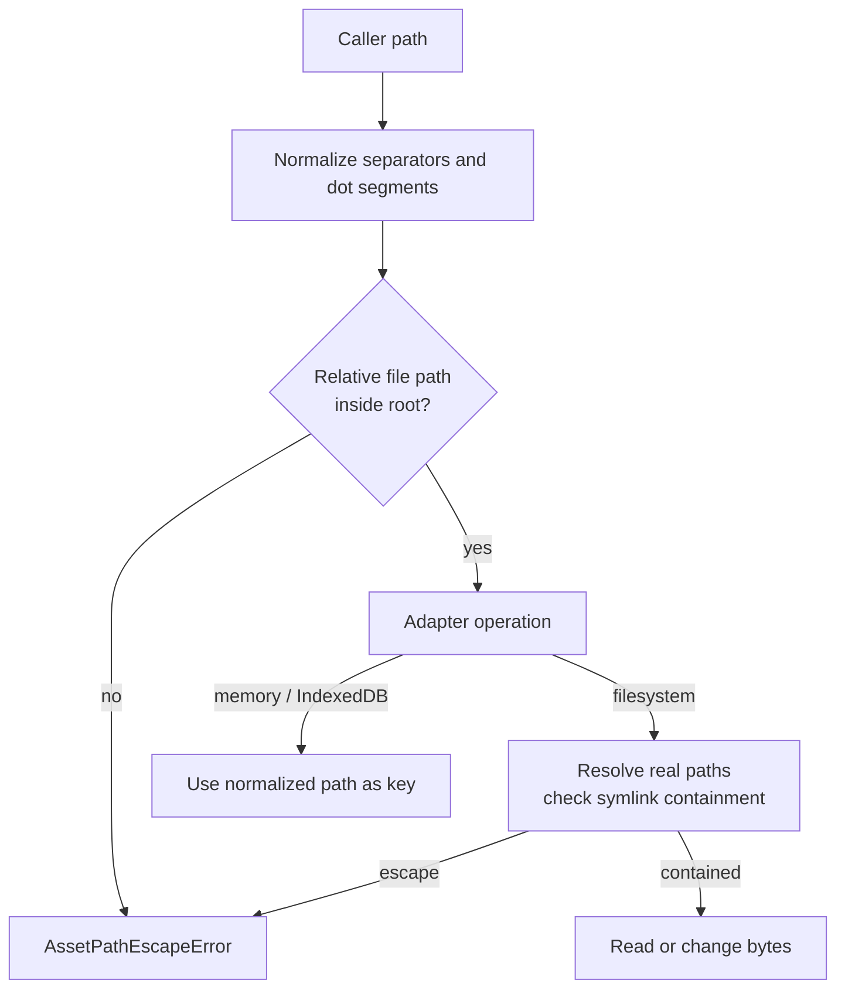
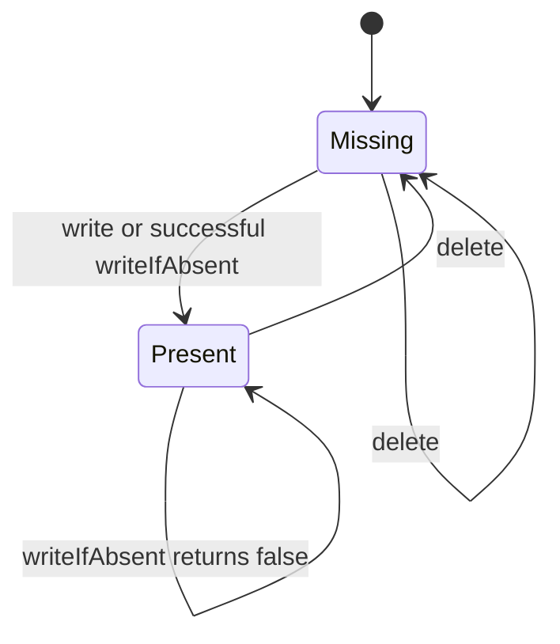
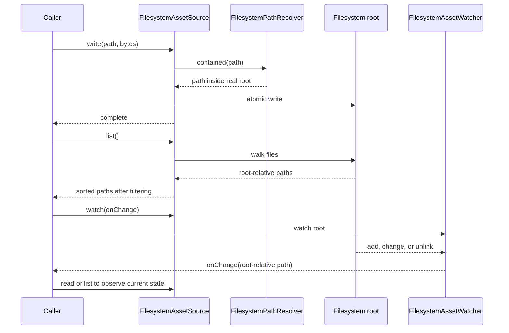
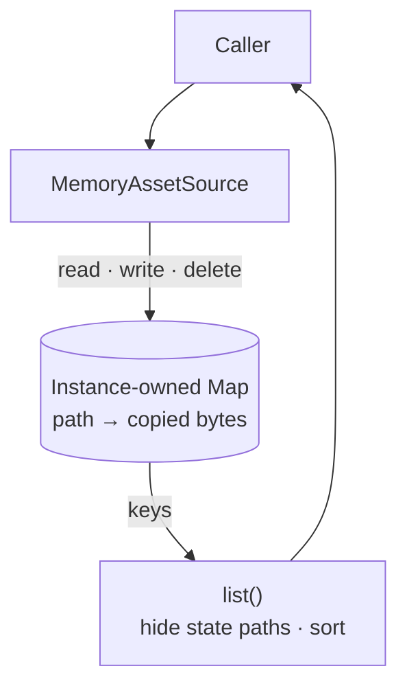
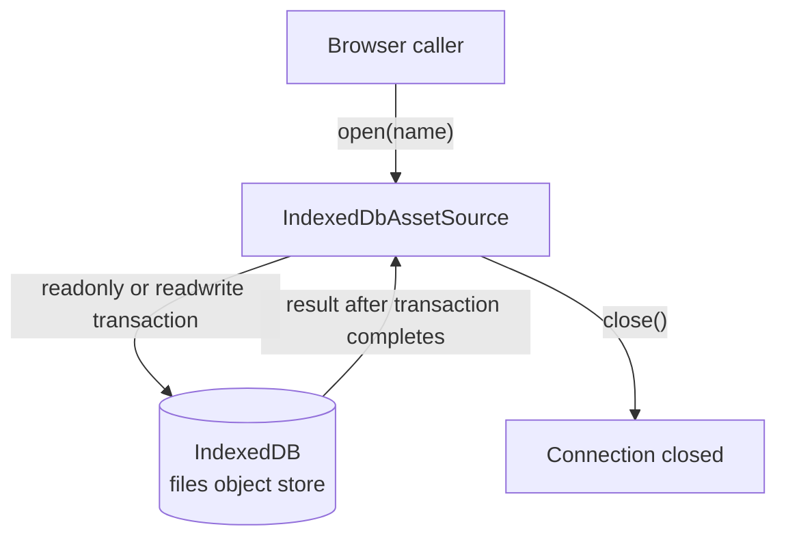
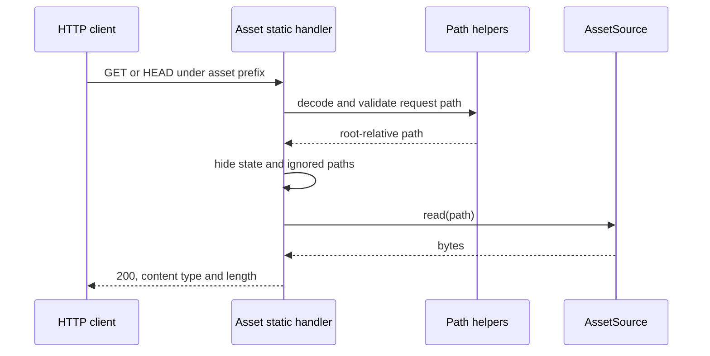

# Asset source architecture

`AssetSource` is the byte-storage boundary used by the asset backend and other
callers. An asset is addressed by a root-relative POSIX path. The caller chooses
an adapter; this package does not keep a catalog or an edit history.

## Workspace map

The contract has six required operations. `isIgnored` and `watch` are optional;
the filesystem adapter supplies both. The HTTP handler accepts any
`AssetSource`, so serving assets does not require filesystem storage.

| Adapter | Backing store | Lifetime | Listing and change signals |
|---|---|---|---|
| `FilesystemAssetSource` | Files below a local root | Persists on disk | Sorted walk; optional `watch()` reports paths |
| `MemoryAssetSource` | A `Map` owned by one instance | Until the instance is discarded | Sorted keys; no watcher |
| `IndexedDbAssetSource` | One IndexedDB `files` object store | Persists across page reloads | Keys from the store; no watcher |

The browser-safe `@jolly-pixel/asset-source/core` entry exports the contract,
memory adapter, path helpers and JSON helpers. The main entry also exports the
filesystem adapter and HTTP handler. IndexedDB has its own
`@jolly-pixel/asset-source/indexeddb` entry.

## Path and storage lifecycle

`safeAssetPath` converts backslashes to `/`, collapses inner `.` and `..`
segments, and rejects empty, absolute, directory and escaping paths.
`normalizeAssetPath` throws `AssetPathEscapeError` on rejection. Direct
filesystem reads, existence checks, writes and deletes also resolve links
before access, so a symlink or junction cannot redirect them outside the
root. `resolve(path)` only performs lexical path resolution; it does not make
that filesystem check.

`read` rejects when an asset is missing, while `exists` observes whether the
path is occupied at that moment. `writeIfAbsent` is the operation for creating
without replacing an occupied path. Filesystem writes use `AtomicFile`; the
memory adapter copies input and output byte arrays, and IndexedDB writes copy
their inputs before a transaction completes.

## Filesystem storage and changes

`list()` skips ignored paths and temporary files from atomic writes. The
filesystem ignore matcher includes `.jollypixel/**`, `.git/**`,
`node_modules/**` and `dist/**`, plus caller-supplied globs. Ignoring affects
listing and watching; direct storage operations can still use those paths.
The watcher reports existing files on startup and provides a path without an
event kind. Its returned stop function closes the watcher.

Memory and IndexedDB also omit `.jollypixel/` state paths from `list()`, while
leaving them available to direct operations. Neither adapter emits changes.

## In-memory storage

Each `MemoryAssetSource` owns its map. Construction and writes copy the input
bytes; reads return a copy. Its contents disappear with the instance, and it
has no `watch()` implementation.

## IndexedDB storage

The object store uses normalized asset paths as keys. `open()` creates it when
the database is first opened; later opens of the same database name see the
stored assets. `close()` releases a connection, while `destroy()` deletes the
database after its connections close. This adapter has no `watch()`
implementation.

## HTTP read path

Requests outside the configured prefix pass to `next()`. Under the prefix,
only `GET` and `HEAD` are served; `HEAD` returns the same headers without the
body. The handler strips query and fragment text, decodes the path once, then
validates it. State paths and paths hidden by `source.isIgnored` return `404`.
Missing assets and directory targets return `404`. Invalid encodings and
control characters return `400`; absolute or escaping paths return `403`.
Other read failures return `500`.

Details: [storage contract](./docs/AssetSource.md),
[filesystem](./docs/Filesystem.md), [memory](./docs/Memory.md),
[IndexedDB](./docs/IndexedDb.md), [HTTP](./docs/Http.md), and
[path utilities](./docs/Utilities.md).
