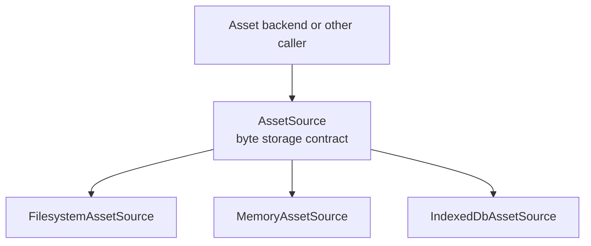

<h1 align="center">
  asset-source
</h1>

<p align="center">
  Physical asset storage
</p>

## 💡 About 

An `AssetSource` stores bytes under root-relative POSIX paths. Its four common
operations read, write, delete and list assets. Both built-in sources normalize
path separators and reject paths that escape their root.



## 💃 Getting Started

This package is available in the Node Package Repository and can be easily installed with [npm][npm] or [yarn][yarn].

```bash
$ npm i @jolly-pixel/asset-source
# or
$ yarn add @jolly-pixel/asset-source
```

## 👀 Usage example

```ts
import {
  FilesystemAssetSource
} from "@jolly-pixel/asset-source/node";

const source = new FilesystemAssetSource("./assets");

const bytes = new TextEncoder().encode("grass texture");
await source.write(
  "textures/grass.png",
  bytes
);
```

## 📚 API

### `AssetSource`

All persistence sources implement this contract:

```ts
interface AssetSource {
  // Rejects when the asset is missing.
  read(path: string): Promise<Uint8Array>;
  // Reports the current state; use writeIfAbsent for concurrent creation.
  exists(path: string): Promise<boolean>;
  write(path: string, data: Uint8Array): Promise<void>;
  // Creates atomically; returns true if created, false if occupied.
  writeIfAbsent(path: string, data: Uint8Array): Promise<boolean>;
  delete(path: string): Promise<void>;
  // Returns sorted paths, excluding .jollypixel/ state files.
  list(): Promise<string[]>;
  // Optional: reports whether a path is hidden from listing and watching.
  isIgnored?(path: string): boolean;
  // Optional: reports changed paths and returns a function to stop watching.
  watch?(onChange: (path: string) => void): () => void;
}
```

> [!IMPORTANT]
> 
> Paths are normalized to root-relative POSIX form. Empty, absolute and
> root-escaping paths are rejected. State files remain available to direct
> storage operations.

### 📦 Persistence

- [`MemoryAssetSource`](./docs/persistence/Memory.md) stores assets in one
  in-process instance.
- [`FilesystemAssetSource`](./docs/persistence/Filesystem.md) stores assets on
  the local filesystem in Node.js.
- [`IndexedDbAssetSource`](./docs/persistence/IndexedDb.md) stores assets in
  browser IndexedDB across page reloads.

> [!NOTE]
> 
> The filesystem source provides both optional methods. The memory and IndexedDB
> sources provide neither. The root entry is browser-safe: it exports the
> contract, the memory and IndexedDB sources and utilities. The filesystem
> source and the HTTP handler are exported from
> `@jolly-pixel/asset-source/node`.

### ✂️ Utilities

[Path, state-directory and JSON helpers](./docs/Utilities.md)

### 🌍 HTTP serving

[`createAssetStaticHandler`](./docs/http/Http.md) serves any `AssetSource` over
HTTP as connect-style middleware.

## ✨ Contributors guide

If you are a developer **looking to contribute** to the project, you must first read the [CONTRIBUTING][contributing] guide.

Run these commands from the monorepo root:

```bash
$ pnpm --filter @jolly-pixel/asset-source test
$ pnpm run lint
```

> [!CAUTION]
> In case you introduce a new feature or fix a bug, make sure to include tests for it as well.

## 📃 License

MIT

<!-- Reference-style links for DRYness -->

[npm]: https://docs.npmjs.com/getting-started/what-is-npm
[yarn]: https://yarnpkg.com
[contributing]: ../../CONTRIBUTING.md
