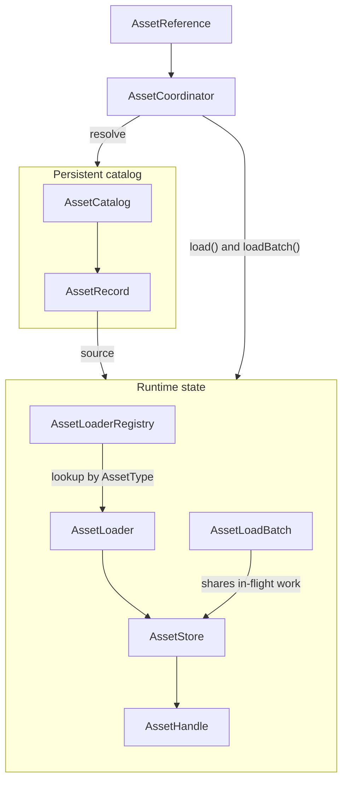
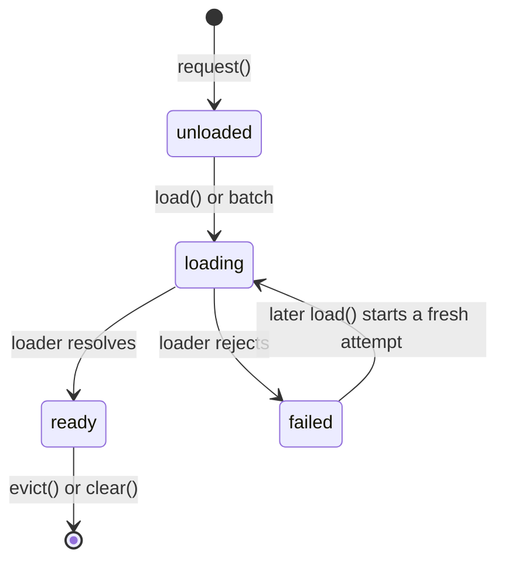
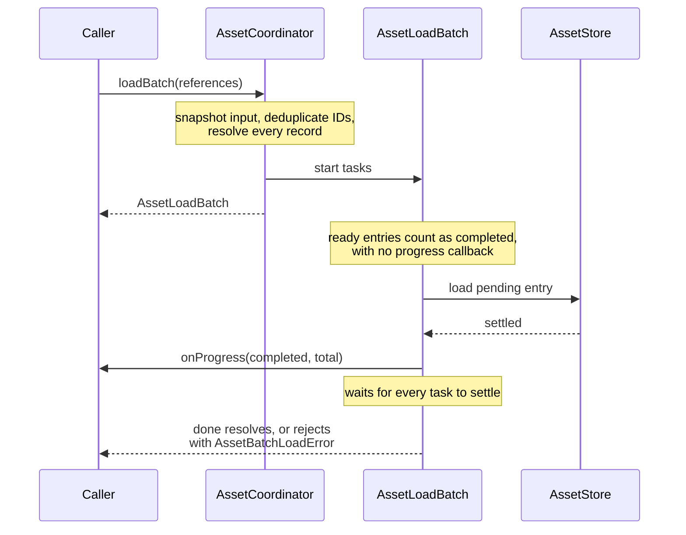

# Runtime loading architecture

`AssetCoordinator` connects the persistent catalog to the objects that own
runtime loading state.

## Request and load

`AssetCoordinator.request()` resolves the reference against the catalog and
creates an unloaded store entry when needed. It returns immediately and starts
no I/O.

`load()` resolves the record, finds the loader registered with the reference's
`AssetType`, and asks the store to run it. `loadBatch()` applies the same work
to a snapshot of references.

Once an asynchronous boundary has completed, runtime-facing code uses a handle
or `AssetCoordinator.get()` for synchronous access.

## Store ownership

An `AssetStore` owns values and in-flight promises for one runtime scope. Each
entry has one of four states:

Concurrent requests for the same asset ID and type receive the same loading
promise. After failure, a later `load()` or batch starts a fresh attempt.

`evict()` removes one entry and returns its ready value. `clear()` removes all
entries. Neither method aborts a loader or disposes a platform resource; the
runtime that owns the resource must handle disposal.

## Batch ownership

An `AssetLoadBatch` represents one operation, such as startup, a scene
transition, or dynamic content. The coordinator snapshots the input and
deduplicates repeated IDs within that batch.

Overlapping batches keep separate totals, progress, status, and failures. They
still share in-flight work through the store. Ready assets count toward the
initial completed value and do not produce progress callbacks.

The batch waits for every task to settle. Asset failures are collected in
`AssetBatchLoadError`. If the progress callback throws, `done` rejects with the
callback value after all tasks settle; that value is not added to the asset
failure list.

## Catalog changes

Catalog and store lifetimes are separate. Replacing or removing an
`AssetRecord` does not evict the value loaded from its previous source. A
runtime that applies catalog revisions should update the catalog, evict the
store entry, dispose the returned value, and start the next load at its chosen
boundary.
