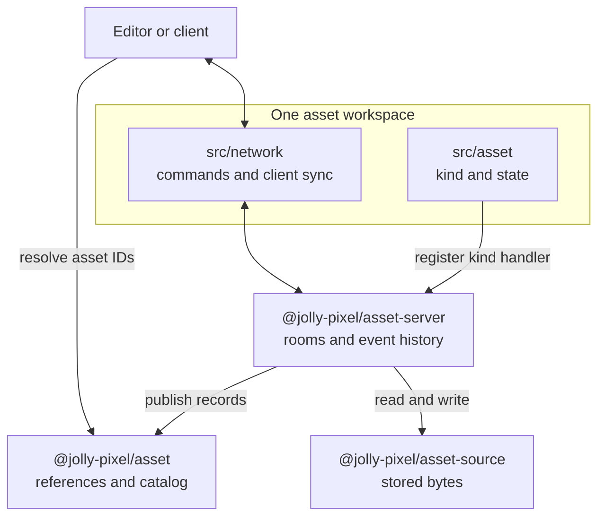
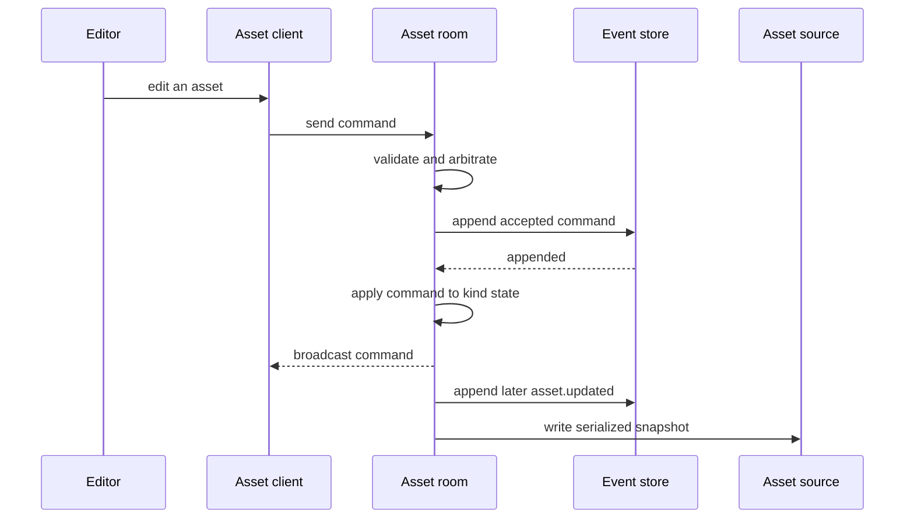

# Asset workspace architecture

Each directory in `packages/assets` owns one editable format. Its `src/asset/` code defines the kind, stored state, codec integration, and asset dependencies. Its `src/network/` code defines the edit protocol and client sync. A format can keep other domain code elsewhere, such as voxel-model's `src/model/`.

The server owns rooms, the catalog, event history, and persistence. Each asset workspace supplies format-specific state and commands through an asset kind handler. The catalog room handles creation, rename, and deletion; an asset room handles edits to one open asset.

## From edit to stored asset

The server replays recorded commands to restore live state and writes serialized snapshots after editing. A kind's apply function is the sole writer of its authoritative state; arbitration is committed after the event append succeeds.

See [asset kinds](../asset-server/docs/AssetKinds.md) and [asset server architecture](../asset-server/ARCHITECTURE.md) for the server contract. [Asset source architecture](../asset-source/ARCHITECTURE.md) describes the storage boundary. Format-specific rules live in the [pixel-art](./pixel-art/ARCHITECTURE.md), [voxel-map](./voxel-map/ARCHITECTURE.md), and [voxel-model](./voxel-model/ARCHITECTURE.md) architecture pages.
