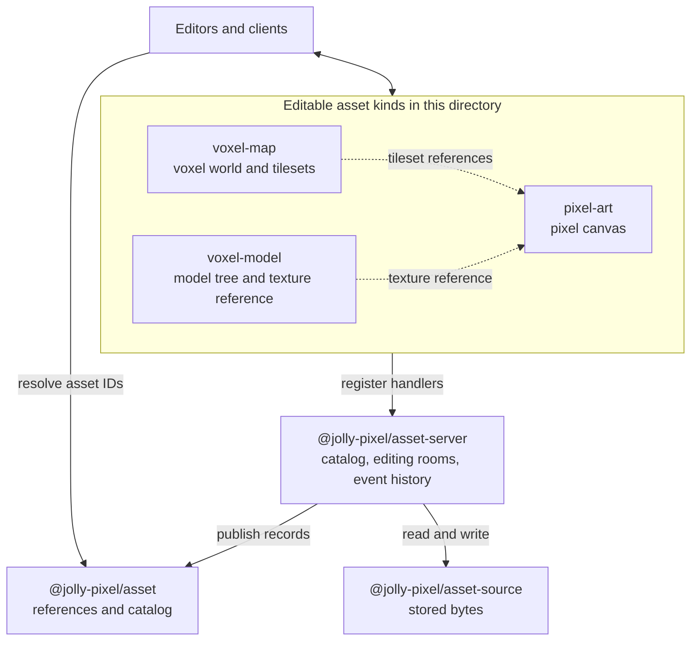
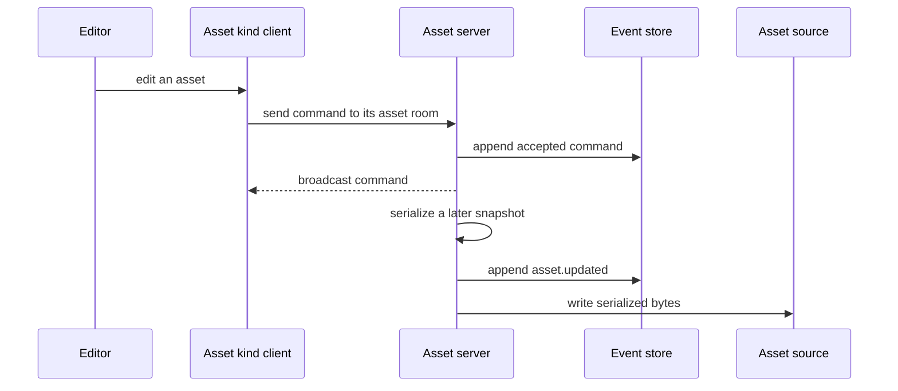

# Asset workspaces

The packages in this directory define editable asset formats. Each format
provides an asset kind for the server and a client-side way to work with its
content. An asset keeps its ID when its path or content changes; the catalog
connects that ID to its current kind, path, and revision.

## How the packages fit together

The asset-kind handler recognizes a file, loads and serializes its state, and
declares any asset dependencies. Editable kinds also define commands for a live
room. The server owns the room, catalog, event history, and persistence
lifecycle; the kind owns the format-specific state and commands. See
[asset kinds](../asset-server/docs/AssetKinds.md) and the
[asset server architecture](../asset-server/ARCHITECTURE.md) for the full
contract and event flow.

## From edit to stored asset

The catalog room handles asset creation, rename, and deletion. An asset room
handles edits to one open asset. The server replays recorded commands to
restore live state and writes a serialized snapshot to storage after editing.
[Asset source architecture](../asset-source/ARCHITECTURE.md) describes the
storage boundary and its filesystem, memory, and IndexedDB adapters.

## Formats in this directory

| Workspace | Content | Details |
|---|---|---|
| [pixel-art](./pixel-art/README.md) | Pixel-art documents and collaborative canvas edits | [API and guides](./pixel-art/docs/asset/index.md) |
| [voxel-map](./voxel-map/README.md) | Voxel worlds with optional pixel-art tileset references | [API and guides](./voxel-map/docs/api/voxel-map-assets.md) |
| [voxel-model](./voxel-model/README.md) | Model trees with an optional pixel-art texture reference | [API](./voxel-model/README.md#-api) |

For the shared meaning of asset ID, kind, reference, record, and catalog, see
the [asset glossary](../asset/GLOSSARY.md).
