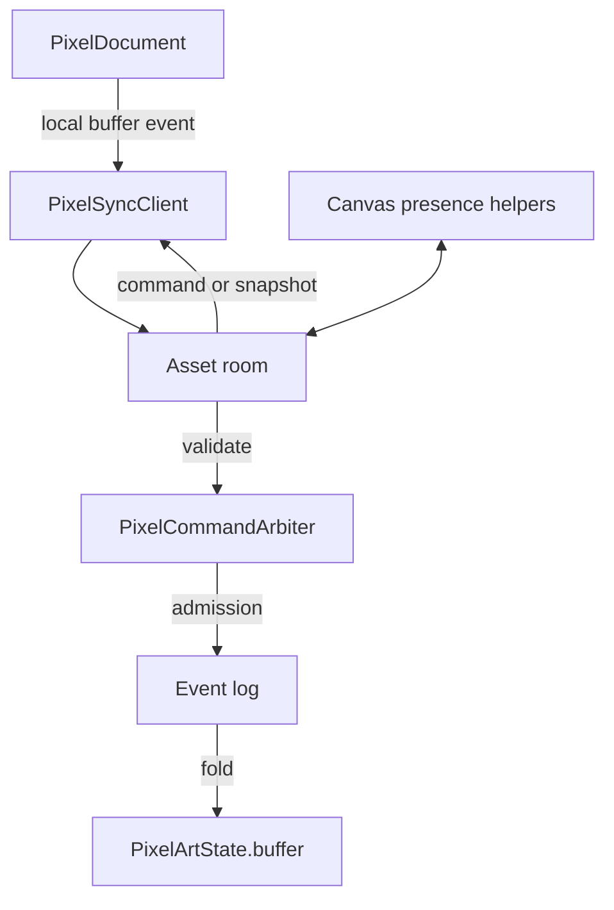
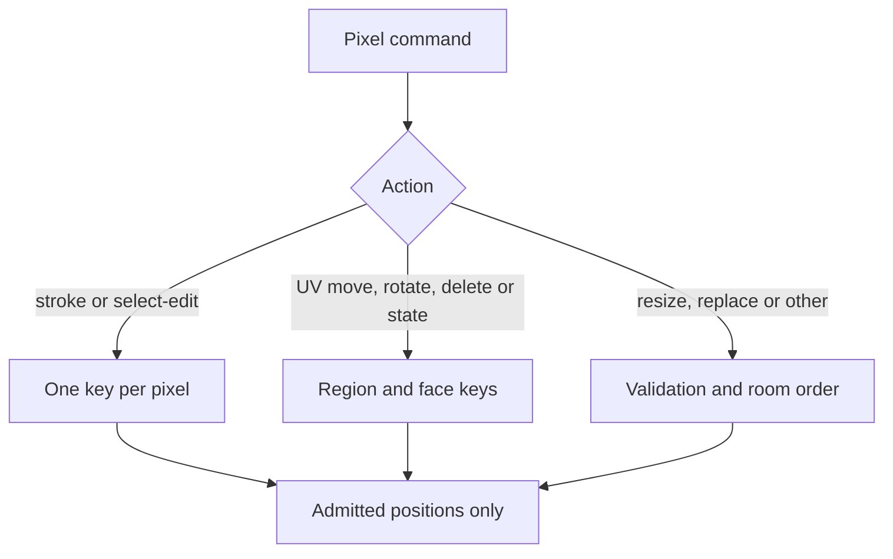

# Pixel-art architecture

`PixelArtState` holds the authoritative `PixelBuffer`. The server opens one room per asset; the browser keeps a `PixelDocument` in sync with it. The shared room and persistence lifecycle is shown in [asset workspace architecture](../ARCHITECTURE.md).

## Edits and conflicts

`commands.apply` is the sole writer of the server buffer. The arbiter checks the current buffer; its conflict trackers commit only after the event append succeeds. Event replay uses the same apply function.

Selection edits keep colors aligned with admitted positions. The arbiter also checks selection lengths, UV data, and allowed buffer sizes. Room presence carries cursors and edit previews; it does not enter the event log or mutate the buffer. See the [network API](./docs/network.md) for the client contract.
