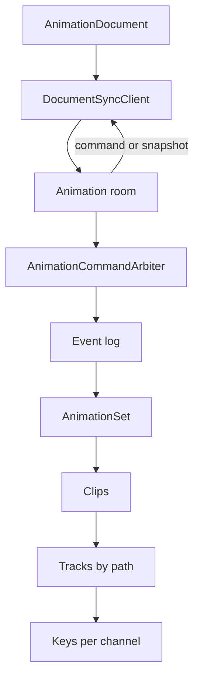
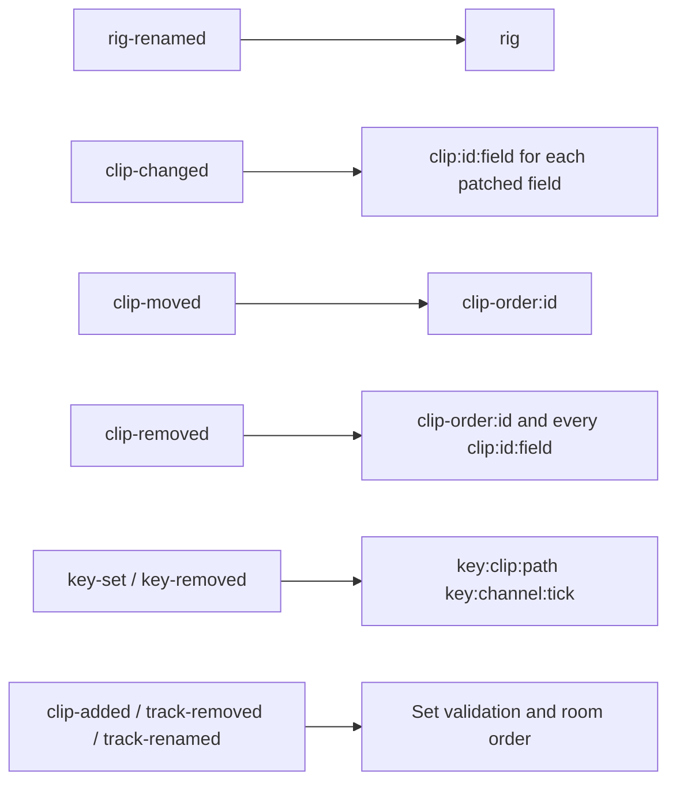

# Voxel-animation architecture

`AnimationSet` is both the server's headless set and the state behind `AnimationDocument` on the client. Its snapshot holds a `rig` label and the clips, in order; each clip holds tracks of keys addressed by block name path. The stored document leaves out a key's `interpolation` when it is `"linear"`, and the decoder fills it back in. A set knows nothing about models: a model links it and binds its tracks to blocks, see [animation bindings](../voxel-model/docs/animation.md). The shared room and persistence lifecycle is shown in [asset workspace architecture](../ARCHITECTURE.md).

## Collision keys

The default resolver is last write wins. The arbiter checks the set rules through `state.accepts()` before the conflict keys. A key's path is keyed by its `TrackPath` key, so `Body/Arm.L` and `body/arm.l` collide. A removal is only refused for its keys when it carries a `basis`, as an undo does: a peer's newer write to the clip then refuses it. Keys inside the removed clip are not covered. See the [network API](./docs/network.md) for command and client details.
