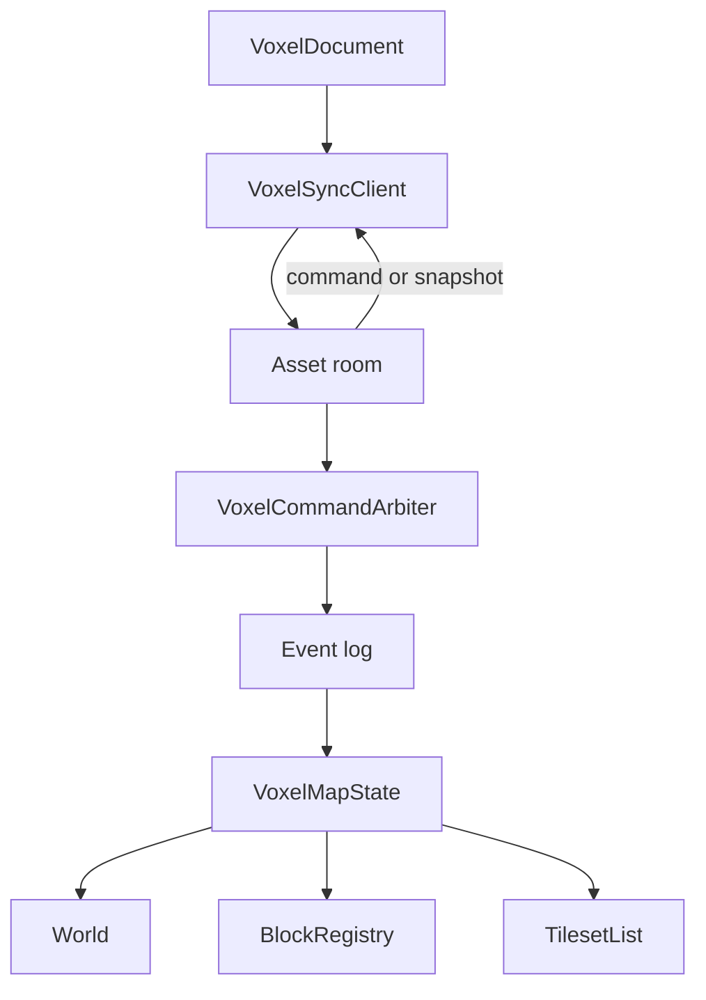
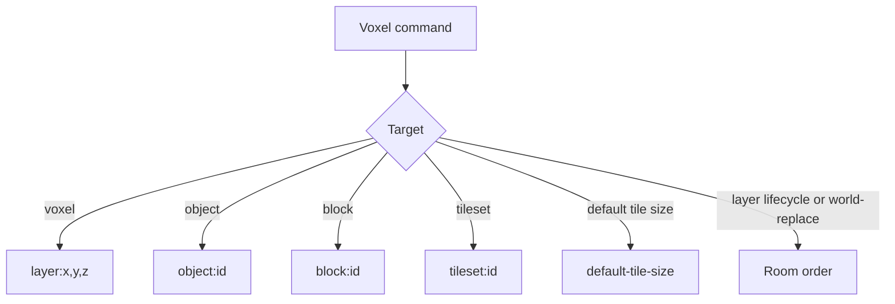

# Voxel-map architecture

`VoxelMapState` is the server's headless world. Its snapshot includes the world, block definitions, tilesets, and default tile size. Asset-backed tilesets become catalog dependencies. The shared room and persistence lifecycle is shown in [asset workspace architecture](../ARCHITECTURE.md).

## Collision keys

Bulk voxel commands arbitrate each cell and retain the entries that win. The default resolver is last write wins. The room commits admissions after a successful append; `commands.apply` then folds the command into state. `world-replace` loads a full document and broadcasts a fresh snapshot. See the [network API](./docs/network.md) for command and client details.
