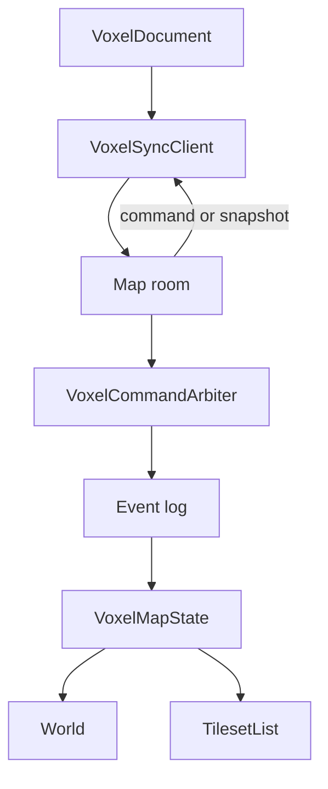
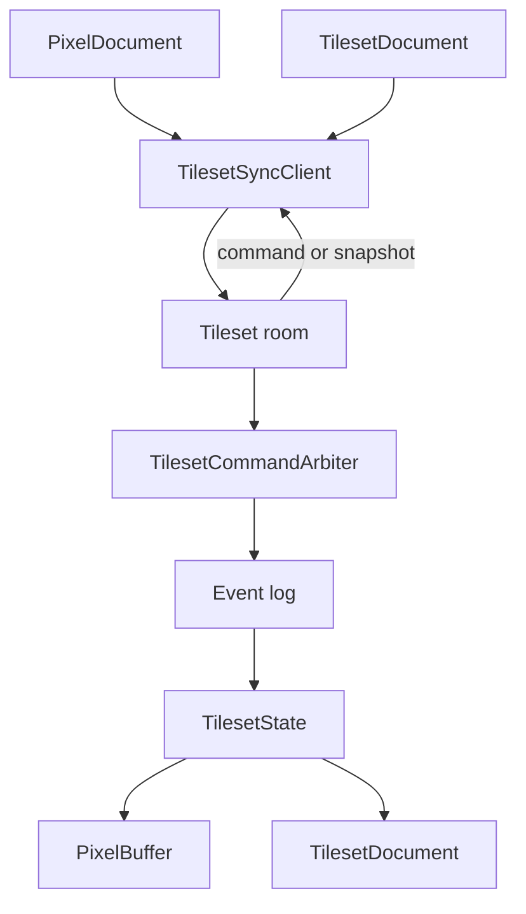
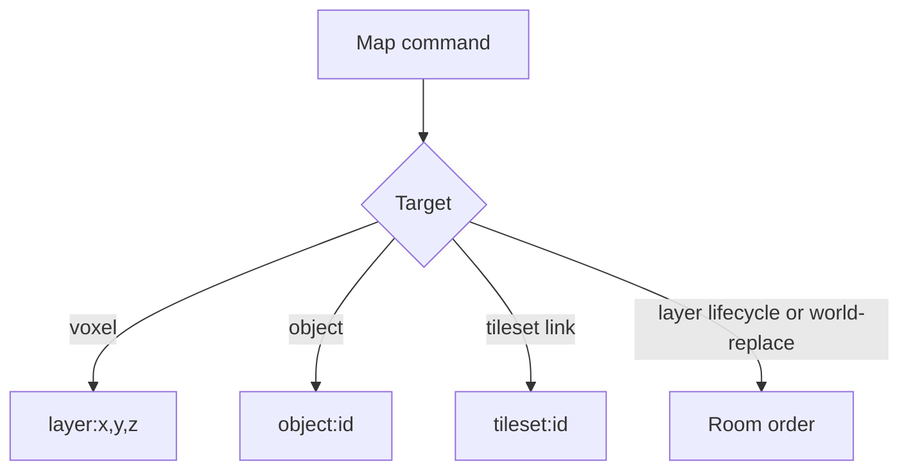
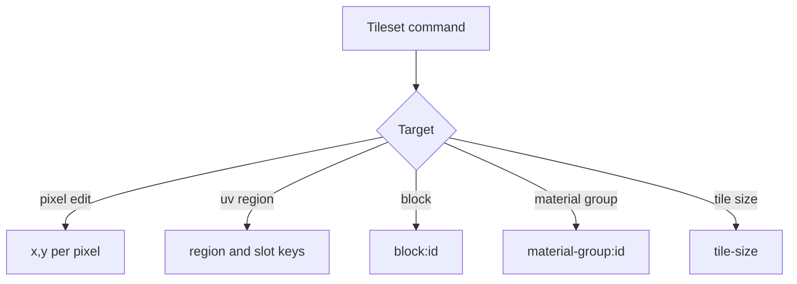

# Voxel-map architecture

The package owns two asset kinds. `VoxelMapState` is the server's headless world: its snapshot holds the layers and the tileset links, each link naming a tileset asset and the block id slot it occupies. `TilesetState` is the server's headless tileset: a pixel buffer next to a `TilesetDocument` holding the tile size, block definitions and material groups. Linked tilesets become catalog dependencies of the world. The shared room and persistence lifecycle is shown in [asset workspace architecture](../ARCHITECTURE.md).

A world engine never receives block commands from its room. The host leases every linked tileset, projects its blocks into the world's block registry under the link's slot, and edits blocks through the tileset room.

## Collision keys

Bulk voxel commands arbitrate each cell and retain the entries that win; strokes do the same per pixel, as in a pixel-art room. The default resolver is last write wins. The room commits admissions after a successful append; `commands.apply` then folds the command into state. `world-replace` loads a full document and broadcasts a fresh snapshot. See the [network API](./docs/network.md) for command and client details.
