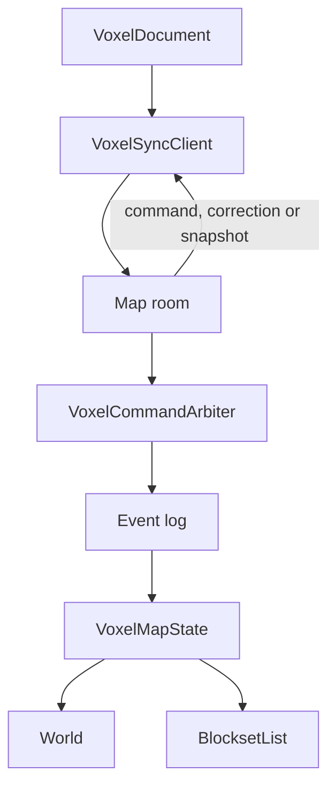
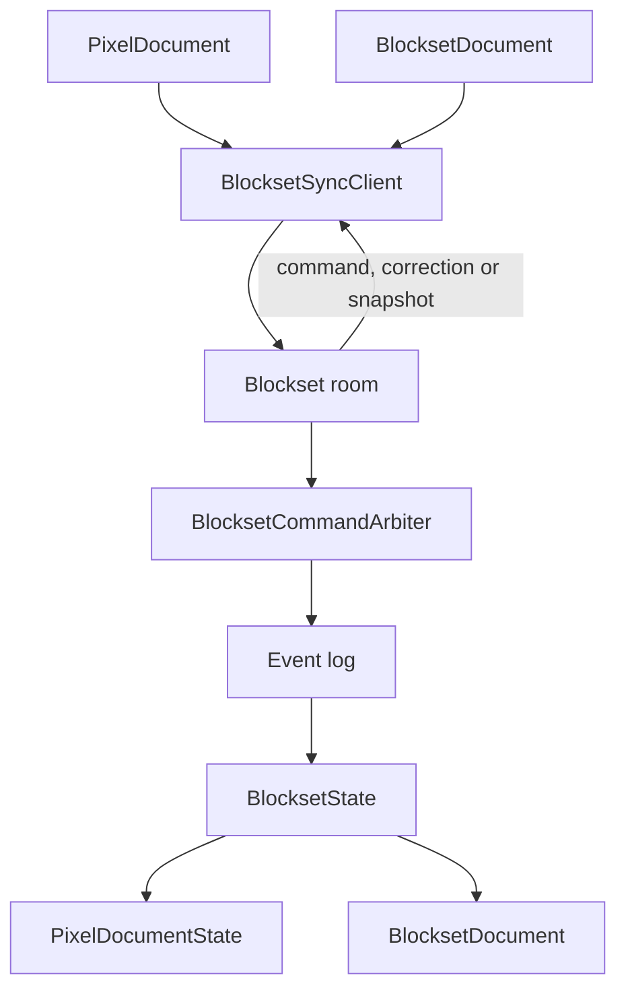
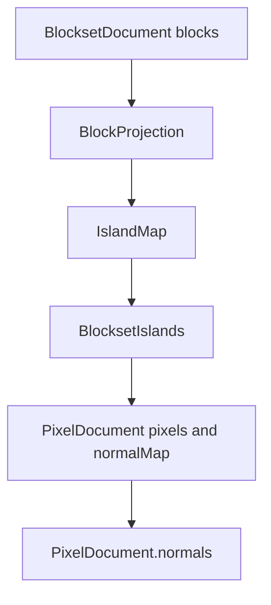
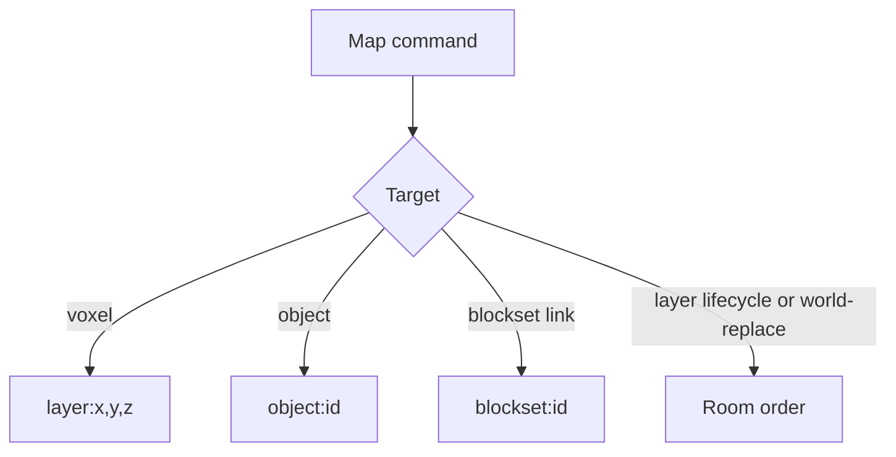
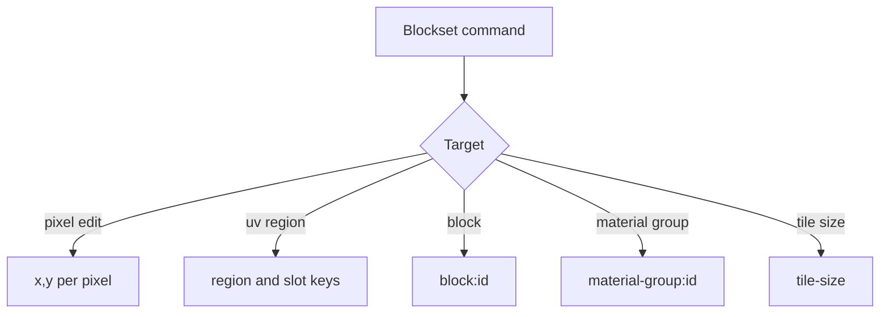

# Voxel-map architecture

The package owns two asset kinds. `VoxelMapState` is the server's headless world: its snapshot holds the layers and the blockset links, each link naming a blockset asset and the block id slot it occupies. `BlocksetState` is the server's headless blockset: a pixel buffer next to a `BlocksetDocument` holding the tile size, block definitions and material groups. Linked blocksets become catalog dependencies of the world. The shared room and persistence lifecycle is shown in [asset workspace architecture](../ARCHITECTURE.md).

```mermaid
flowchart TB
    Document["VoxelDocument"] --> Sync["VoxelSyncClient"]
    Sync --> Room["Map room"]
    Room --> Arbiter["VoxelCommandArbiter"]
    Arbiter --> Log["Event log"]
    Log --> State["VoxelMapState"]
    State --> World["World"]
    State --> Links["BlocksetList"]
    Room -->|"command, correction or snapshot"| Sync
```

```mermaid
flowchart TB
    Pixels["PixelDocument"] --> BlocksetSync["BlocksetSyncClient"]
    Blocks["BlocksetDocument"] --> BlocksetSync
    BlocksetSync --> BlocksetRoom["Blockset room"]
    BlocksetRoom --> BlocksetArbiter["BlocksetCommandArbiter"]
    BlocksetArbiter --> BlocksetLog["Event log"]
    BlocksetLog --> BlocksetState["BlocksetState"]
    BlocksetState --> Buffer["PixelDocumentState"]
    BlocksetState --> Definitions["BlocksetDocument"]
    BlocksetRoom -->|"command, correction or snapshot"| BlocksetSync
```

A world engine never receives block commands from its room. The host leases every linked blockset, projects its blocks into the world's block registry under the link's slot, and edits blocks through the blockset room.

A blockset's normal map settings live in its pixel document and travel as pixel commands. The normal pixels are never stored: the pixel document generates them on the client. `BlocksetIslands` hands it one island per block face projected onto the atlas, so a tile never samples its neighbour, and the texture editor and the 3D view read the same map.

```mermaid
flowchart TB
    BlocksetBlocks["BlocksetDocument blocks"] --> Projection["BlockProjection"]
    Projection --> Islands["IslandMap"]
    Islands --> BlocksetIslands["BlocksetIslands"]
    BlocksetIslands --> BlocksetPixels["PixelDocument pixels and normalMap"]
    BlocksetPixels --> NormalMap["PixelDocument.normals"]
```

## Collision keys

```mermaid
flowchart TB
    Command["Map command"] --> Action{"Target"}
    Action -->|"voxel"| Cell["layer:x,y,z"]
    Action -->|"object"| Object["object:id"]
    Action -->|"blockset link"| Blockset["blockset:id"]
    Action -->|"layer lifecycle or world-replace"| Order["Room order"]
```

```mermaid
flowchart TB
    BlocksetCommand["Blockset command"] --> BlocksetAction{"Target"}
    BlocksetAction -->|"pixel edit"| Pixel["x,y per pixel"]
    BlocksetAction -->|"uv region"| Region["region and slot keys"]
    BlocksetAction -->|"block"| Block["block:id"]
    BlocksetAction -->|"material group"| Group["material-group:id"]
    BlocksetAction -->|"tile size"| Size["tile-size"]
```

Bulk voxel commands arbitrate each cell and retain the entries that win; strokes do the same per pixel, as in a pixel-art room. The default resolver is last write wins. The room commits admissions after a successful append; `commands.apply` then folds the command into state. `world-replace` is admitted only when its document loads into a scratch world; it then loads into state, resets the conflict keys to its version and broadcasts a fresh snapshot. A voxel layer command whose layer id is missing is refused, as is an `added` or `cloned` layer whose id exists and a merge of a layer into itself. See the [network API](./docs/network.md) for command and client details.
