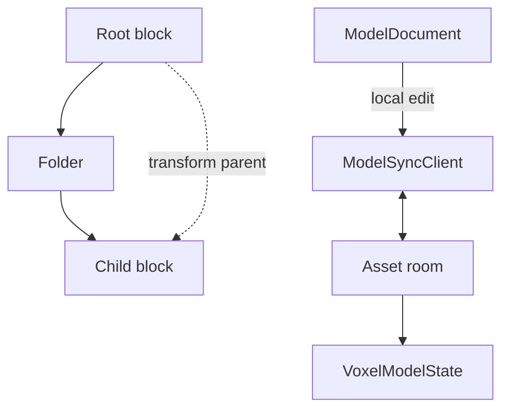
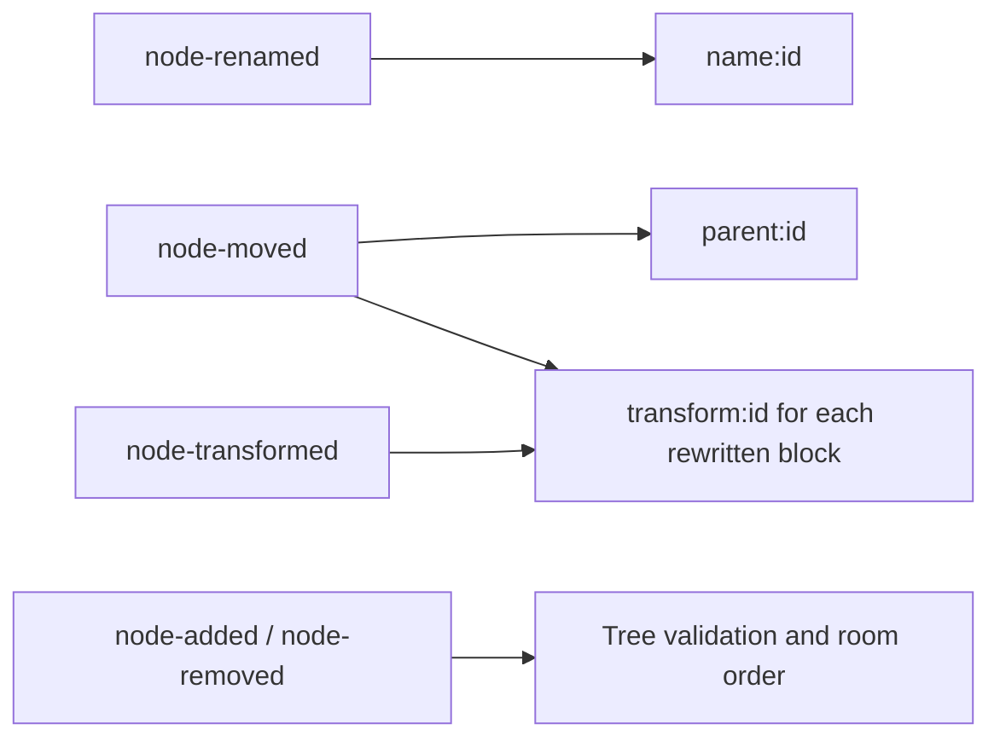

# Voxel-model architecture

A model tree contains blocks and folders. Folders have no transform; a block inherits from the nearest block above it, possibly through folders. The stored document includes a required texture asset reference, while live snapshots contain only nodes. The shared room and persistence lifecycle is shown in [asset workspace architecture](../ARCHITECTURE.md).

`ModelTree.accepts()` requires unused IDs and existing parents. A move cannot place a node in its own subtree; transforms target blocks. Removing a node removes its descendants. A move can carry block transforms in the same command when the transform parent changes.

## Collision keys

The default resolver is last write wins. The server checks tree constraints before arbitration and commits accepted conflict keys after the event append. See the [network API](./docs/network.md) for command shapes and sync behavior.
