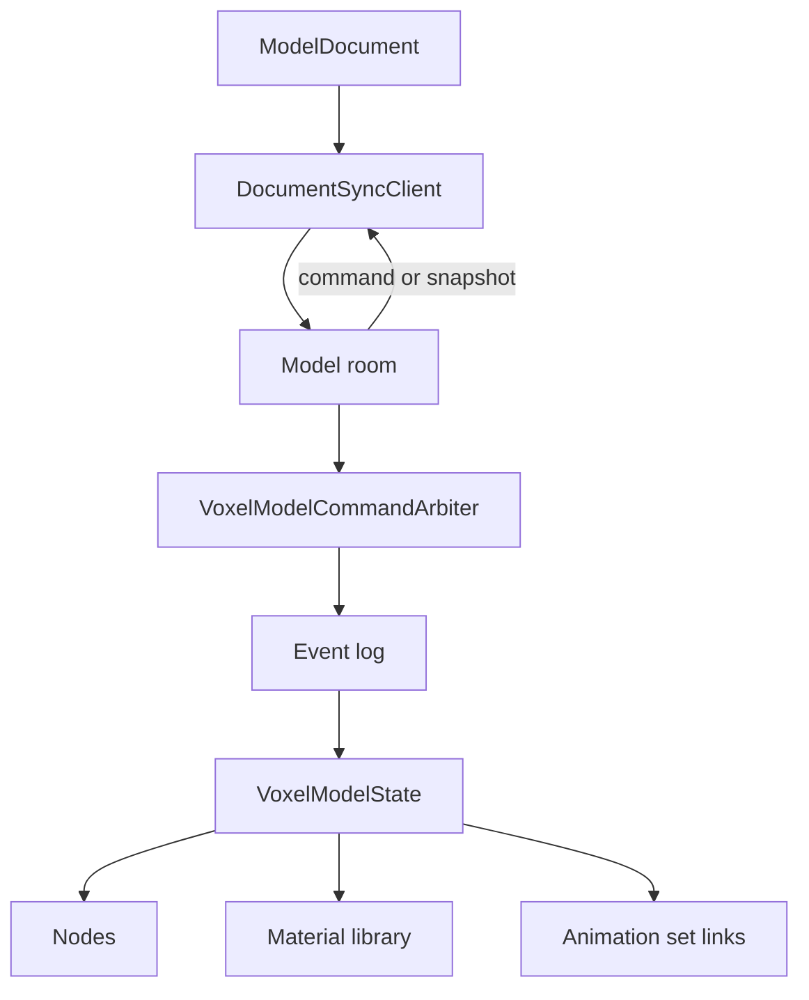
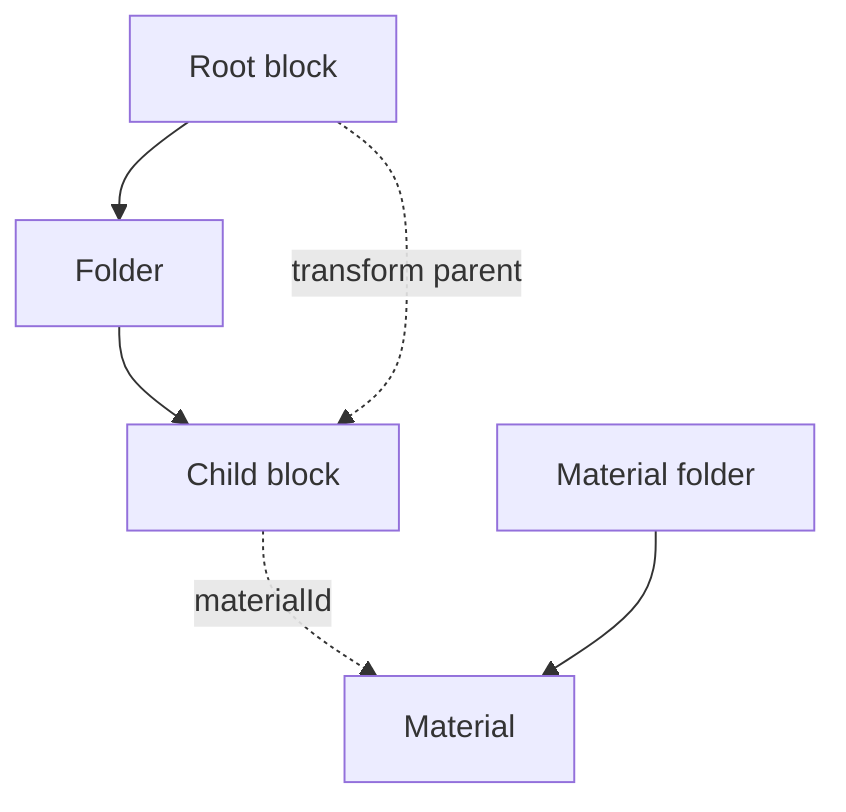
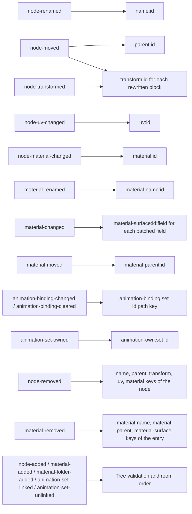

# Voxel-model architecture

`VoxelModelState` is the server's headless model. Its snapshot holds three ordered parts: the nodes (blocks and folders), the material library (materials and material folders) and the animation set links. The stored document adds a version and the texture reference, which stay outside the live snapshot. It also leaves out the transform vectors that match `BlockTransform.create()` and an `activeFaces` list that names every face in `faces` order. The decoder fills both back in, so the snapshot, the commands and `VoxelModelState.toJSON()` always hold full blocks. Linked animation sets become catalog dependencies of the model. The shared room and persistence lifecycle is shown in [asset workspace architecture](../ARCHITECTURE.md).

```mermaid
flowchart TB
    Document["ModelDocument"] --> Sync["DocumentSyncClient"]
    Sync --> Room["Model room"]
    Room --> Arbiter["VoxelModelCommandArbiter"]
    Arbiter --> Log["Event log"]
    Log --> State["VoxelModelState"]
    State --> Nodes["Nodes"]
    State --> Materials["Material library"]
    State --> Links["Animation set links"]
    Room -->|"command or snapshot"| Sync
```

Folders have no transform. A block's transform is relative to the nearest block above it, folders skipped. A move that changes a block's transform parent carries the rewritten transforms in the same command. A block points to a material by ID, never to a material folder. Removing a node removes its subtree; removing a material clears it from the blocks that used it in the same command.

```mermaid
flowchart TB
    Root["Root block"] --> Folder["Folder"]
    Folder --> Child["Child block"]
    Root -.->|"transform parent"| Child
    Child -.->|"materialId"| Material["Material"]
    MaterialFolder["Material folder"] --> Material
```

Animation sets target blocks by name path, not by ID. A link can remap a track to another block path, or ignore it; at most one link is the model's own set, which holds the clips made for this model. See [animation bindings](./docs/animation.md).

## Collision keys

```mermaid
flowchart LR
    Rename["node-renamed"] --> Name["name:id"]
    Move["node-moved"] --> Parent["parent:id"]
    Move --> Transform["transform:id for each rewritten block"]
    Edit["node-transformed"] --> Transform
    Uv["node-uv-changed"] --> UvKey["uv:id"]
    Material["node-material-changed"] --> MaterialKey["material:id"]
    MaterialName["material-renamed"] --> MaterialNameKey["material-name:id"]
    MaterialSurface["material-changed"] --> MaterialSurfaceKey["material-surface:id:field for each patched field"]
    MaterialMove["material-moved"] --> MaterialParentKey["material-parent:id"]
    Binding["animation-binding-changed / animation-binding-cleared"] --> BindingKey["animation-binding:set id:path key"]
    Owned["animation-set-owned"] --> OwnKey["animation-own:set id"]
    NodeRemove["node-removed"] --> NodeValues["name, parent, transform, uv, material keys of the node"]
    MaterialRemove["material-removed"] --> MaterialValues["material-name, material-parent, material-surface keys of the entry"]
    AddRemove["node-added / material-added / material-folder-added / animation-set-linked / animation-set-unlinked"] --> Order["Tree validation and room order"]
```

The default resolver is last write wins. The arbiter checks the tree rules through `state.accepts()` before the conflict keys, and the room commits the keys after the event append. A removal holds the keys of the values it erases but is only refused for them when it carries a `basis`, as an undo does: an undo that would erase a peer's newer edit is refused. Clients check the same tree rules on peer commands and on the replay of their pending ones; a pending command the tree refuses leaves the tree until the server's snapshot repairs it. See the [network API](./docs/network.md) for command and client details.
