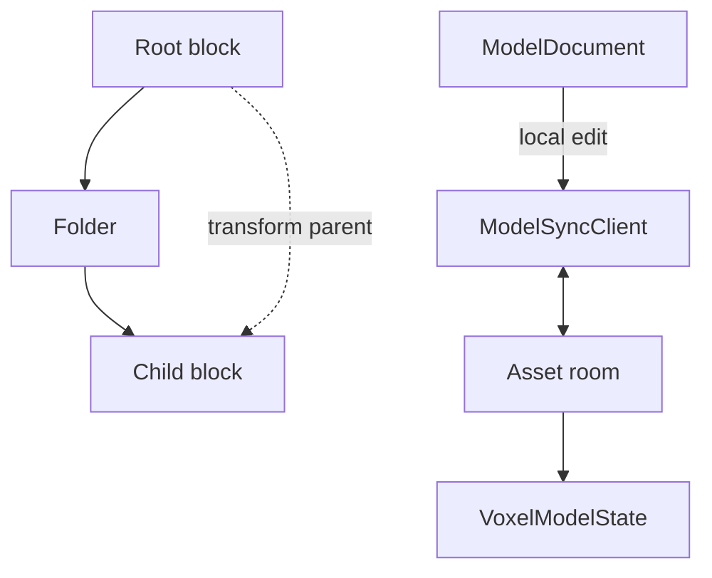
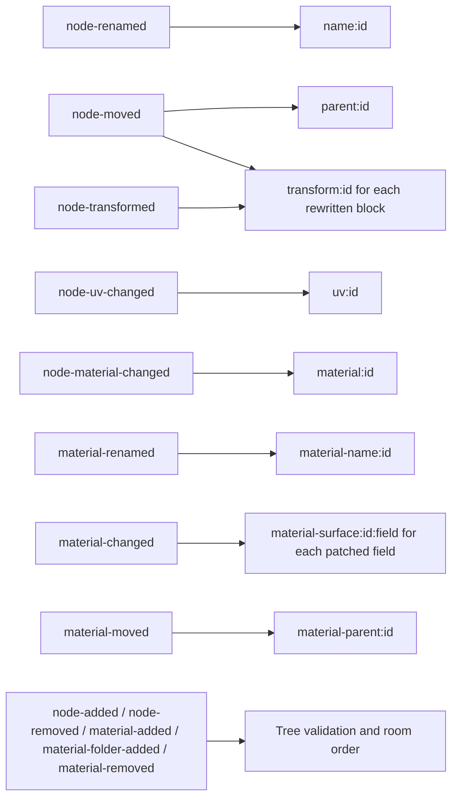

# Voxel-model architecture

A model tree contains blocks and folders. Folders have no transform; a block inherits from the nearest block above it, possibly through folders. The stored document includes a required texture asset reference, while live snapshots contain only nodes. The shared room and persistence lifecycle is shown in [asset workspace architecture](../ARCHITECTURE.md).

```mermaid
flowchart TB
    Root["Root block"] --> Folder["Folder"]
    Folder --> Child["Child block"]
    Root -.->|"transform parent"| Child
    Document["ModelDocument"] -->|"local edit"| Sync["ModelSyncClient"]
    Sync <--> Room["Asset room"]
    Room --> State["VoxelModelState"]
```

`ModelTree.accepts()` requires unused IDs and existing parents. A move cannot place a node in its own subtree; transforms, UV layouts and materials target blocks. The model owns a material library, `ModelMaterials`: materials and folders in one ordered tree, kept apart from the nodes and checked by its own `accepts()`. An entry's parent is a folder or the root, and a folder cannot move into its own subtree. Nodes and the library are both an `OrderedTree`, which owns placement, moves, removal and load checks; each kind only says which parents can contain an entry. A block points to a material by ID, which must exist, and removing a material or a folder clears the removed materials from their blocks in the same command. Removing a node removes its descendants. A move can carry block transforms in the same command when the transform parent changes.

## Collision keys

```mermaid
flowchart LR
    Rename["node-renamed"] --> Name["name:id"]
    Move["node-moved"] --> Parent["parent:id"]
    Move --> Transform["transform:id for each rewritten block"]
    Edit["node-transformed"] --> Transform
    Uv["node-uv-changed"] --> UvKey["uv:id"]
    Material["node-material-changed"] --> MaterialKey["material:id"]
    MaterialName["material-renamed"] --> MaterialNameKey["material-name:id"]
    MaterialSurface["material-changed"] --> MaterialSurfaceKey["material-surface:id:field for each patched field"]
    MaterialMove["material-moved"] --> MaterialParentKey["material-parent:id"]
    AddRemove["node-added / node-removed / material-added / material-folder-added / material-removed"] --> Order["Tree validation and room order"]
```

The default resolver is last write wins. The arbiter checks tree constraints through `state.accepts()` before the conflict keys, and the room commits accepted keys after the event append. Clients check the same constraints on remote commands and on the replay of their pending ones: a pending command their tree refuses leaves the tree, and the room's snapshot to its author brings both sides back in line. See the [network API](./docs/network.md) for command shapes and sync behavior.
