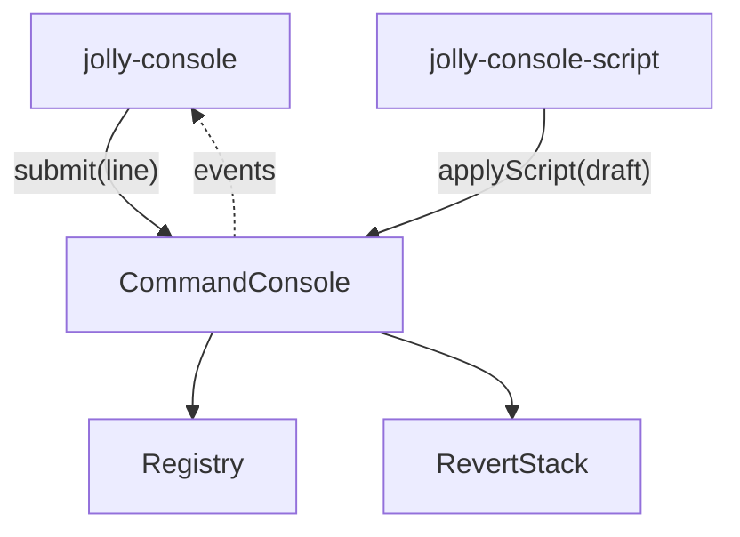
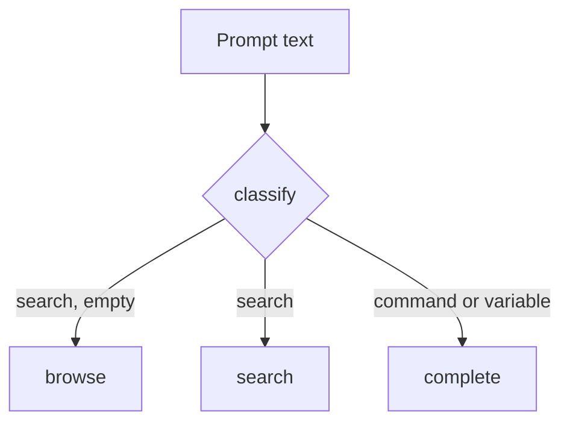
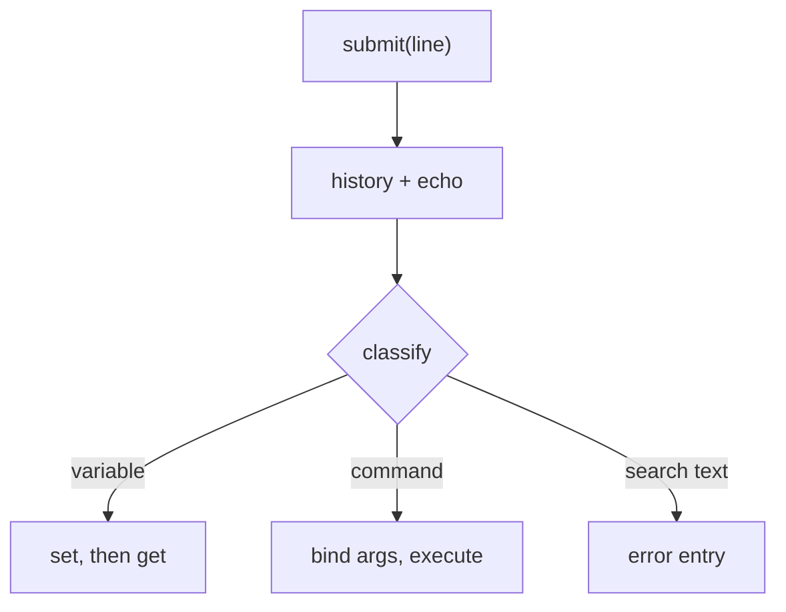
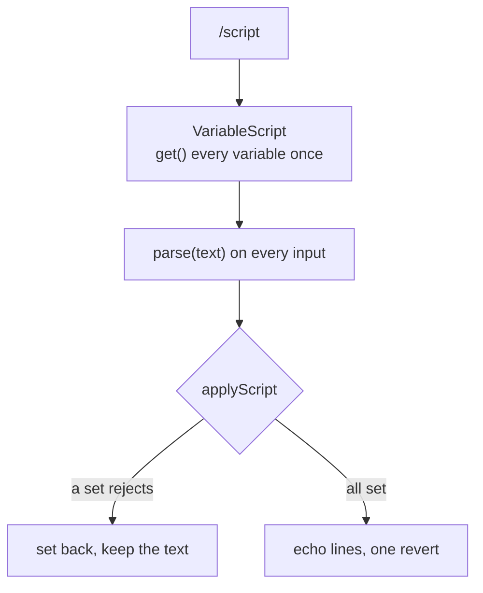
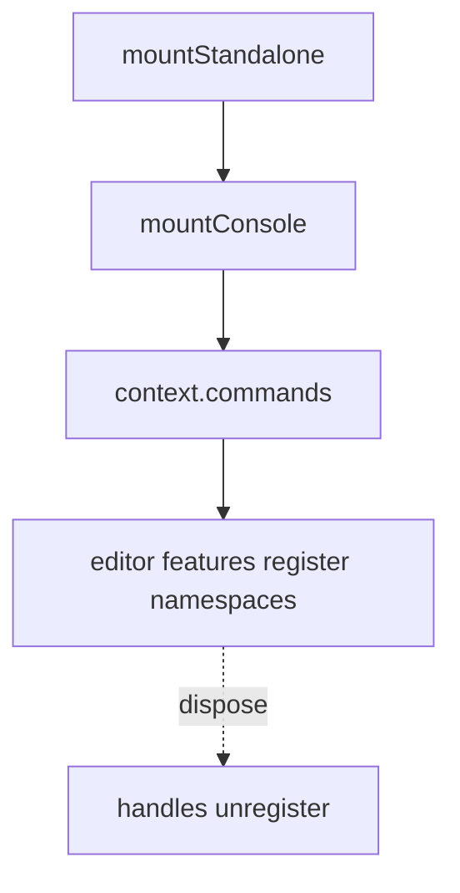

# Console architecture

Two entries:

- `@jolly-pixel/console`: the headless `CommandConsole`. No DOM, no Lit.
- `@jolly-pixel/console/element`: the Lit `jolly-console` dialog.

The element imports the root, never the reverse. No instance is exported: each
editor page creates one and passes it down.

## Map

| Folder | Holds |
|---|---|
| `registry/` | `Registry`, `NamespaceEntry`, definitions, validation, `ConsoleFeature` |
| `input/` | `tokenize`, `classify`, `coerce` |
| `execution/` | `bindArguments`, variables, `InputHistory`, `RevertStack`, `Scrollback`, built-ins |
| `search/` | `Suggestion`, `score`, `search`, `complete`, `browse`, `typo` |
| `script/` | `scanScript`, `VariableScript`, `ScriptDraft`, `highlightLine` |
| `element/` | the three elements, `KeyboardController`, `SuggestionController` |

## One keystroke

- An exact variable name wins over search.
- `complete` may await `autocomplete()`. Each request is numbered; a late one is dropped.
- Every result is a `Suggestion` that already holds the line and caret it leaves.
- The list lives in the prompt shadow root so ARIA IDREFs resolve
  ([ADR-0007](./docs/adr/0007-the-suggestion-list-shares-the-prompt-shadow-root.md)).

## Submitting a line

- `submit()` never throws. Errors become error entries.
- A returned promise keeps the echo pending until it settles.
- `ctx.signal` aborts when the command is replaced or unregistered.

## Reverting

- `RevertStack` keeps applied changes only. `InputHistory` cannot: it keeps no-op lines.
- `/revert` pops newest first and skips a change whose address no longer resolves
  ([ADR-0009](./docs/adr/0009-revert-is-opt-in-per-command.md)).
- A variable revert writes the previous value through `set`, so mirrors need nothing more.
- A mirrored command's revert stays in `ConsoleServer` under a `revertId`.

## Scripts

- `parse` diffs against the snapshot, so only edited lines are written.
- Rollback and `/revert` restore what `get()` returned just before each write.
- `scanScript` feeds both the parser and `highlightLine`.
- The editor is a transparent `textarea` over a colored `pre`, in one grid cell
  and one scroller. Nothing to sync, and native undo still works.

See [ADR-0010](./docs/adr/0010-scripts-edit-variables-as-ini-all-or-nothing.md).

## Registration

- The last registration wins, for commands, variables and namespaces
  ([ADR-0003](./docs/adr/0003-last-registration-wins.md)).
- Namespaces are flat entries keyed by dotted address; parents with no registration of their
  own are derived ([ADR-0011](./docs/adr/0011-namespaces-nest-by-address.md)).
- A handle only removes the entry it created.
- Replacing or unregistering a command aborts its signal.
- Every change emits `registry-changed`.
- `registerConsoleFeatures` unregisters what it registered if a feature throws.

## Scope

- `CommandConsole` keeps the scope as an address; `scope` walks up to the nearest registered
  namespace.
- The prompt reads through `scoped`, a `ScopedRegistry` that tries `<scope>.<name>` first.
  `registry`, the mirror and the server always use full addresses
  ([ADR-0012](./docs/adr/0012-the-scope-is-a-prompt-view.md)).

## In an editor

The host owns the instance. A new command is a feature module plus one line in
the editor's feature list.

API: [CommandConsole](./docs/CommandConsole.md), [features](./docs/features.md),
[grammar](./docs/grammar.md), [jolly-console](./docs/element.md),
[ADRs](./docs/adr/README.md).
