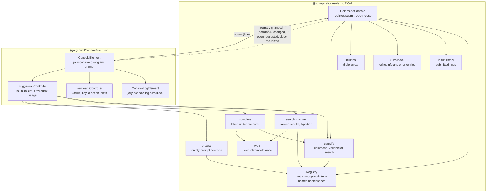
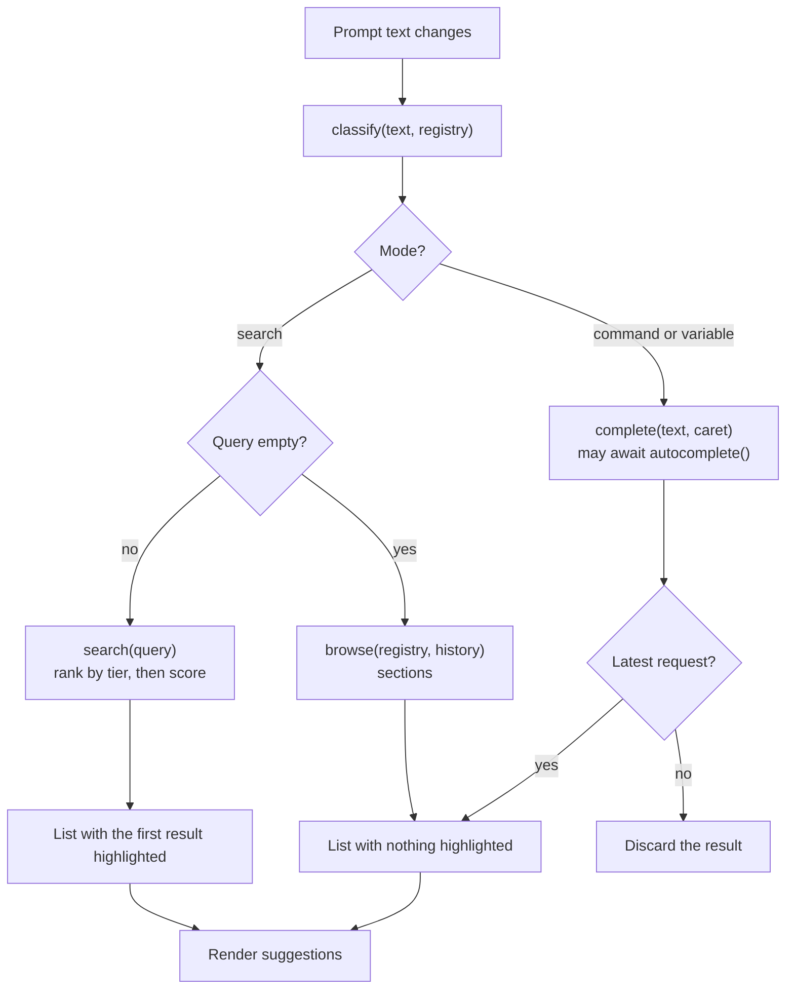
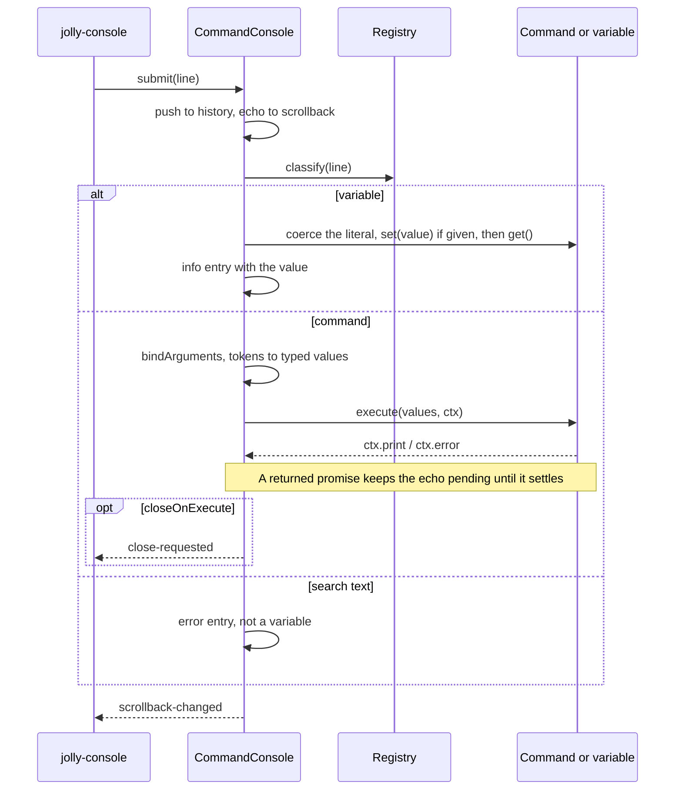
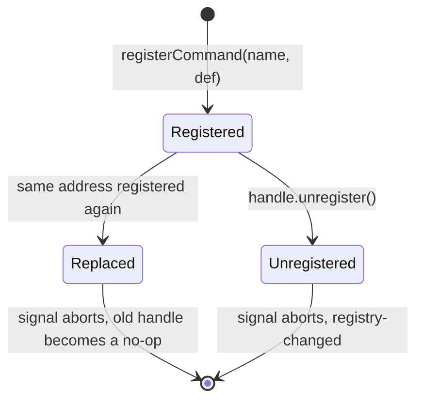
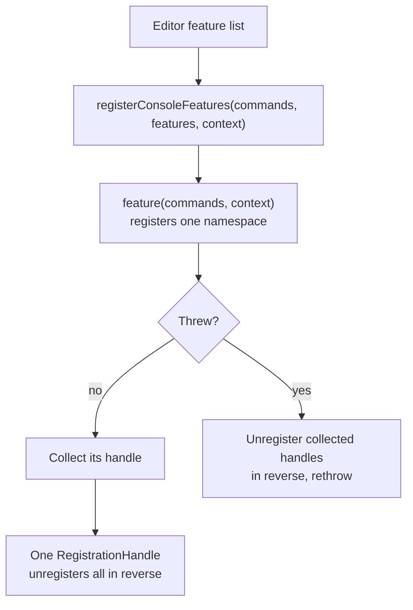
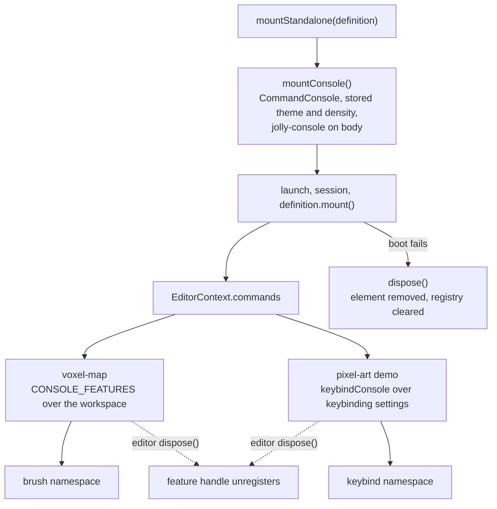

# Console architecture

The package has two entries. The root entry is the headless `CommandConsole`:
the registry, the input grammar, search and execution, with no DOM.
`@jolly-pixel/console/element` is the Lit `jolly-console` dialog. It keeps the
prompt, renders the scrollback through `jolly-console-log` and the suggestion
list through a controller, listens to four `CommandConsole` events and hands
each submitted line back to `submit()`.

## Workspace map

The element imports root modules; nothing in the root imports the element or
Lit. The package exports no instance: each editor page constructs one and
passes it down.

| Folder | Holds |
|---|---|
| `registry/` | `Registry`, `NamespaceEntry`, definition types and validation, `ConsoleFeature` |
| `input/` | `tokenize`, `classify`, `coerce` |
| `execution/` | `bindArguments`, variable access, `InputHistory`, `Scrollback`, builtins and `help` |
| `search/` | `score` tiers, `search`, `complete`, `browse` sections, `typo` tolerance over the `levenshtein` port |
| `element/` | `ConsoleElement` and its styles, `ConsoleLogElement`, `KeyboardController`, `SuggestionController` |

## One keystroke

Search and browse are synchronous. Completion can wait on an `autocomplete()`
promise, so `SuggestionController` numbers each request and drops a result that arrives after a newer
one; the previous completion list stays on screen meanwhile. The list renders
in the prompt shadow root so the combobox IDREFs resolve
([ADR-0007](./docs/adr/0007-the-suggestion-list-shares-the-prompt-shadow-root.md)). An exact variable
match puts the prompt in variable mode before search is tried.

## Submitting a line

An error thrown while binding or by the handler becomes an error entry;
`submit()` never rethrows. `ctx.signal` aborts when the command is replaced or
unregistered while it runs. While open, the element re-adopts the ambient theme
whenever a `theme` attribute changes, so `theme light` restyles the open
console.

## Registration lifetime

The last registration wins for commands, variables and whole namespaces, and a
handle only removes the entry it created. Variables follow the same rules
without a signal. Every change emits `registry-changed`, which refreshes the
list of an open element.

## In an editor

The host owns the instance. An editor registers its features during `mount()`
and unregisters them on dispose. A new command goes in a feature module plus one
line in the editor's feature list.

For API details, see [CommandConsole](./docs/CommandConsole.md),
[features](./docs/features.md), the [input grammar](./docs/grammar.md),
[jolly-console](./docs/element.md) and the
[architecture decisions](./docs/adr/README.md).
