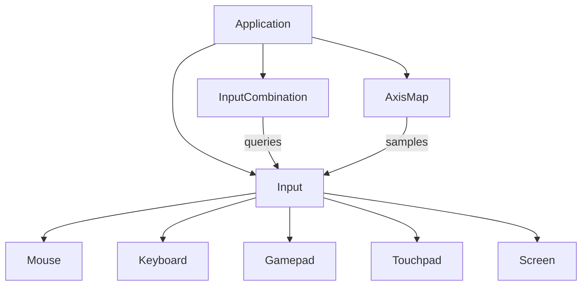
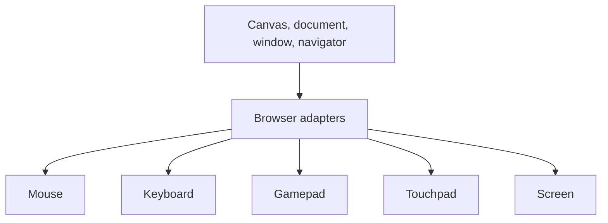

# Controls architecture

`Input` groups the controls for one canvas. It owns five devices, connects
their browser listeners, and advances input state once per frame. Each device
can also be used on its own.

## Application and Input

## Browser adapters and devices

`Mouse`, `Keyboard`, `Gamepad`, and `Touchpad` keep their own button, key,
axis, or touch state. `Screen` handles fullscreen state for the canvas.
Adapters give the devices access to browser APIs through narrow interfaces.

The application calls `input.connect()` to attach listeners, then
`input.update()` each frame before reading device state. `Input` also tracks
whether gamepad or mouse, keyboard, and touch input was used most recently.
Touch events are mirrored into `Mouse`, and mouse presses can complete a
pending fullscreen request in `Screen`.

`InputCombination` evaluates conditions across devices. `AxisMap` samples
device inputs into named scalar values. Both are created by the application
and read an `Input` instance; neither is owned by `Input`.

For methods and device behavior, see the [Input API](./docs/input.md) and
[glossary](./GLOSSARY.md).
