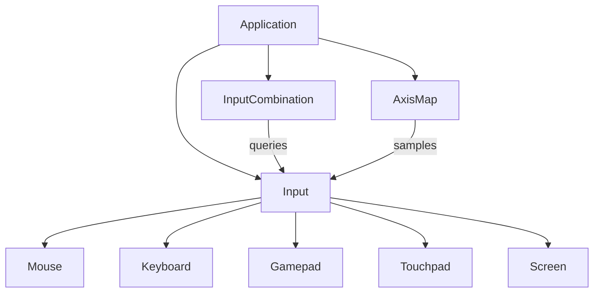
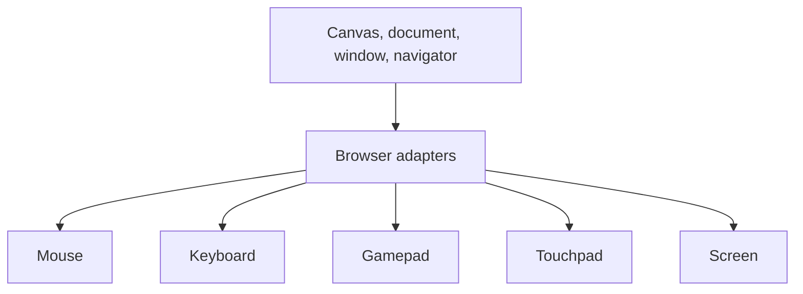
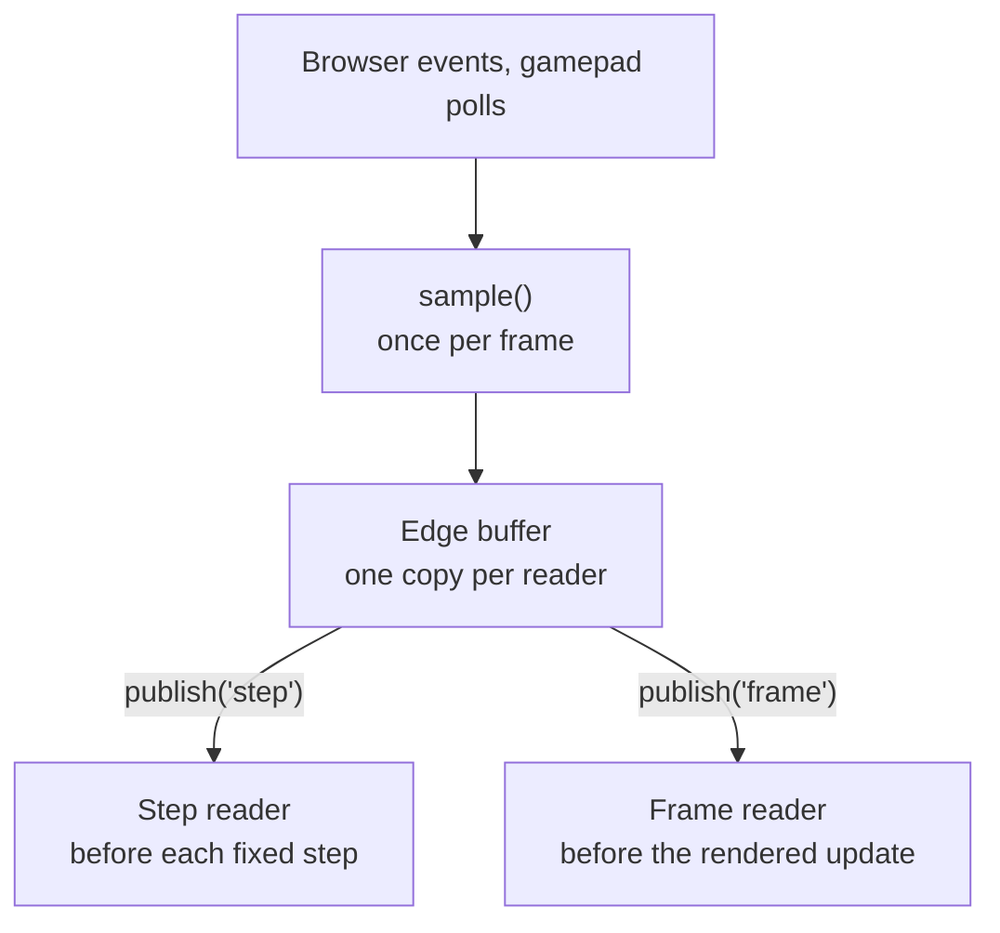
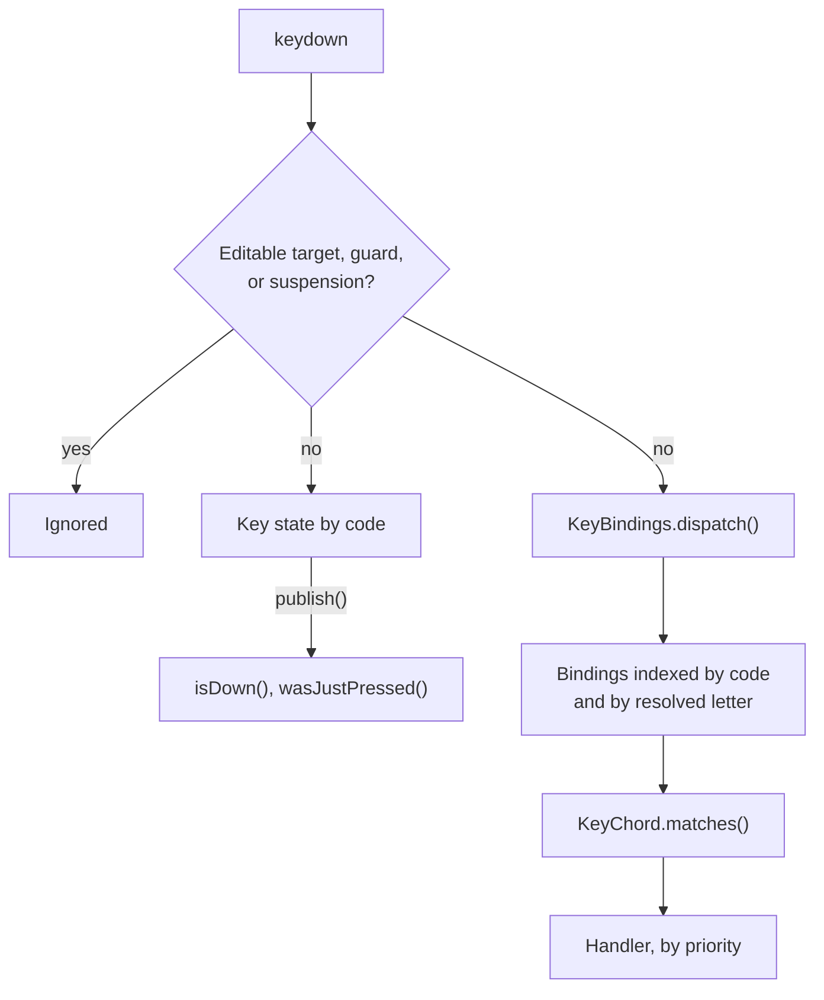

# Controls architecture

`Input` groups the controls for one canvas.

- It owns five devices and connects their browser listeners.
- It advances input once per frame, or once per fixed step.
- Each device also works on its own.

## Application and Input

```mermaid
flowchart TB
    App["Application"] --> Input["Input"]
    Input --> Mouse["Mouse"]
    Input --> Keyboard["Keyboard"]
    Input --> Gamepad["Gamepad"]
    Input --> Touchpad["Touchpad"]
    Input --> Screen["Screen"]

    App --> Combinations["InputCombination"]
    App --> Axes["AxisMap"]
    Combinations -->|queries| Input
    Axes -->|samples| Input
```

| Part | Role | Owned by `Input` |
| --- | --- | --- |
| `Mouse`, `Keyboard`, `Gamepad`, `Touchpad` | keep their button, key, axis, or touch state | yes |
| `Screen` | fullscreen state of the canvas | yes |
| `InputCombination` | conditions across devices | no, the application creates it |
| `AxisMap` | samples inputs into named scalar values | no, the application creates it |

Links between devices:

- Touch events are mirrored into `Mouse`.
- A mouse press can complete a pending fullscreen request in `Screen`.
- `Input` tracks the device preference: gamepad, or mouse, keyboard, and touch.

## Browser adapters

```mermaid
flowchart TB
    Browser["Canvas, document, window, navigator"] --> Adapters["Browser adapters"]
    Adapters --> Mouse["Mouse"]
    Adapters --> Keyboard["Keyboard"]
    Adapters --> Gamepad["Gamepad"]
    Adapters --> Touchpad["Touchpad"]
    Adapters --> Screen["Screen"]
```

Adapters give the devices browser APIs through narrow interfaces.

## Calling order

| Host | Calls |
| --- | --- |
| Any | `input.connect()` once, to attach listeners |
| Variable rate | `input.update()` each frame, before reading device state |
| Fixed step | `sample()` once per frame, then `publish(reader)`, see below |

## Steps and rendered frames

**The problem.** A fixed-step game reads input twice per frame: before each
fixed step, and before the rendered update. A frame runs several steps or
none, so a single "since the last `update()`" view repeats edges or loses them.

**The fix.** Each device splits sampling from publishing.

- `sample()` reads browser changes and turns them into edges.
- Every edge is kept once for each [reader](./GLOSSARY.md#reader).
- `publish(reader)` gives one reader what it has not taken yet: the
  `wasJust*` flags, typed characters, movement, and wheel values.
- `update()` is `sample()` then `publish("step")`.

```mermaid
flowchart TB
    Browser["Browser events, gamepad polls"] --> Sample["sample()<br/>once per frame"]
    Sample --> Buffer["Edge buffer<br/>one copy per reader"]
    Buffer -->|"publish('step')"| Step["Step reader<br/>before each fixed step"]
    Buffer -->|"publish('frame')"| Frame["Frame reader<br/>before the rendered update"]
```

| Frame | Step reader sees | Frame reader sees |
| --- | --- | --- |
| One step | the frame's edges | the same edges |
| Three catch-up steps | every edge on the first step | every edge, once |
| No step | nothing; the edges stay pending | the frame's edges |
| Paused, then one step | every edge since the last step | each frame's edges |
| Render skipped by `maxFps` | as in the rows above | nothing; the edges wait for the next drawn frame |

### Buffers

`EdgeBuffer` sits in `src/devices/`; the others live in their device folder.

| Buffer | Keeps |
| --- | --- |
| `EdgeBuffer` | button, touch, and gamepad edges, as bits |
| `MouseMask` | an `EdgeBuffer`, plus bits queued by DOM events between samples |
| `MotionBuffer` | mouse movement and wheel deltas, summed |
| `KeyEdgeBuffer` | key codes and typed characters |

## Keyboard

```mermaid
flowchart TB
    Event["keydown"] --> Filter{"Editable target, guard,<br/>or suspension?"}
    Filter -->|yes| Ignored["Ignored"]
    Filter -->|no| State["Key state by code"]
    Filter -->|no| Bindings["KeyBindings.dispatch()"]
    State -->|"publish()"| Polling["isDown(), wasJustPressed()"]
    Bindings --> Candidates["Bindings indexed by code<br/>and by resolved letter"]
    Candidates --> Match["KeyChord.matches()"]
    Match --> Handler["Handler, by priority"]
```

`Keyboard` reads keys two ways:

| Path | Runs | Reads |
| --- | --- | --- |
| Polling | on `publish()`, once per step or drawn frame | `event.code`, a physical position |
| Bindings | synchronously on the keydown, outside the frame | key chords |

### Matching a binding

`KeyBindings` keeps two indexes: by key code for physical chords, and by
letter for letter chords. On a keydown:

1. Resolve the letter from `event.key`, or from `event.code` on non-Latin
   layouts.
2. Collect candidates from both indexes.
3. Check each candidate's chords with `KeyChord.matches()`, exact modifiers
   included.
4. Run candidates by priority until one handles the key.

### KeyBindingMap

- Sits above the `KeyBindings` registry.
- Resolves each action to its chords once, from the defaults and the
  overrides.
- Registers one binding per action.
- Finds conflicts when the map is built, not on a keydown.

### Labels

`KeyChord.format()` builds tooltip labels.

- A letter chord prints its letter.
- A physical chord prints the QWERTY character, or the user's keycap when
  given the map from `loadKeyboardLayout()`.
- The layout is only read for labels; matching never depends on it.

## See also

- [Input API](./docs/input.md)
- [Key chords](./docs/key-chords.md)
- [KeyBindingMap](./docs/key-binding-map.md)
- [Glossary](./GLOSSARY.md)
