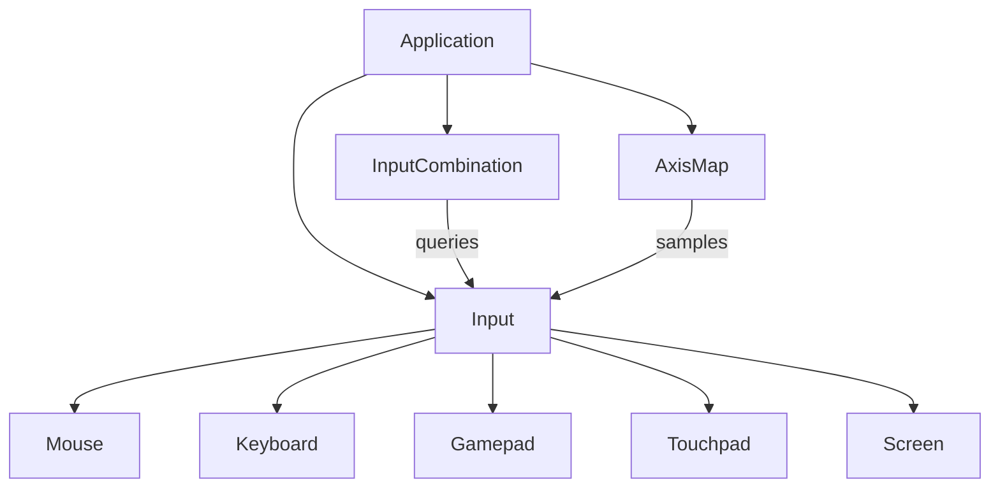
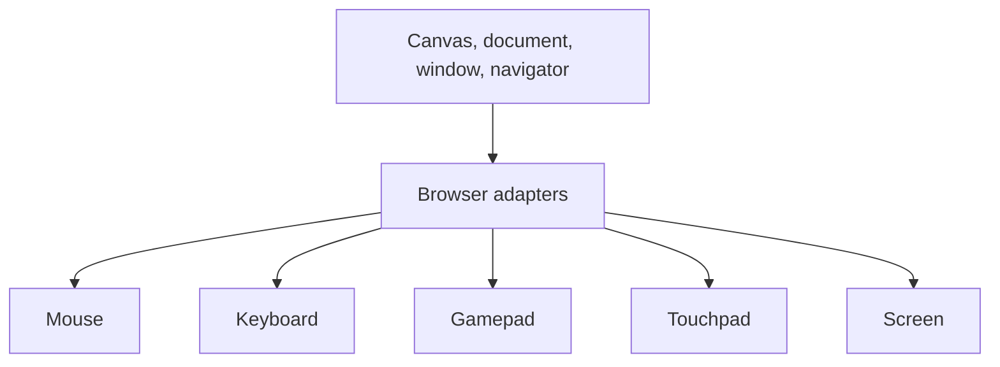

# Controls architecture

`Input` groups the controls for one canvas. It owns five devices, connects
their browser listeners, and advances input state once per frame. Each device
can also be used on its own.

## Application and Input

```mermaid
flowchart TB
    App["Application"] --> Input["Input"]
    Input --> Mouse["Mouse"]
    Input --> Keyboard["Keyboard"]
    Input --> Gamepad["Gamepad"]
    Input --> Touchpad["Touchpad"]
    Input --> Screen["Screen"]

    App --> Combinations["InputCombination"]
    App --> Axes["AxisMap"]
    Combinations -->|queries| Input
    Axes -->|samples| Input
```

## Browser adapters and devices

```mermaid
flowchart TB
    Browser["Canvas, document, window, navigator"] --> Adapters["Browser adapters"]
    Adapters --> Mouse["Mouse"]
    Adapters --> Keyboard["Keyboard"]
    Adapters --> Gamepad["Gamepad"]
    Adapters --> Touchpad["Touchpad"]
    Adapters --> Screen["Screen"]
```

`Mouse`, `Keyboard`, `Gamepad`, and `Touchpad` keep their own button, key,
axis, or touch state. `Screen` handles fullscreen state for the canvas.
Adapters give the devices access to browser APIs through narrow interfaces.

The application calls `input.connect()` to attach listeners, then
`input.update()` each frame before reading device state. `Input` also tracks
whether gamepad or mouse, keyboard, and touch input was used most recently.
Touch events are mirrored into `Mouse`, and mouse presses can complete a
pending fullscreen request in `Screen`.

`InputCombination` evaluates conditions across devices. `AxisMap` samples
device inputs into named scalar values. Both are created by the application
and read an `Input` instance; neither is owned by `Input`.

## Keyboard polling and bindings

```mermaid
flowchart TB
    Event["keydown"] --> Filter{"Editable target, guard,<br/>or suspension?"}
    Filter -->|yes| Ignored["Ignored"]
    Filter -->|no| State["Key state by code"]
    Filter -->|no| Bindings["KeyBindings.dispatch()"]
    State -->|"update()"| Polling["isDown(), wasJustPressed()"]
    Bindings --> Candidates["Bindings indexed by code<br/>and by resolved letter"]
    Candidates --> Match["KeyChord.matches()"]
    Match --> Handler["Handler, by priority"]
```

`Keyboard` reads keys two ways. Polling records state by `event.code` and
publishes it on `update()`, so gameplay checks a physical position each
frame. Bindings run synchronously on the keydown, outside the frame.

`KeyBindings` keeps two indexes: one by key code for physical chords, one by
letter for letter chords. A keydown resolves its letter from `event.key`,
falling back to `event.code` on non-Latin layouts, and collects candidates
from both indexes. Each candidate's chords are checked with
`KeyChord.matches()`, which also compares the exact modifiers. Candidates run
by priority until one handles the key.

A `KeyBindingMap` sits above the registry. It resolves each action to its
chords once, from the defaults and the overrides, and registers one binding
per action. Conflicts are found when the map is built, not on a keydown.

`KeyChord.format()` builds tooltip labels. Letter chords print their letter.
Physical chords print the QWERTY character, or the user's keycap when given
the map from `loadKeyboardLayout()`. The layout is only read for labels;
matching never depends on it.

For methods and device behavior, see the [Input API](./docs/input.md),
[key chords](./docs/key-chords.md),
[KeyBindingMap](./docs/key-binding-map.md), and [glossary](./GLOSSARY.md).
