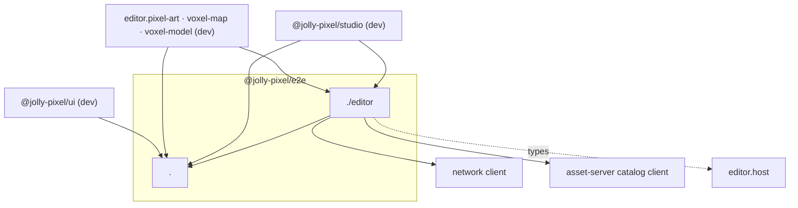

# @jolly-pixel/e2e — SPEC

Status: planned 2026-09-23. Nothing built. `PREREQUISITES.md` lands first,
then `PLAN.md`.

## Goal

One private workspace holding the Playwright code every e2e suite repeats:
config, ports, pointer and `jolly-*` locator helpers, and the editor boot
fixture. Suites keep their domain helpers. Modeled on `@jolly-pixel/bench`:
raw TS exports, no build step, consumed as a devDependency.

## Non-goals

- A page-object framework or a base editor class. The suites differ for
  real reasons; the shared layer stays readable in five minutes.
- Domain helpers: voxel cells, gizmo handles, hierarchy, pixel painting, the
  ui gallery and dock helpers, the seed encoders under each `vite/` folder.
- Test hooks in production code. Anything the suites need from an editor is
  a product contract, listed in `PREREQUISITES.md`.

## Inventory (2026-09-23)

| Workspace | e2e lines | Boot |
|---|---|---|
| ui | ~5.7k | gallery; `support/` pointer, dock, styles, events, locators |
| editors/pixel-art | ~2.2k | per-worker assets seeded in `vite.config.ts`; `utils.ts` |
| editors/voxel-map | ~1.9k | fresh world per test through `catalog.create` |
| editors/voxel-model | ~1.0k | copy of the voxel-map pattern |
| studio | 34 | one offline spec |

What repeats:

1. `playwright.config.*`: voxel-map and voxel-model identical, pixel-art and
   ui identical; the only variables are port, command, workers, viewport.
2. `constants.ts`: same shape, ports 3000 to 3004 allocated by comment.
3. Editor fixtures (voxel-map, voxel-model): catalog client lifecycle,
   `e2e/<uuid>` folder, username init script, `?target=&max-fps=` navigation,
   ready wait. They differ only in seed documents and the ready check.
4. `nextFrames`, `pressAt` and NDC → client projection in both voxel
   `support/scene.ts`; texel → client in pixel-art and voxel-map.
5. `dialog()` and `textField()` identical in both voxel `support/panels.ts`;
   the rest of those files wrap `jolly-*` elements like ui's
   `support/locators.ts`. ui's `pointer.ts` is generic.
6. The "no websocket except Vite's `token=` socket" recorder in the offline
   specs; the peer context opened and closed by hand in all three
   collaboration specs.
7. Four copy-pasted e2e jobs in `.github/workflows/node.js.yml`.

Items 4 (frames, projection) and the ready check in 3 move into product
packages through `PREREQUISITES.md`, not into this workspace.

## Package

- `packages/e2e`, `"private": true`, `"type": "module"`.
- `@playwright/test` stays a root devDependency; the package lists it as a
  peer. It adds `@jolly-pixel/network` and `@jolly-pixel/asset-server` for
  the editor entry, and `@jolly-pixel/editor.host` for types only.
- Consumers add it under `devDependencies`. ui is public; a devDependency
  does not ship.

Dependency rule: the package never imports `@jolly-pixel/ui` or an editor.
Locators match tag names and roles only. This keeps ui → e2e free of a
cycle.

## Entry `@jolly-pixel/e2e`

For every suite.

- `defineE2EConfig({ port, command, workers?, ciWorkers?, viewport?, timeout? })`:
  `testDir: "./test/e2e"`, `testMatch: "**/*.e2e.ts"`, `fullyParallel`,
  `retries: CI ? 1 : 0`, `trace: "retain-on-failure"`, `webServer` with
  `reuseExistingServer: !CI`. Returns a `PlaywrightTestConfig` the suite can
  spread and override.
- `PORTS`: one table (`pixelArt: 3000`, `ui: 3001`, `voxelMap: 3002`,
  `voxelModel: 3003`, `studio: 3004`) and `baseUrl(port)`, `socketUrl(port)`.
  Vite configs read the same table for `server.port`.
- Pointer: `boxOf`, `centerOf`, `widthOf`, `heightOf`, `hold`, `dragTo`,
  `scrubBy`, `pressAt(page, points, button?)`. Moved from ui.
- Locators: `dialog`, `titledDialog`, `dialogTitle`, `textField`,
  `selectField`, `checkboxField`, `buttonGroup`, `treeRow`, `fieldRow`.
- `recordSockets(page)`: websocket URLs opened by the page, Vite's HMR
  socket excluded.

## Entry `@jolly-pixel/e2e/editor`

For editors and studio. Assumes T1 to T3 from `PREREQUISITES.md`.

- `withCatalog(socketUrl, fn)`: opens a network client and a
  `CatalogClient`, awaits `ready`, runs `fn`, disposes both.
- `e2eFolder()`: `e2e/<uuid>`.
- `openEditor(page, { target?, username?, maxFps?, query? })`: navigates
  with `target`, `username`, `max-fps` and extra query entries, then waits
  for `data-editor-state="ready"`. No editor-specific code.
- `editorFixture({ socketUrl, create })`: a `test.extend` with an auto
  fixture that runs `create(catalog)` and opens the editor on the returned
  target. Suites pass their seed documents; the type of the created record
  flows to the tests.
- `peer`: a fixture opening a second browser context on the same target
  under the username `Peer`, closed on teardown.
- `editorHandle(page)`: `JSHandle` on `window.jollyEditor`, typed as
  `EditorHandle`. Frame waits call `runtime.nextFrame()` through it.

## Per-suite result

| Suite | Keeps | Drops |
|---|---|---|
| ui | gallery, dock, styles, events helpers | config body, pointer, locators |
| voxel-map | scene cells, texture panel helpers, seeds | config, constants, fixture body, panels locators, `nextFrames` |
| voxel-model | hierarchy, gizmo, block helpers, seeds | same as voxel-map |
| pixel-art | painting, UV, file helpers | config, constants, `openDemo`/`waitForDemo`, `resetCanvas` once on catalog assets |
| studio | its spec | config, the tree cast |

## CI

One `e2e` job with a matrix over `{ filter, changesOutput, artifactPath }`
replaces the four jobs. The voxel-map and voxel-model entries keep their
`if: false` until their CI timeouts are fixed; the matrix does not change
that.

## Open questions

- Whether pixel-art keeps per-worker seeded assets. Moving to per-test
  `catalog.create` drops `resetCanvas` and the seeding in `vite.config.ts`,
  but changes its isolation model and fixture cost.
- Whether a suite may still read its concrete editor global after T2, or
  must go through `jollyEditor` plus a cast.
