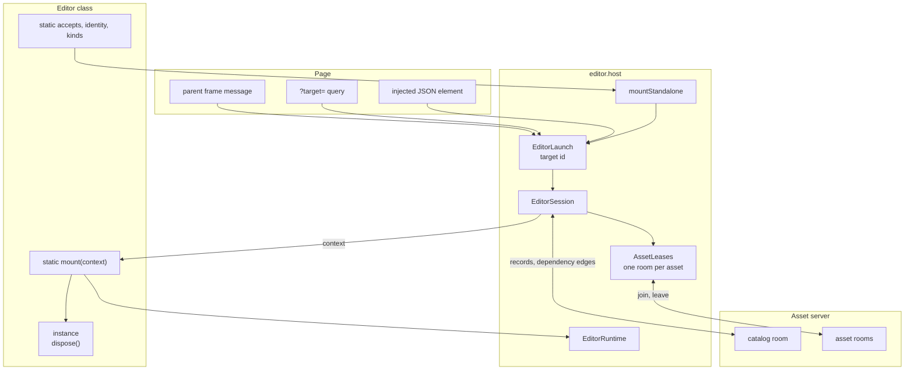
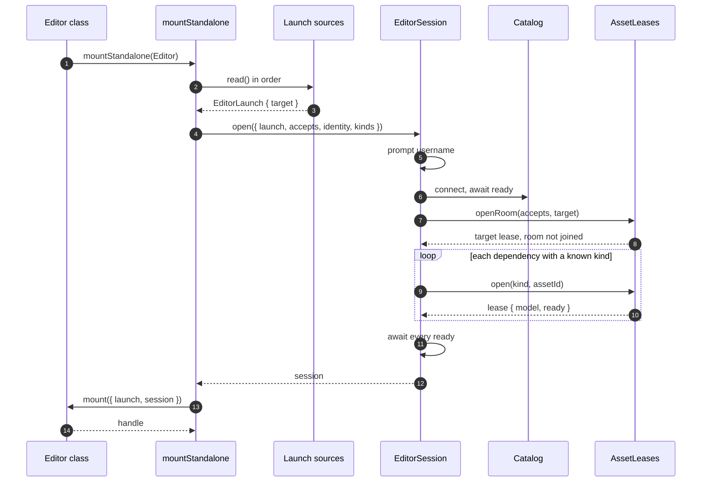
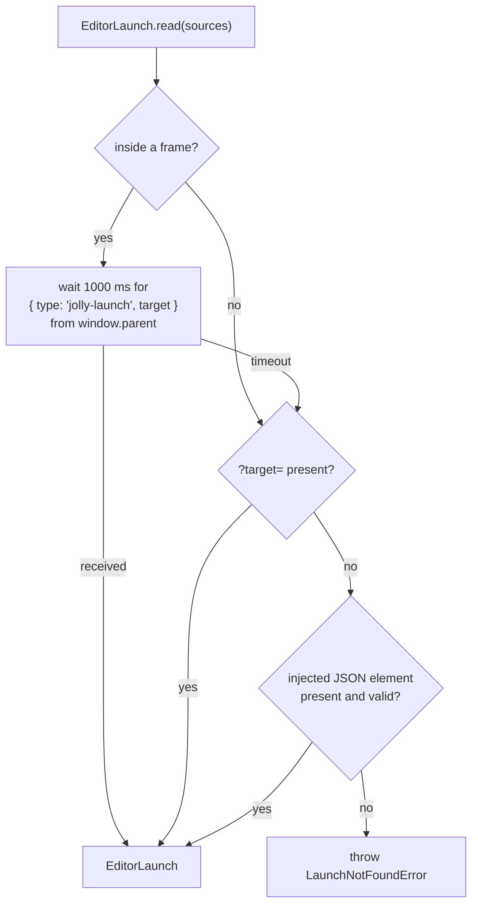
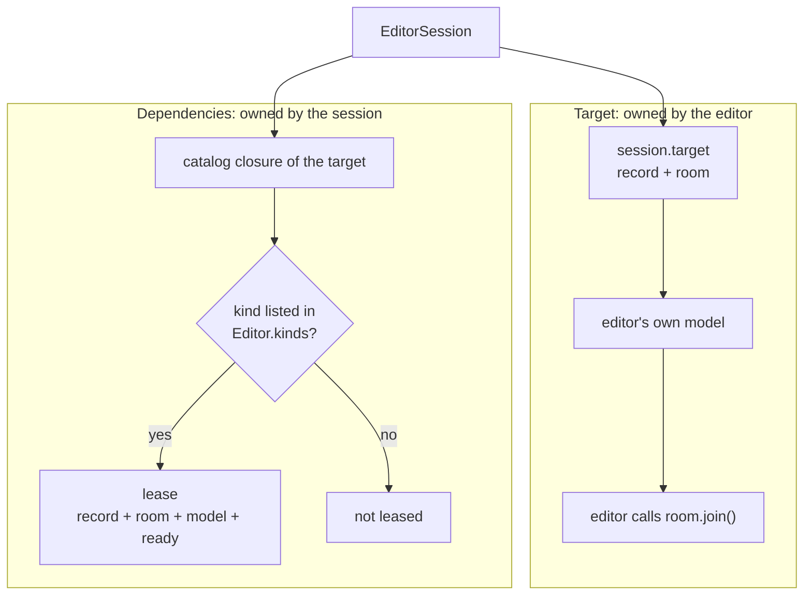
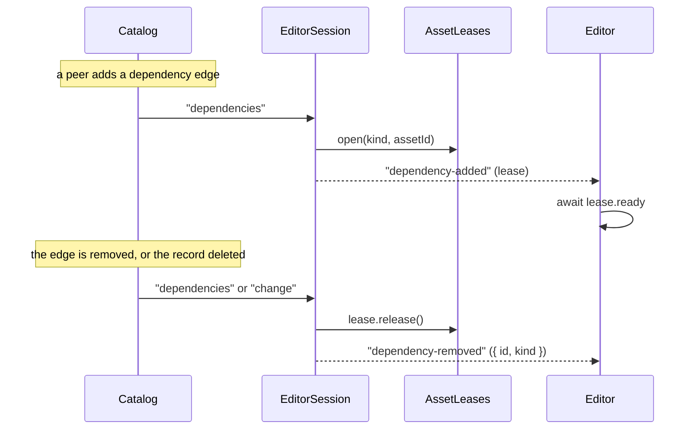
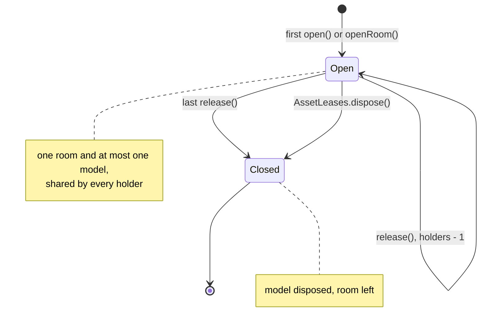
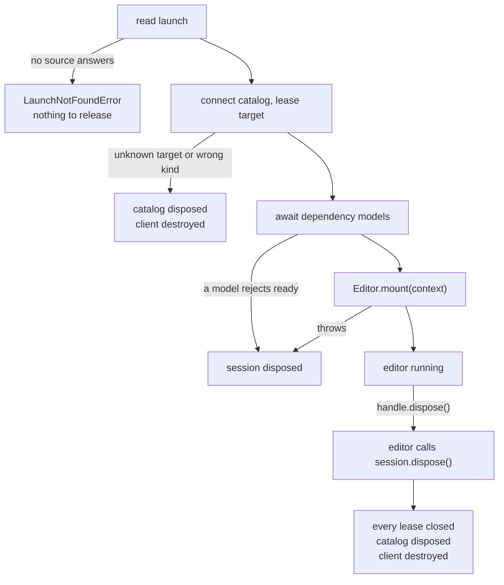
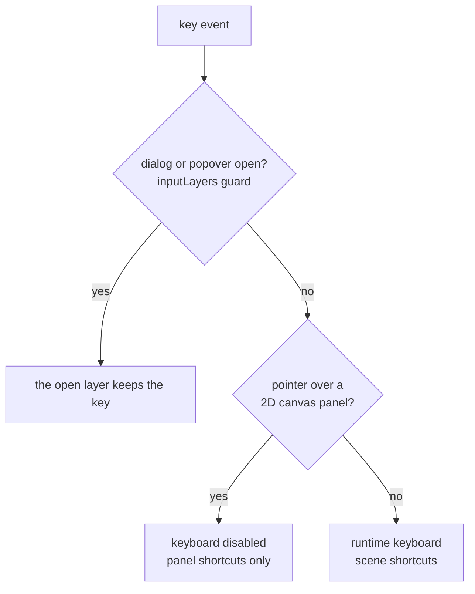
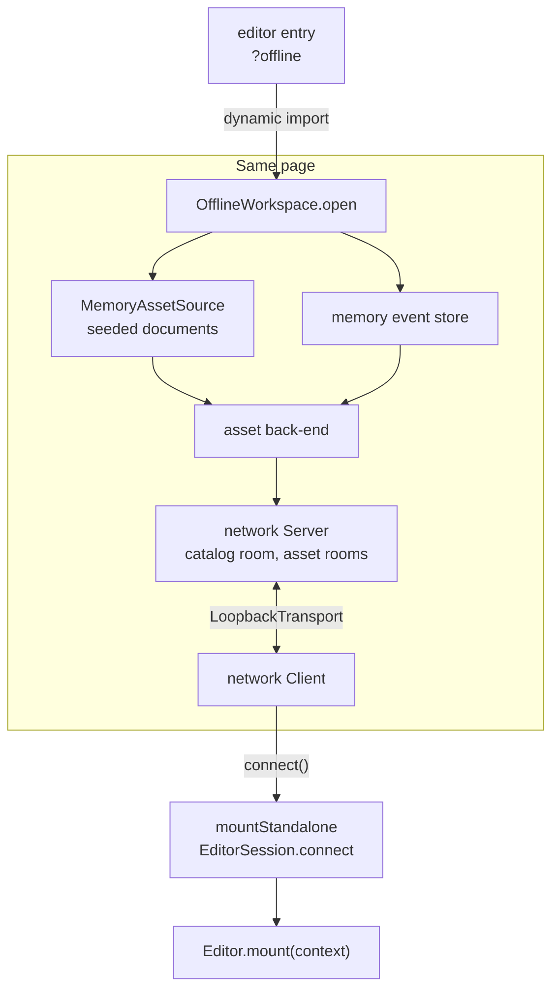

# Architecture

`@jolly-pixel/editor.host` is the part every editor shares: it finds the asset
to open, connects to the asset server, keeps the asset's dependencies loaded
and hands the result to the editor. The words used here are defined in the
[glossary](./GLOSSARY.md).

## System map

The host owns everything above `mount`. The editor owns its scene, its panels
and the model of the asset it edits.

## Boot

`mount` starts with every dependency model already synced. The target is the
exception: the session only reserves its room.

## Finding the target

The first source that answers wins. A page outside a frame skips the wait, so
a plain tab boots without the timeout. The injected element is written by the
asset workspace Vite plugin's `launch` option.

## Target and dependencies

The session never builds the target model because each editor syncs its target
differently. It builds dependency models from the `AssetModelKind` objects in
`kinds`, and joins their rooms itself.

## Following the catalog

Only the boot waits for `ready`. A lease announced by `dependency-added` may
still be syncing.

## Lease lifecycle

A panel that opens its own lease on a dependency keeps the model alive after
the session drops the edge. The entry remembers how it was first opened:

| First opened with | Then `openRoom` | Then `open(sameKind)` | Then `open(otherKind)` |
|---|---|---|---|
| `open(kind)` | shares | shares | `AssetModelConflictError` |
| `openRoom` | shares | `AssetModelConflictError` | `AssetModelConflictError` |

## Failure and teardown

After a successful `mount` the session belongs to the editor: the host never
disposes it again.

## Runtime keyboard

`EditorRuntime.create` installs the guard. The hover branch exists only after
the editor calls `suspendKeyboardOnHover`.

## Offline

Offline swaps the transport and the storage, nothing else: the session, the
leases and the editor are the online ones. The username prompt is skipped for
a guest identity. Disposing the session destroys the client, which closes the
workspace.
