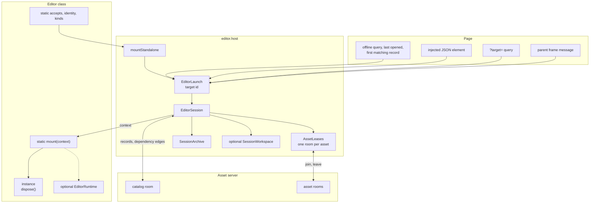
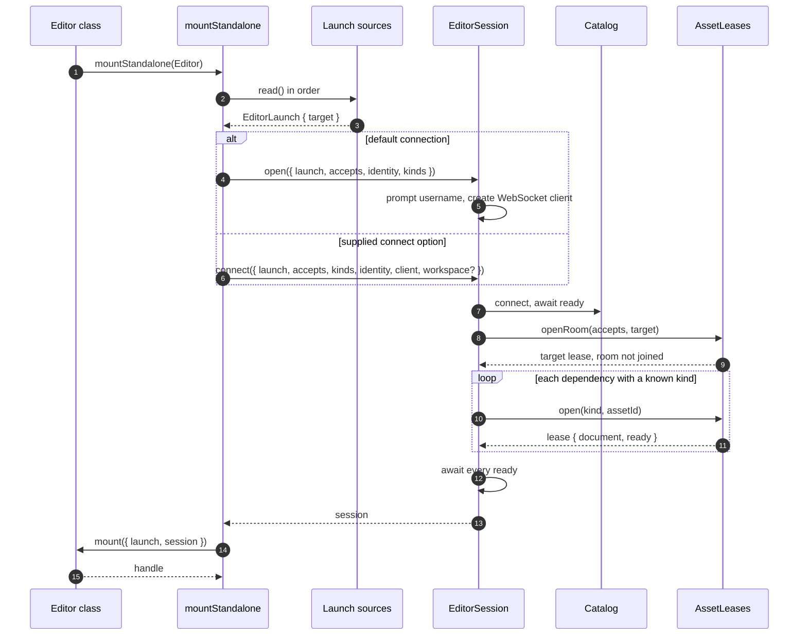
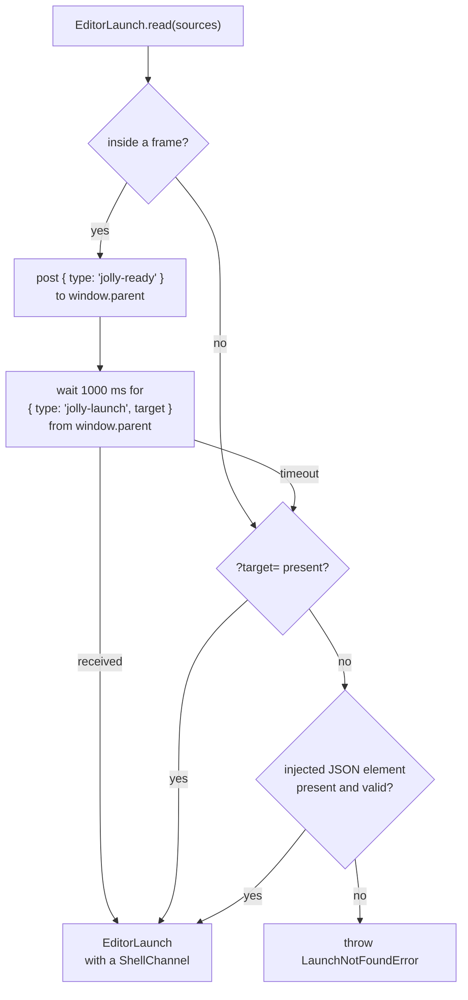
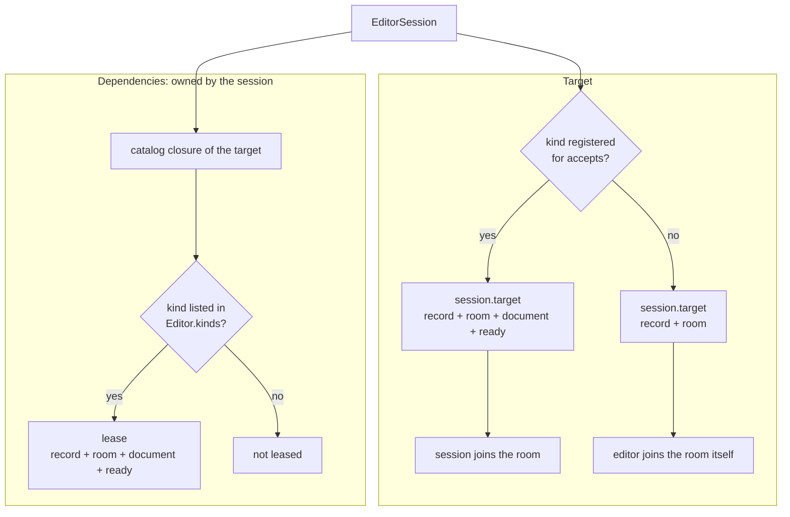
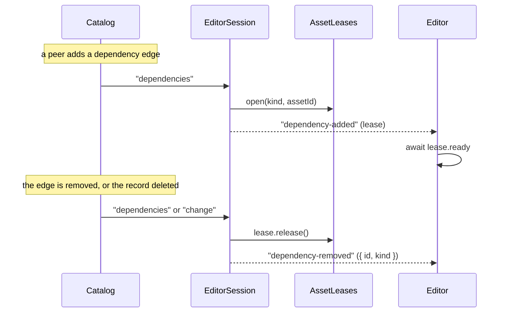
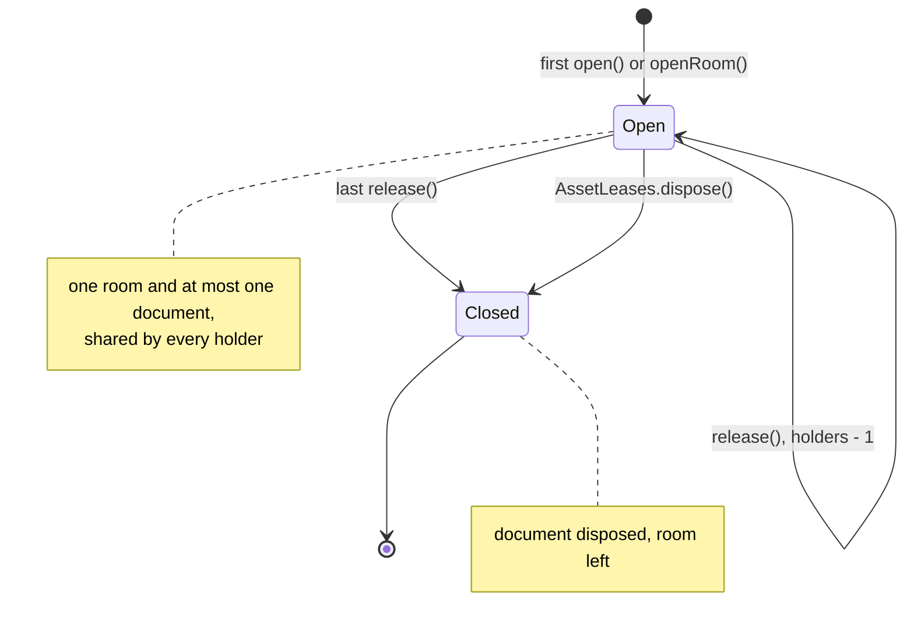
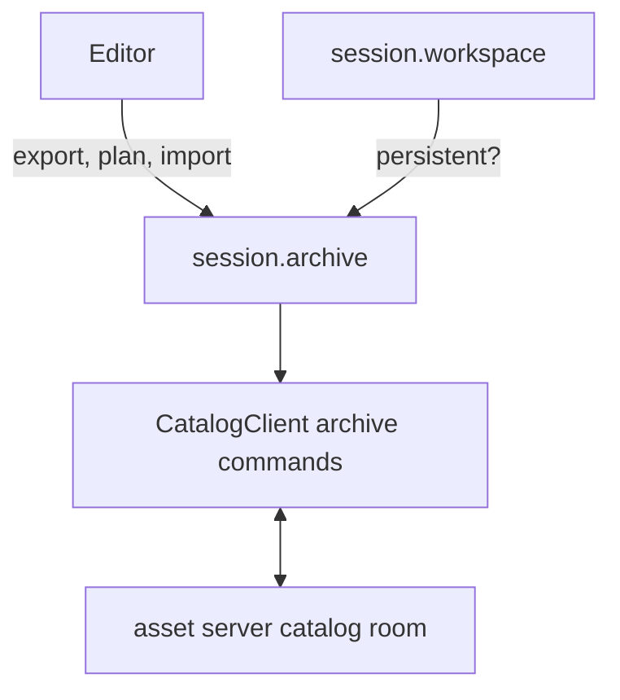
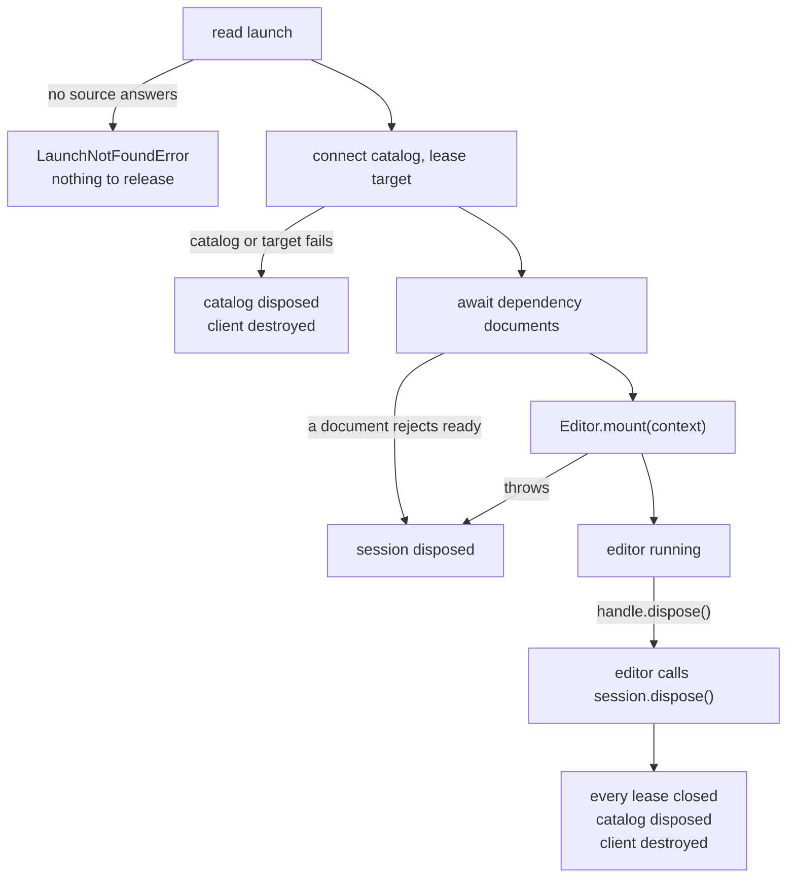
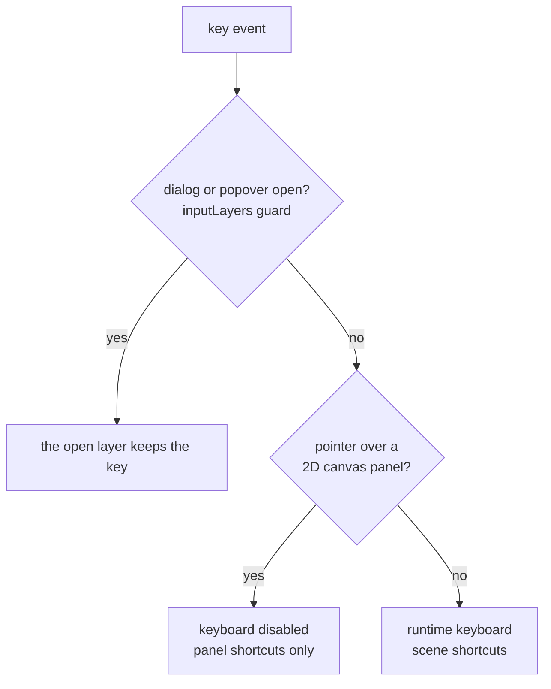
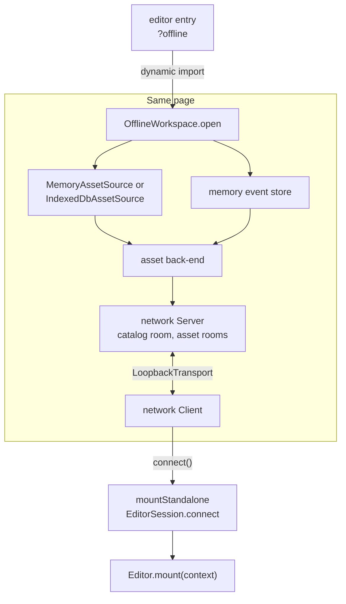

# Architecture

`@jolly-pixel/editor.host` is the part every editor shares: it finds the asset
to open, connects to the asset server, keeps the asset's dependencies loaded
and hands the result to the editor. The words used here are defined in the
[glossary](./GLOSSARY.md).

## System map

The host owns launch resolution and session setup. After `mount` succeeds, the
editor owns the returned session and decides whether to create an
`EditorRuntime`. The editor also owns its scene, panels, and target document.

## Boot

`mount` starts with every dependency document already synced. The target is the
exception: the session only reserves its room. The `connect` option supplies an
identity and client instead of the default username prompt and network client.
It may also supply a `SessionWorkspace`. `mountStandalone` exposes the handle on
`globalThis` when `debugHandle` is set. For a workspace-backed session it also
remembers the successfully opened target for the next launch.

## Finding the target

The first source that answers wins. A page outside a frame skips the wait, so
a plain tab boots without the timeout. The injected element is written by the
asset workspace Vite plugin's `launch` option. Only a launch answered by the
parent carries a `ShellChannel`, reachable as `context.shell`, through which
the editor posts `jolly-shell` commands such as `open-asset` back to the
parent.

`mountStandalone({ sources })` replaces this list. Offline workspaces provide
their own list: `?target=`, the last opened ID if the catalog still has it with
the accepted kind, then the first catalog record of that kind. If no source
returns a target, `EditorLaunch.read` throws before a client is created.

## Target and dependencies

The session builds the target document when the editor registered a document
kind for `accepts`, and leaves the target room-only otherwise, for editors that
sync it themselves. It builds dependency documents from the same
`AssetDocumentKind` objects in `kinds`, and joins their rooms itself. `AssetLeases` checks the catalog record
exists and has the requested kind before opening a room. A dependency is used
only when its reference kind matches its current record kind and the editor
registered a document kind for it.

The session exposes `target`, `catalog`, `assets`, `identity`, `archive`, and
`workspace` (`null` for the default server connection). Editors can read the
current dependencies with `dependencies()` or `dependency(assetId)`. These are
frozen views without `release()`: the session owns those leases. A panel that
needs a longer lifetime opens its own lease through `session.assets`.

## Following the catalog

Only the boot waits for the readiness promises in its initial dependency
snapshot. A lease announced by `dependency-added` may still be syncing. After
awaiting it, check that `session.dependency(id)` is still that view; an edge
could have been removed or replaced meanwhile. On each catalog change the
session acquires newly wanted leases, releases removed ones, updates its map,
then emits removal and addition events. If an acquisition throws, it releases
the leases opened in that pass and keeps the previous dependency set.

## Lease lifecycle

A panel that opens its own lease on a dependency keeps the document alive after
the session drops the edge. The entry remembers how it was first opened:

| First opened with | Then `openRoom` | Then `open(sameKind)` | Then `open(otherKind)` |
|---|---|---|---|
| `open(kind)` | shares | shares | `AssetDocumentConflictError` |
| `openRoom` | shares | `AssetDocumentConflictError` | `AssetDocumentConflictError` |

The document kind comparison is by object identity. Reuse the same kind object in
the editor's `kinds` and in later `assets.open` calls. A room-only lease does
not join the room; a document lease creates its document and joins on first
open.
`release()` is idempotent for each holder, and `AssetLeases.dispose()` closes
all entries, including leases still held by panels.

## Archives and workspace capability

`session.archive` sends archive operations through the catalog connection for
both online and offline sessions. `export(assetId?)` returns a ZIP `Blob` for
one asset and its referenced assets, or for the whole catalog when no ID is
given. `plan(file)` reports import conflicts without writing. `import(file, {
onConflict })` performs the import and returns a report. A memory-backed
workspace sets `archive.canImport` to `false`; `import` then throws
`ArchiveImportDisabledError`. Default server sessions and persistent offline
workspaces allow import. See the [archive API](./docs/EditorSession.md#archives)
and the [archive format](../../asset-server/docs/Archive.md).

`session.workspace` is the optional capability supplied by a custom
connection. It reports `persistent` and offers `reset()`. For
`OfflineWorkspace`, reset closes the workspace and deletes its IndexedDB
database when one exists.

## Failure and teardown

After a successful `mount` the session belongs to the editor: the host never
disposes it again. The editor handle's `dispose()` must dispose the session.
Session disposal removes catalog listeners, closes all leases, disposes the
catalog client, and destroys the network client. For an offline connection,
destroying that client also starts workspace closure.

## Runtime keyboard

`EditorRuntime.create` wraps `Runtime.create` and installs the input-layer
guard. `load` starts a scene without a loading screen and can set `maxFps`.
The hover branch exists only after the editor calls `suspendKeyboardOnHover`.
Overlapping hover bindings keep the runtime keyboard suspended until the last
one releases it. `PeerFrustums` is a separate actor component for peer camera
poses, labels, and frustum display; editors add it to their scenes as needed.

## Offline

`OfflineWorkspace.open` starts an asset back-end and network server in the
page. It uses a loopback client and a guest identity, so the same catalog,
session, leases, and editor mounting path work without the remote server.
The offline code is reached through the separate `./offline` entry point so
an online entry point can load it only when needed.

Storage defaults to memory. With `storage: "indexeddb"`, the asset source
persists documents and IDs under `jolly-workspace:<name>` (`default` if no
name is supplied). The event store remains in memory. On reopening, the
back-end reconciles from stored files; the workspace clears its projection
checkpoint before doing so. Seeds are applied only when the source is empty.
Persistent storage uses delayed snapshots and flushes on page visibility
changes and page hide. Closing flushes and stops the back-end and server.

An IndexedDB workspace holds a Web Lock for its database name when the browser
supports the Locks API. Direct `OfflineWorkspace.open` falls back to memory
when another tab owns the database. `openSharedTabWorkspace` instead connects
the second tab to the owner over BroadcastChannel with the network package's
`ChannelTransport`, forwarding the existing network room protocol. The owner
alone writes IndexedDB. If Web Locks are unavailable, the shared opener uses
memory storage. A memory workspace can export and plan an archive, but cannot
import one. Disposing a session destroys its client; the owner stays open while
other tabs use it.
