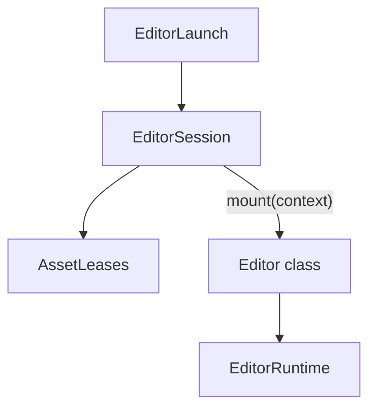

<h1 align="center">
  editor.host
</h1>

<p align="center">
  Shared launch, session and runtime boot for JollyPixel editors
</p>

## 💃 Getting Started

This workspace-private package is never published. Add it as a dependency of
an editor workspace:

```json
{
  "dependencies": {
    "@jolly-pixel/editor.host": "workspace:*"
  }
}
```

## 💡 About

An editor opens one asset, its target. The host reads the target from the
page, connects a session to the asset server, leases the target's
dependencies with synced models and hands the result to the editor's `mount`.



[Editor boot](./docs/concepts/editor-boot.md) walks through each step and
what a failure releases.

## 👀 Usage example

```ts
import {
  EditorRuntime,
  mountStandalone,
  type EditorContext
} from "@jolly-pixel/editor.host";
import { pixelArtModelKind } from "@jolly-pixel/asset.pixel-art/network/client.ts";

class MyEditor {
  static readonly accepts = "voxelmap";
  static readonly identity = { title: "Join voxel map" };
  static readonly kinds = [pixelArtModelKind()];

  static async mount(
    context: EditorContext
  ): Promise<MyEditor> {
    const editorRuntime = await EditorRuntime.create("#canvas");
    await editorRuntime.load(new MyScene(context.session.target.room));

    return new MyEditor(context);
  }

  // ...

  dispose(): void {
    this.session.dispose();
  }
}

await mountStandalone(MyEditor, {
  debugHandle: "myEditor"
});
```

## 📚 API

### Boot

- [`mountStandalone`](./docs/api/mountStandalone.md): boots an editor class
  that satisfies `EditorDefinition`.
- [`EditorLaunch`](./docs/api/EditorLaunch.md): the target to open, and the
  launch sources that read it.
- [`DevOptions`](./docs/api/DevOptions.md): typed query-string switches, and
  `exposeDebugHandle`.

### Session

- [`EditorSession`](./docs/api/EditorSession.md): catalog connection, target
  lease and live dependency closure.
- [`AssetLeases`](./docs/api/AssetLeases.md): ref-counted rooms and synced
  models per asset.

### Runtime

- [`EditorRuntime`](./docs/api/EditorRuntime.md): runtime boot with the
  editor keyboard policy.
- [`PeerFrustums`](./docs/api/PeerFrustums.md): peer camera frustums as an
  actor component.

### State

- [`EditorStore`](./docs/api/EditorStore.md): typed emitter whose `watch`
  returns its own unsubscribe.

The reference also covers [package errors](./docs/api/errors.md).

## ✨ Contributors guide

If you are a developer **looking to contribute** to the project, you must first read the [CONTRIBUTING][contributing] guide.

Once you have finished your development, check that the tests (and linter) are still good by running the following script:

```bash
pnpm --filter @jolly-pixel/editor.host test
pnpm run lint
```

## 📃 License

MIT

<!-- Reference-style links for DRYness -->

[contributing]: ../../../CONTRIBUTING.md
