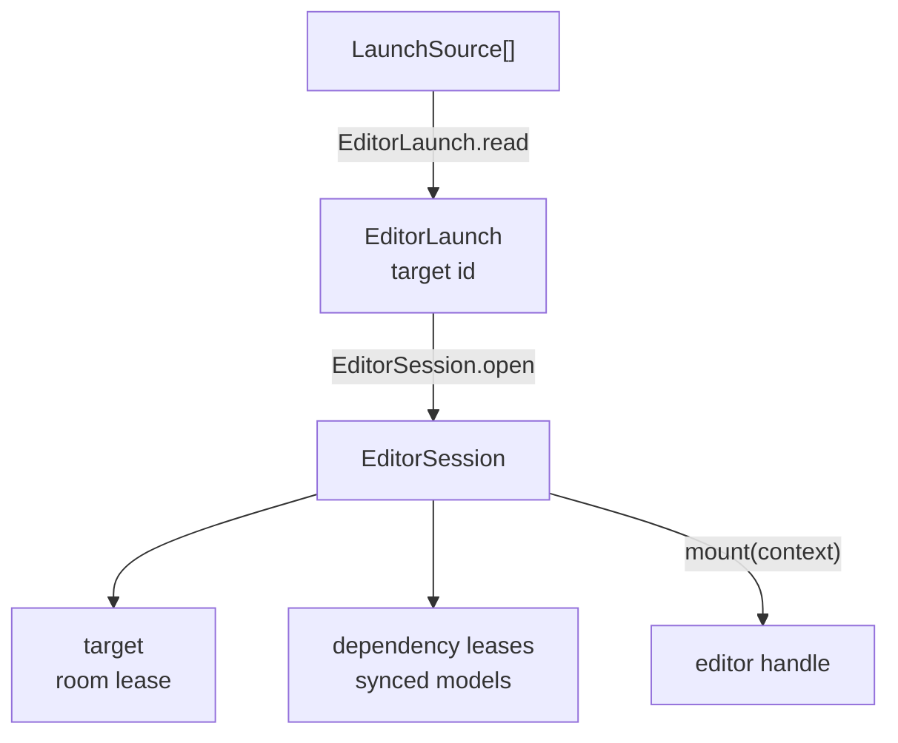

# Editor boot

A standalone editor boots in four steps, all driven by
[`mountStandalone`](../api/mountStandalone.md):

## Launch

The launch names one asset, the target. Sources are asked in order and the
first one that answers wins: the parent frame's `jolly-launch` message, the
`?target=` query parameter, then the JSON element injected by the asset
workspace Vite plugin. Outside a frame the host message source answers
nothing at once, so a plain page does not wait for its timeout.

## Session

The session prompts for the username (kept per tab under
`jolly-pixel:username`), connects the network client and waits for the
catalog. It checks that the target exists and has the kind the editor
accepts.

The target is leased room-only and is not joined. The editor owns the target
model: it attaches it to `session.target.room` and joins the room itself.

Every asset of the target's dependency closure whose kind appears in the
editor's `kinds` is leased with a synced model, and `open` resolves once all
of them are ready. From then on the session follows the catalog: a new edge
leases the asset and emits `dependency-added`, a removed edge or a deleted
record releases it and emits `dependency-removed`.

## Leases

Leases are ref-counted per asset, so a panel that opens its own lease on a
dependency keeps the model alive after the session drops the edge. The last
release disposes the model and leaves the room.

## Failure

A failure at any step releases what the earlier steps opened: a missing
target destroys the client, a dependency that never gets ready disposes the
whole session, and a `mount` that throws disposes the session.
