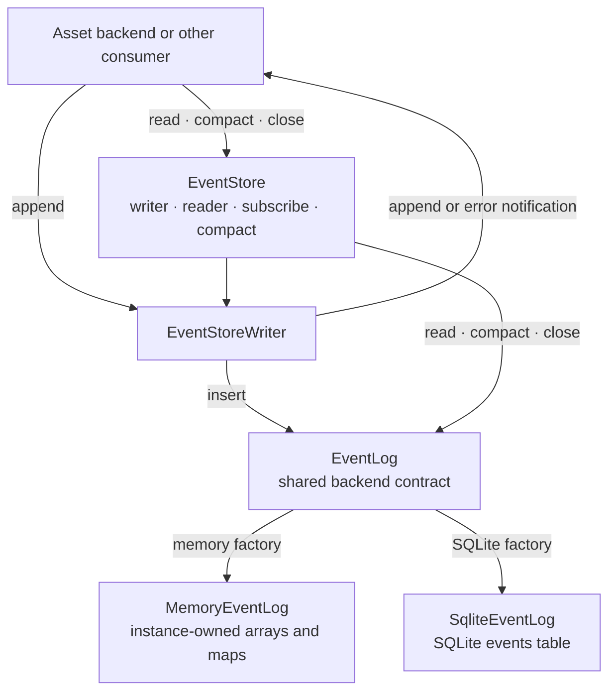
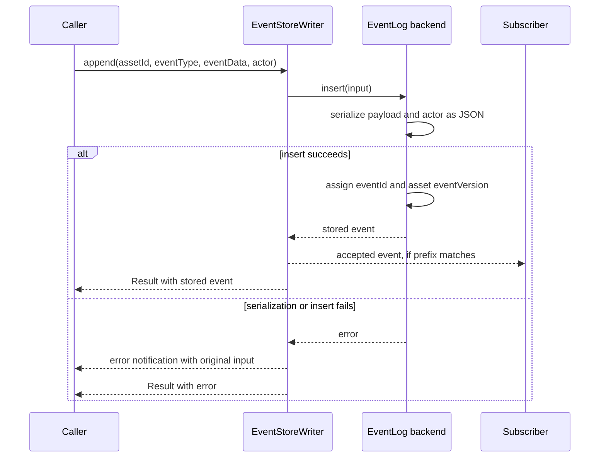
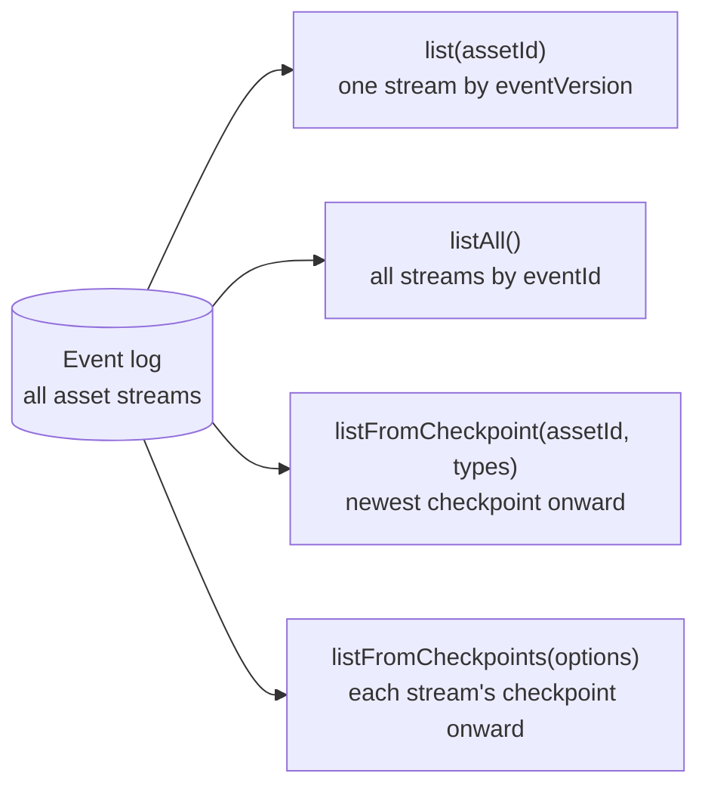
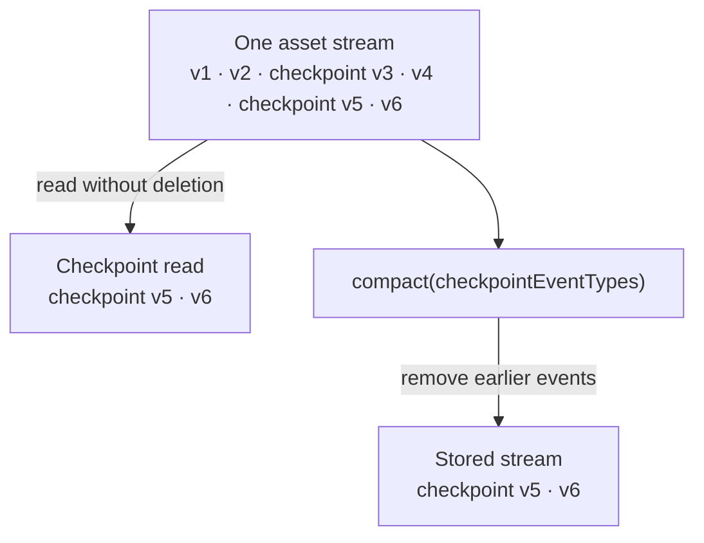

# Event store architecture

The event store records an ordered history for each asset. It assigns an ID
across the whole log and a version within each asset stream. Consumers decide
what events mean and how to rebuild state from them.

## Workspace map

`createEventStore` connects an `EventStoreWriter` and an `EventLog`. The writer
returns a `Result` for each append and emits `append` or `error`. `subscribe`
listens to accepted appends, optionally filtering by a literal event type
prefix. It does not replay earlier events; a consumer reads history to build
its initial view.

An optional schema map checks `eventType` and `eventData` when appending at the
TypeScript boundary. Reads still return `Event` with an `unknown` payload, so
consumers validate stored data before treating it as a typed domain event.

| Backend | Factory | Storage | Runtime |
|---|---|---|---|
| Memory | `persistence.memory()` | One store instance | Browser or Node.js |
| SQLite | `await persistence.sqlite(location?)` | SQLite connection, optionally backed by a file | Node.js |

The main entry loads the Node-only SQLite backend when its factory is called.
The separate `@jolly-pixel/event-store/sqlite` entry exposes the SQLite factory,
log, and schema directly.

## Appending an event

`eventId` orders accepted events across all assets. `eventVersion` increases
within one asset stream. Each event also records `assetType`, `eventType`,
`eventData`, `actor`, and `createdAt`. Both backends store JSON values rather
than references to the caller's objects; a rejected append consumes neither
position. Subscriber callbacks run after the backend accepts an event.

## Reading history

`list` can exclude versions at or below `fromVersion`. `listAll` can exclude
IDs at or below `fromEventId`, filter by event type prefix, and limit the
result. Checkpoint reads retain each stream's newest matching checkpoint and
every later event. A stream without a matching checkpoint remains whole. The
multi-stream form returns surviving events in global `eventId` order; its
prefix filter applies after the checkpoint boundary is chosen.

## Checkpoints and compaction

The caller supplies checkpoint event types because only the consumer knows
which events can replace earlier state. `compact` permanently removes events
before the newest matching checkpoint in each asset stream. Streams without a
checkpoint stay intact. Surviving IDs and versions do not change, and the
report counts removed events and assets with checkpoints. SQLite can run
`VACUUM` after a deletion when `reclaim` is true; the memory backend has no
file to reclaim.

Details: [API and data model](./docs/EventStore.md),
[memory persistence](./docs/Memory.md), [SQLite persistence](./docs/Sqlite.md),
and [glossary](./GLOSSARY.md).
