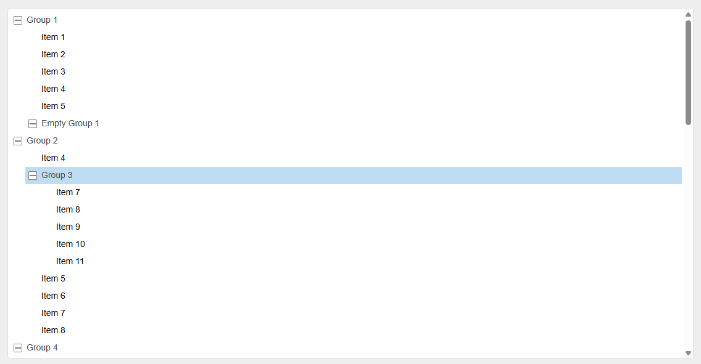

<h1 align="center">
  fs-tree
</h1>

<p align="center">
  A modern fork/re-implementation of <a href="https://github.com/sparklinlabs/dnd-tree-view">dnd-tree-view</a> from Sparklin Labs, rewritten to be fully compatible with the Web Platform using <code>EventTarget</code> and native <code>ES2022</code> features.
</p>

<p align="center">

</p>

## 💃 Getting Started

This package is available in the Node Package Repository and can be easily installed with [npm][npm] or [yarn][yarn].

```bash
$ npm i @jolly-pixel/fs-tree
# or
$ yarn add @jolly-pixel/fs-tree
```

## 👀 Usage example

```ts
import { TreeView } from "@jolly-pixel/tree-view";

const container = document.getElementById(
  "tree"
) as HTMLDivElement;

const tree = new TreeView(container, {
  multipleSelection: true,
  dragStartCallback(event, node) {
    // Optional: cancel drag for some nodes
    console.log("Dragging", node.textContent);

    return true;
  },
  dropCallback(event, location, nodes) {
    // Optional: handle drop and return false to cancel move
    console.log("Dropped", nodes, "at", location);

    return true;
  }
});

const group = document.createElement("li");
group.textContent = "Group A";

const item = document.createElement("li");
item.textContent = "Item A.1";

tree.append(group, "group");
tree.append(item, "item", group);
```

Then you can include a minimal stylesheets

```css
.tree {
  list-style: none;
}

.tree .group > .toggle::before {
  content: "▸";
  display: inline-block;
  margin-right: 5px;
  cursor: pointer;
}

.tree .group.collapsed > .toggle::before {
  content: "▾";
}
```

## 📚 API

- [TreeView](./docs/TreeView.md)

## 🎨 Custom theme

🚧 Integrated stylesheets are coming in a future release

- Dark
- Light

## ✨ Contributors guide

If you are a developer **looking to contribute** to the project, you must first read the [CONTRIBUTING][contributing] guide.

Once you have finished your development, check that the tests (and linter) are still good by running the following script:

```bash
$ npm run test
$ npm run lint
```

> [!CAUTION]
> In case you introduce a new feature or fix a bug, make sure to include tests for it as well.

### 🚀 Running the examples

One interactive example live in the `examples/` directory and are served by Vite. Start the dev server from the package root:

```bash
npm run preview -w @jolly-pixel/fs-tree
```

## 📃 License

MIT

<!-- Reference-style links for DRYness -->

[npm]: https://docs.npmjs.com/getting-started/what-is-npm
[yarn]: https://yarnpkg.com
[contributing]: ../../CONTRIBUTING.md
