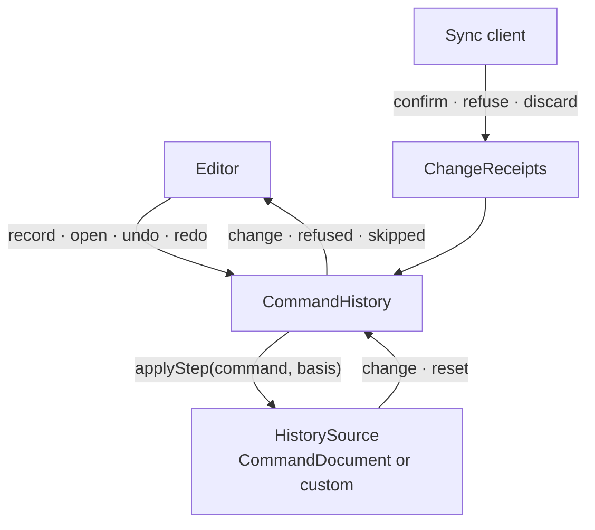
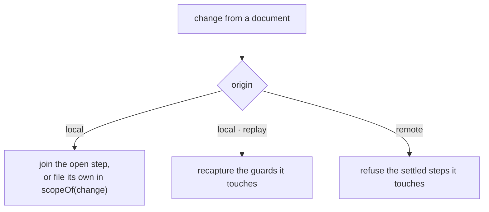
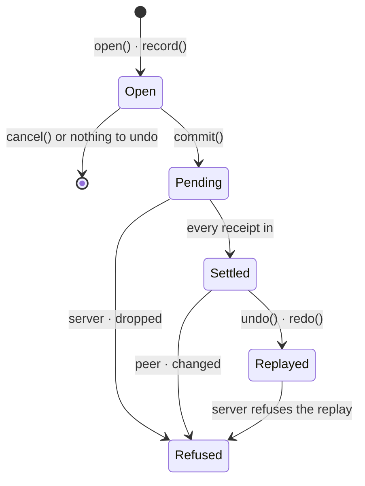
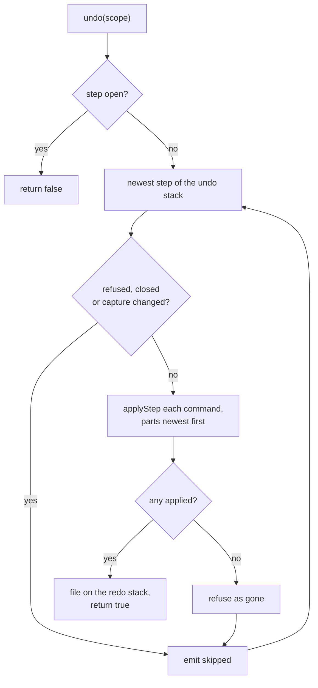

# History architecture

`CommandHistory` listens to registered documents, groups their local changes
into steps, and undoes a step by applying its inverse commands as new local
edits. A step a peer has overwritten is refused, never half undone.

History never talks to the server: a sync client sends the undo like any other
local edit, and reports the server's answers through the document's receipts.

| Folder | Holds |
| --- | --- |
| `src/document` | `CommandDocument`, the `CommandChange` it emits and the `ChangeReceipts` a sync client writes |
| `src/history` | `CommandHistory`, `HistoryScopes` holding one `ScopeStacks` (undo and redo) per scope, `HistoryStep` with one `HistoryPart` per document and its `PartBasis`, `HistoryRegistration` and `KeyedGuard` |

## Incoming changes

| Event | Effect |
| --- | --- |
| `reset("load")` | refuses as `changed` the settled steps whose capture no longer holds |
| `reset("rewind")` | ignored, the pending commands replay right after |
| a change without inverse | joins no step |

## Step lifecycle

- Without a sync client attached, a committed step is settled at once.
- Filing compacts each part and captures its guard; it also clears the redo stack.
- A replay is a new step on the other stack. If the server refuses it, it goes
  away and the original comes back refused.
- A step with no confirmed change yet replays with `basis` 0.

## Undo

Every check passes or the whole step is skipped. Redo is the same with the stacks swapped.

## Receipts

| Receipt | Effect on the step |
| --- | --- |
| `confirmed(change, version)` | the change stops waiting; `basis` becomes the newest version |
| `refused(change)` | refused as `server` |
| `discarded()` | every step still pending on that document is refused as `dropped` |

See the [API docs](./README.md#-api) and the [glossary](./GLOSSARY.md) for
details.
