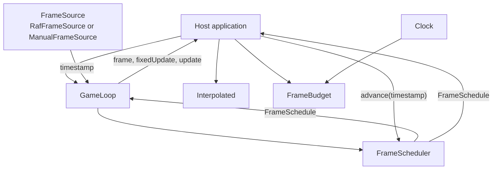
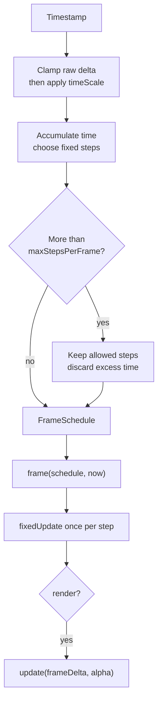

# Loop architecture

`FrameScheduler` turns frame timestamps into fixed simulation steps and a
render decision. `GameLoop` connects it to a frame source and calls the host's
callbacks. A host with its own frame pump can use `FrameScheduler` directly.

`FrameSource` only supplies timestamps; it does not cap the frame rate.
`RafFrameSource` uses `requestAnimationFrame`. `ManualFrameSource` uses a
`ManualClock` and emits frames on demand, including a zero-delta frame when
started. `FrameBudget` measures a deadline for optional work and is separate
from the scheduler's fixed-step limit. The host owns any `Interpolated` values
and pushes a new sample after each fixed step.

## One frame

The first `advance()` has zero delta and permits rendering. Later calls clamp
long wall-clock gaps before applying `timeScale`. The scheduler runs at most
`maxStepsPerFrame` fixed steps; when more are due, it discards the remaining
accumulator and reports `panicked` with `droppedMs`. The separate `maxFps` cap
can skip `update`, while fixed steps still run. `alpha` is the unconsumed
fraction of a fixed step and can be passed to `Interpolated.at()`.

`GameLoop` emits `clamp` and `panic` before calling `frame`, then calls
`fixedUpdate` for each scheduled step and `update` only when rendering is due.
Pausing sets the scheduler's effective `timeScale` to zero, so source frames
and rendering continue without simulation steps.

For API details, see [FrameScheduler](./docs/framescheduler.md),
[GameLoop](./docs/gameloop.md), [FrameSource](./docs/framesource.md),
[Interpolated](./docs/interpolated.md), [FrameBudget](./docs/framebudget.md),
and the [glossary](./GLOSSARY.md).
