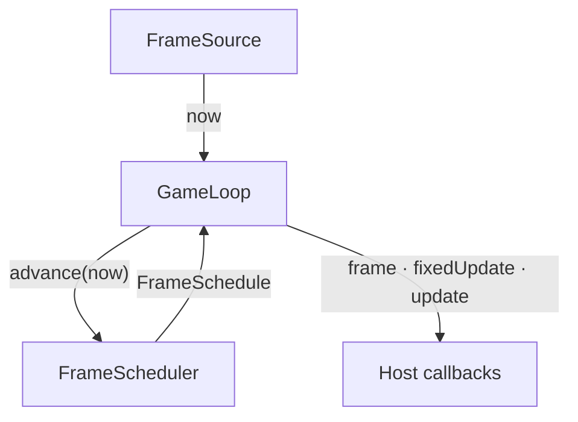
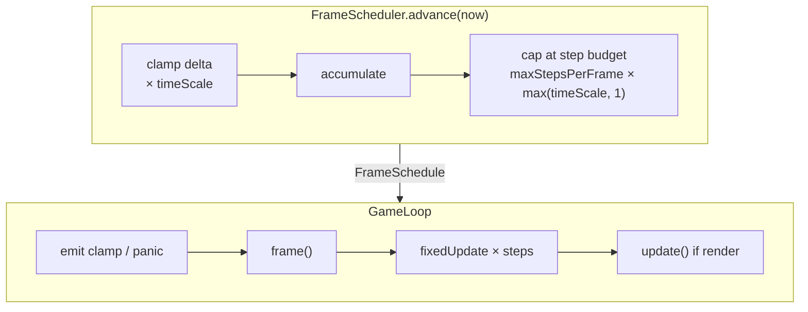
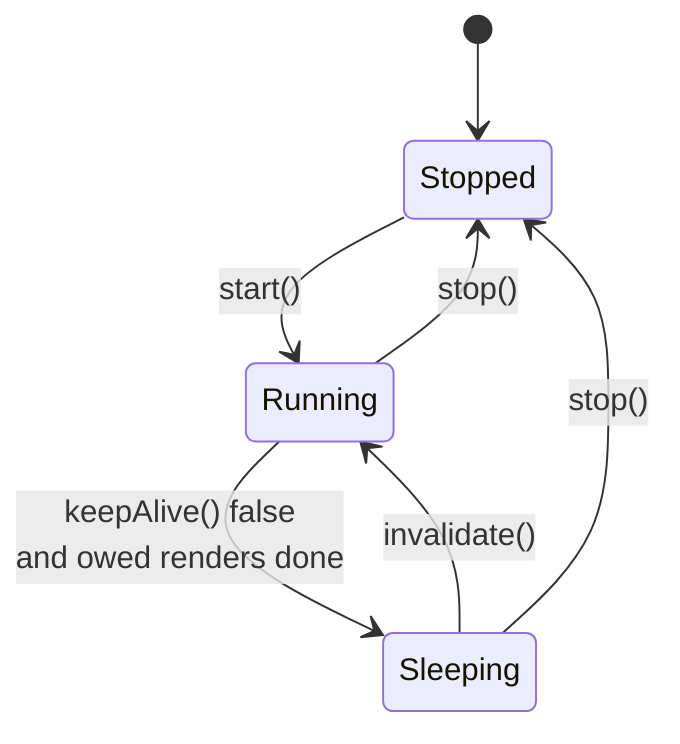

# Loop architecture

`FrameScheduler` turns frame timestamps into fixed steps and a render decision.
`GameLoop` connects it to a frame source and calls the host's callbacks.

```mermaid
flowchart TB
    Source["FrameSource"] -->|"now"| Loop["GameLoop"]
    Loop -->|"advance(now)"| Scheduler["FrameScheduler"]
    Scheduler -->|"FrameSchedule"| Loop
    Loop -->|"frame · fixedUpdate · update"| Host["Host callbacks"]
```

A host with its own frame pump skips `FrameSource` and `GameLoop` and calls
`advance()` itself.

## Frame sources

Sources only supply timestamps. They never cap the frame rate.

| Source | Frames come from | Use for |
| --- | --- | --- |
| [RequestAnimationFrameSource](./docs/sources/requestanimationframesource.md) | `requestAnimationFrame` | browsers, the default |
| [AnimationLoopFrameSource](./docs/sources/animationloopframesource.md) | a renderer's `setAnimationLoop()` | renderers that own the frame pump |
| [ManualFrameSource](./docs/sources/manualframesource.md) | `step()` and `run()` on a `ManualClock` | tests and replays |

## Utilities

None of these are required by the core.

| Utility | Where it plugs in |
| --- | --- |
| [Interpolated](./docs/interpolated.md) | push a sample after each `fixedUpdate`, read `at(alpha)` in `update` |
| [FrameBudget](./docs/framebudget.md) | a deadline for optional work inside a frame, timed by a `Clock` |
| [suspendWhenHidden](./docs/suspendwhenhidden.md) | stops and restarts a `GameLoop` as its element leaves and enters view |
| [Clock](./docs/clock.md) | time for `FrameBudget` and `ManualFrameSource` |

## One frame

```mermaid
flowchart TB
    subgraph Scheduler["FrameScheduler.advance(now)"]
        direction LR
        Delta["clamp delta<br/>× timeScale"] --> Accumulate["accumulate"] --> Cap["cap at step budget<br/>maxStepsPerFrame × max(timeScale, 1)"]
    end
    subgraph Loop["GameLoop"]
        direction LR
        Events["emit clamp / panic"] --> Frame["frame()"] --> Fixed["fixedUpdate × steps"] --> Update["update() if render"]
    end
    Scheduler -->|"FrameSchedule"| Loop
```

| Case | `FrameSchedule` | `GameLoop` |
| --- | --- | --- |
| First `advance()` | zero delta, `render: true` | calls `update` only |
| Long gap | `clamped: true` | emits `clamp` |
| Overload | `panicked: true`, `droppedMs` | emits `panic` |
| `maxFps` cap | `render: false` | still runs fixed steps |
| Paused | effective `timeScale` is `0` | keeps receiving and rendering frames |

The [lag policy](./README.md#-lag-policy) explains why excess time is dropped.

## Lifecycle

```mermaid
stateDiagram-v2
    [*] --> Stopped
    Stopped --> Running: start()
    Running --> Stopped: stop()
    Running --> Sleeping: keepAlive() false<br/>and owed renders done
    Sleeping --> Running: invalidate()
    Sleeping --> Stopped: stop()
```

A sleeping loop stops its source until `invalidate()` wakes it. Pausing is a
separate flag and does not change these states.

See the [API section](./README.md#-api) and the [glossary](./GLOSSARY.md) for
details.
