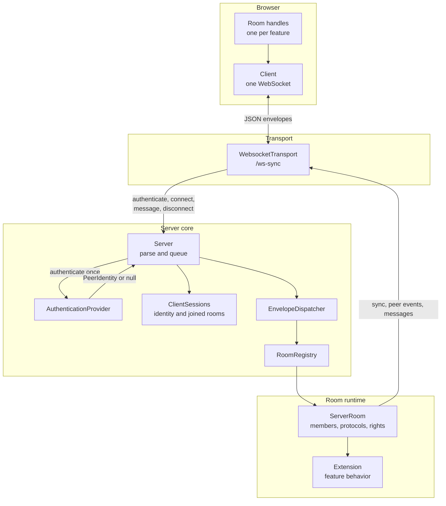
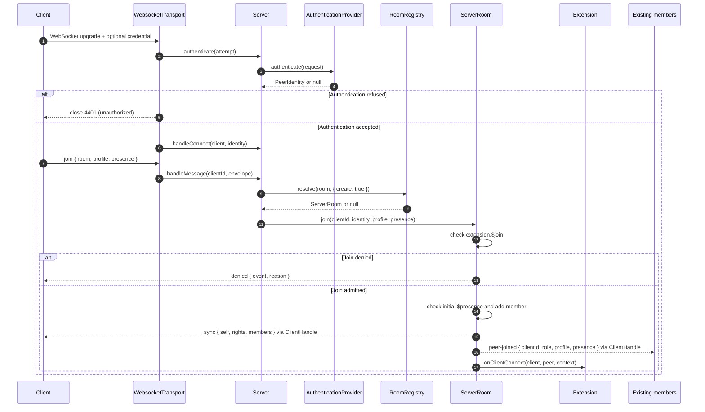
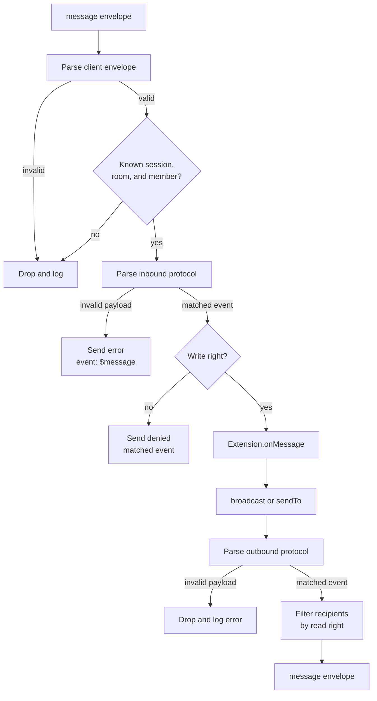
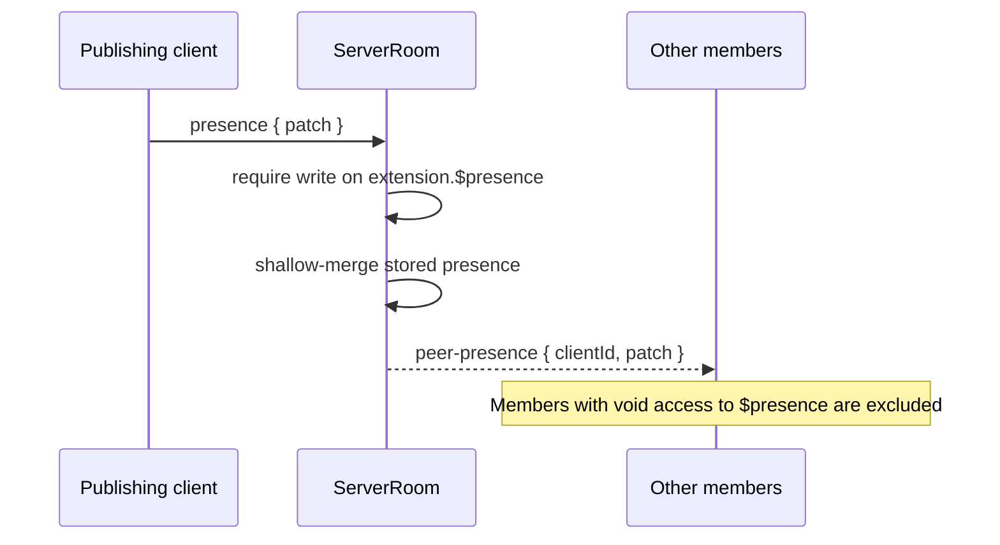
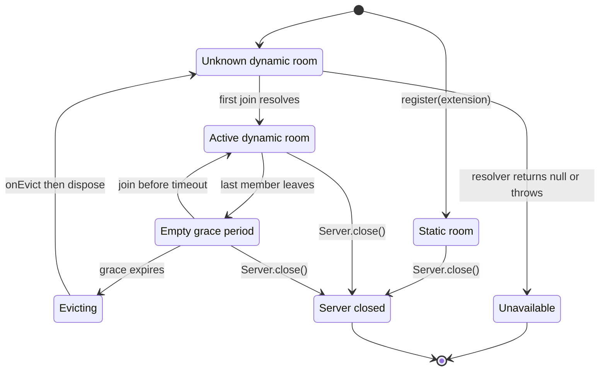
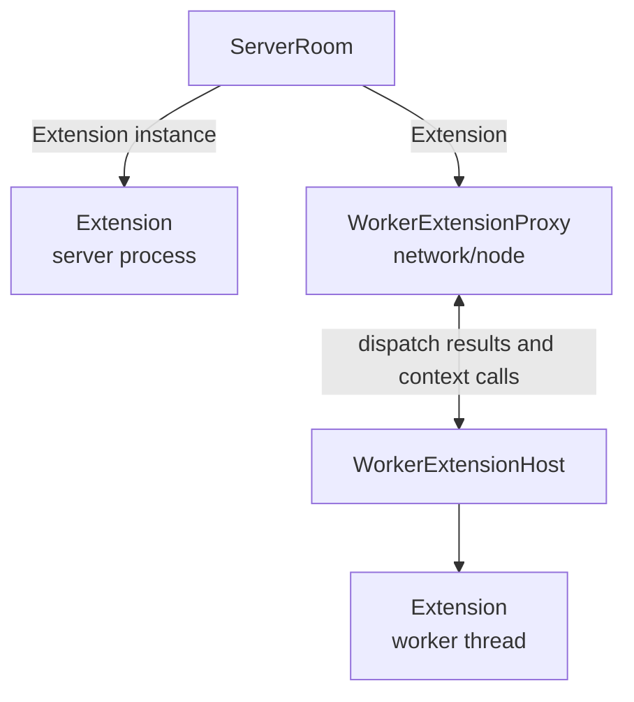

# Architecture

`@jolly-pixel/network` carries several independent features over one WebSocket
connection. Each feature owns a room. The network layer owns authentication,
envelope routing, membership, presence, protocol validation, and rights checks.
An `Extension` owns the feature-specific behavior inside a room.

## System map

`Client.room(name)` creates a local `Room` handle. It does not create another
socket and does not join immediately. Calls on every room are wrapped in an
envelope containing the room name, which lets the server route unrelated
features without coupling their extensions.

## Wire protocol

Every frame is a JSON envelope. The `room` field chooses the room and `kind`
chooses the network operation.

| Direction | `kind` | Data | Purpose |
|---|---|---|---|
| Client to server | `join` | `profile?`, `presence?` | Request membership and publish initial peer data. |
| Client to server | `leave` | | Leave a joined room. |
| Both | `message` | `payload` | Carry a feature-specific message. |
| Client to server | `presence` | `patch` | Update per-room presence. |
| Server to client | `sync` | `self`, `rights`, `members` | Initialize the joining client's room state. |
| Server to client | `peer-joined` | `clientId`, `role`, `profile`, `presence` | Announce a new member. |
| Server to client | `peer-left` | `clientId` | Remove a member from the peer mirror. |
| Server to client | `peer-presence` | `clientId`, `patch` | Apply a presence patch to a peer. |
| Server to client | `denied` | `event`, `reason` | Report a rights rejection. |
| Server to client | `error` | `event`, `reason` | Report a rejected inbound payload. |

The same peer has three kinds of metadata with different trust and lifetime
rules:

| Data | Set by | Lifetime | Visibility |
|---|---|---|---|
| `PeerIdentity` | `AuthenticationProvider` | WebSocket connection | `subject` stays on the server; `role` is shared with room members. |
| `profile` | Client options | Reused for every room join | Shared with room members. It is untrusted display data. |
| `presence` | `Room.updatePresence()` | One room membership | Shared only with members allowed to read `$presence`. |

The schemas in
[`Envelope.schema.ts`](./src/protocol/Envelope.schema.ts) are the source of
both the TypeScript envelope types and the checked-in validators. The server
parses only client envelope kinds and the browser parses only server envelope
kinds. An envelope sent in the wrong direction is rejected before routing.
Unknown properties remain compatible with older peers.

## Connecting and joining

Authentication finishes before the server opens a client session. The
resulting `PeerIdentity` is fixed for the socket lifetime, so a join payload
cannot claim a different subject or role.

Only `join` may ask `RoomRegistry` to resolve an unknown room. A resolver that
returns `null` or throws leaves the room unavailable, and the join is dropped.
Repeated joins are ignored after the session records the membership.
If the client may join but cannot write `$presence`, the room admits it with
empty presence and sends a separate `denied` envelope for `$presence`.

The `sync.members` snapshot includes the joining member. The browser adopts
its server-assigned `self`, `role`, and `rights`, then keeps only remote members
in `room.peers`. Existing members receive `peer-joined`; the joiner does not.

## Message routing

Client messages and extension output pass through separate protocols. The
matched schema variant supplies the event name used by the rights table.

Rights keys use `${extension.name}.${event}`. A writer needs `write` access to
the inbound event. An outbound recipient receives the event with `read` or
`write` access; `void` removes that recipient from the send. `denied` means the
event was understood but forbidden. `error` reports a payload rejected by the
inbound protocol.

An extension may declare an opaque side with a `null` protocol. Opaque payloads
skip schema parsing. A server with a configured rights table refuses an
extension with an opaque inbound protocol because it cannot derive an event to
gate. An opaque outbound protocol also skips per-event recipient filtering. See
[Extension](./docs/Extension.md) and [Rights](./docs/Rights.md) for the protocol
and rule formats.

The server queues dispatch by client and room. Envelopes keep their arrival
order inside one room, while slow work in another room can continue on a
separate lane. Disconnect waits for every lane owned by the client before it
removes the remaining memberships.

## Presence and leaving

`Room.updatePresence(patch)` shallow-merges the local value. Before `join()`,
the client holds the patch and includes it as initial presence in the join
envelope. After joining, each patch follows this path:

An explicit `leave` and a socket disconnect use the same room cleanup. The
server removes the member, broadcasts `peer-left` to the remaining members,
and calls `Extension.onClientDisconnect()`. Leaving is never rights-gated.
Profile and presence disappear with the membership.

## Room lifetime

Static rooms are registered before clients connect. Dynamic rooms are created
by a `RoomResolver` when the first client joins an unknown room.

The default grace period for a resolved room is 30 seconds. A resolution can
override it. Static rooms do not enter the grace period and remain registered
until `Server.close()`. See [Dynamic rooms](./docs/Server.md#dynamic-rooms) for
the resolver and eviction contracts.

## Extension execution

The room boundary stays the same whether feature code runs in the server
process or in a worker thread.

The main thread still parses protocols and applies rights. The worker receives
accepted lifecycle calls and can call `broadcast` or `sendTo` through the
proxy. Worker startup, timeouts, restarts, and disposal are covered in
[Worker extensions](./docs/Extension.md#worker-extensions).

## Higher-level helpers

These APIs build on `Room` messages and presence without changing the routing
model above:

- [`PresenceChannel`](./docs/PresenceChannel.md) exposes one typed presence
  field per peer.
- [`CommandSync`](./docs/sync/CommandSync.md) stamps commands and suppresses a
  client's own echoes.
- [`ConflictTracker`](./docs/sync/Conflicts.md) applies server-side conflict
  rules before an extension commits a command.

The remaining public contracts are indexed in the [API reference](./docs/index.md).
