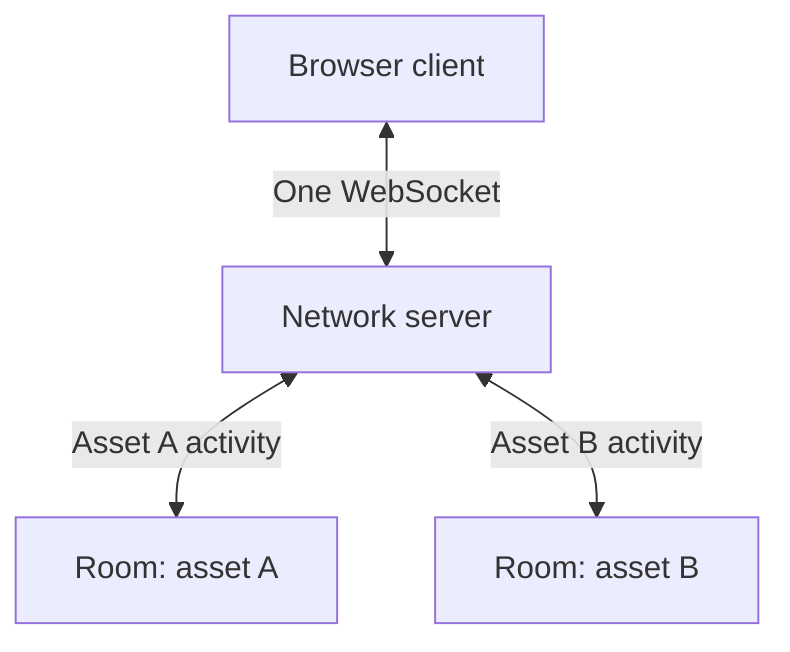
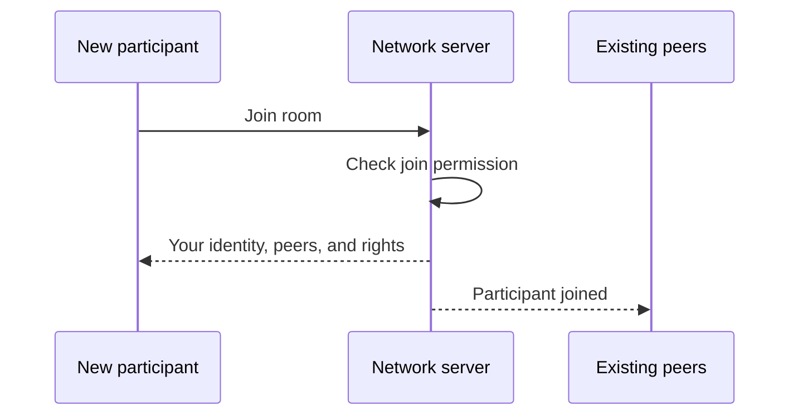
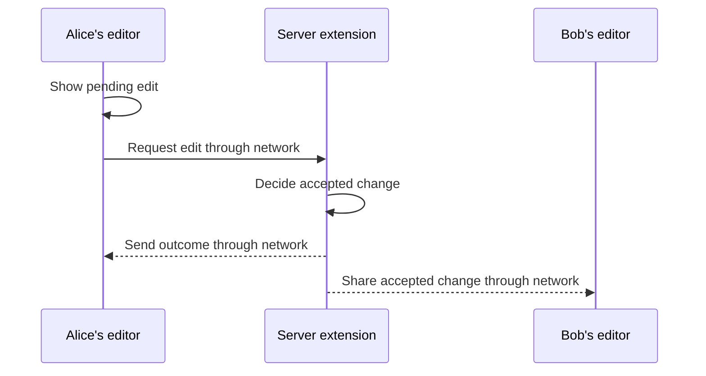
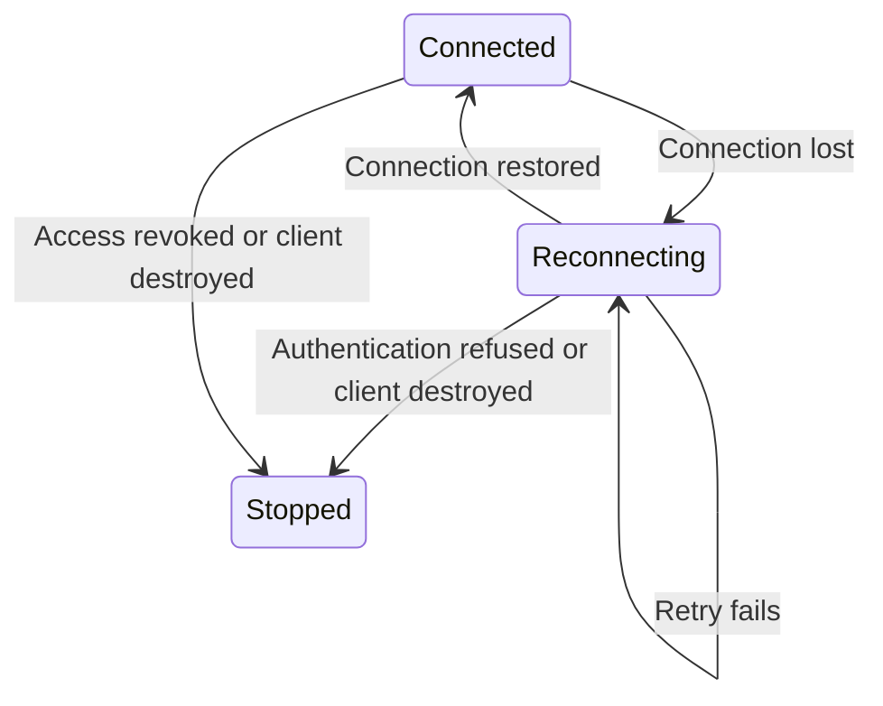

# Architecture

Start with [rooms, peers, and extensions](./GLOSSARY.md#collaboration).
This guide follows a participant from connecting to sharing edits.

## 1. One connection, several rooms

A browser's `Client` shares one WebSocket across its rooms. Each room serves
one feature instance, such as an open asset.

```mermaid
flowchart TD
  Client["Browser client"] <-->|"One WebSocket"| Server["Network server"]
  Server <-->|"Asset A activity"| RoomA["Room: asset A"]
  Server <-->|"Asset B activity"| RoomB["Room: asset B"]
```

Opening a room handle does not join it. Calling `room.join()` asks the server
to admit the participant.

See [Client and Room](./docs/client/Client.md).

## 2. Network carries activity; extensions give it meaning

- **Network** manages participants, shares presence, and routes activity.
  It checks identity, message contracts, and permissions.
- **Extension** implements the feature inside a room. It decides what an edit
  does and owns any feature state or persistence it needs.

Passing network checks permits a request to reach the extension. The extension
can still refuse the requested edit.

See [Extension](./docs/server/Extension.md) and [Rights](./docs/server/Access.md#rights).
Worker extensions follow the same boundary; see [Worker extensions](./docs/server/Extension.md#worker-extensions).

## 3. Joining establishes who is in the room

1. Connect. The server establishes the participant's trusted identity.
2. Join a room. The server checks permission to enter.
3. Receive the room's peers and permissions. The extension handles the arrival
   and may send initial feature state.

After the connection is accepted, a successful join looks like this:

```mermaid
sequenceDiagram
  participant New as New participant
  participant Server as Network server
  participant Peers as Existing peers
  New->>Server: Join room
  Server->>Server: Check join permission
  Server-->>New: Your identity, peers, and rights
  Server-->>Peers: Participant joined
```

The room's peer list excludes the local participant. Feature state, such as an
image snapshot, arrives separately from the peer list.

See [Authentication](./docs/server/Access.md#authentication) and [Room events](./docs/client/Client.md#events).

## 4. Sharing edits and presence

An extension decides how commands change shared state. A participant may show
an edit locally before the server answers, keeping the editor responsive.

```mermaid
sequenceDiagram
  participant Alice as Alice's editor
  participant Feature as Server extension
  participant Bob as Bob's editor
  Alice->>Alice: Show pending edit
  Alice->>Feature: Request edit through network
  Feature->>Feature: Decide accepted change
  Feature-->>Alice: Send outcome through network
  Feature-->>Bob: Share accepted change through network
```

This is a command-synchronized feature. A refused edit can require a local
rollback; competing edits are resolved by the feature's conflict policy.
`CommandSync` reconciles pending local edits with server changes.

Presence follows a simpler path: a participant updates their cursor or selection,
and network shares it with peers allowed to receive it. Extensions do not need
to interpret those updates.

See [CommandSync](./docs/client/CommandSync.md),
[Conflicts](./docs/client/CommandSync.md#conflict-resolution), and
[PresenceChannel](./docs/client/Client.md#presencechannel-api).

## 5. Leaving and reconnecting

Leaving a room removes the participant and their presence from that room.
A closed connection removes them from every room they joined.

With automatic retries enabled, the connection moves between these states:

```mermaid
stateDiagram-v2
  direction TB
  Connected --> Reconnecting: Connection lost
  Reconnecting --> Reconnecting: Retry fails
  Reconnecting --> Connected: Connection restored
  Reconnecting --> Stopped: Authentication refused or client destroyed
  Connected --> Stopped: Access revoked or client destroyed
```

Each retry authenticates again. Once connected, rooms rejoin and `CommandSync`
asks the extension for missed commands or a fresh snapshot. Connection recovery
comes before feature-state recovery. Disabling retries makes a disconnect stop
the client instead.

Rooms can be registered ahead of time or created on the first join. An empty
dynamic room is removed after its grace period; static rooms remain until
server shutdown.

See [Reconnecting](./docs/client/Client.md#reconnecting),
[Resume](./docs/client/CommandSync.md#resume), and [Dynamic rooms](./docs/server/Server.md#dynamic-rooms).

The [API reference](./README.md#api) covers transport wiring, protocol formats,
and the remaining contracts.
