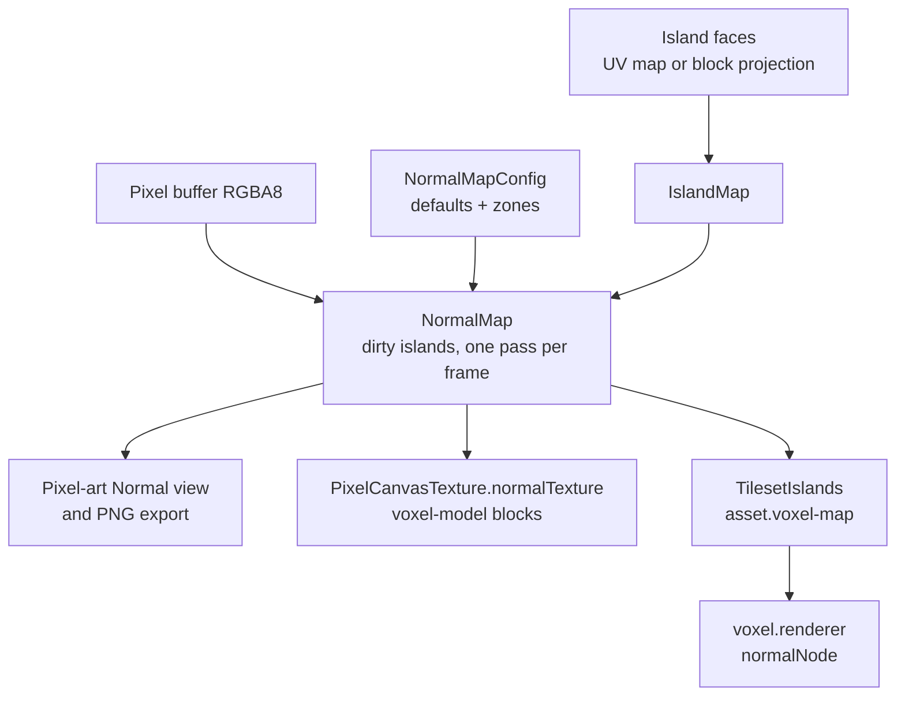

# Normal map generation — SPEC

Automatic normal maps for pixel documents. A texture can opt in, either as a
whole or per UV region. The pixel-art editor can show the generated map in
place of the texture. The voxel-map editor lights its tilesets with it, so
voxels stop reading as flat painted cubes.

The design was settled on 2026-10-03. Each phase in [Delivery](#delivery) ends
with the touched packages' tests, `pnpm run typecheck` and `pnpm run lint`
green, Markdown API docs updated, and one short changeset per public package.

## Scope

In v1:

- Generation from the texture's own pixels, configured per texture and per UV
  region.
- The pixel-art editor: `Albedo | Normal` view switch, settings dock, region
  overrides, normal map PNG export.
- `voxel.renderer` lighting tilesets with a normal texture, and a per material
  group strength.
- The voxel-map editor wiring, through `asset.voxel-map`.
- The voxel-model editor applying the normal map to model block materials.

Deferred:

- Hand painting normals, and any stored normal pixels.
- A `Lit` preview view in the pixel-art editor.
- `asset.voxel-model`: a shipped game renders voxel-model blocks without normal
  maps until that package projects its own islands.
- Multi-light (Sprite Lamp style) reconstruction, AI depth estimation, baked
  ambient occlusion from height.
- Generation in a worker, partial texture uploads.

## Model

The normal map is **derived**. A document stores settings, never normal
pixels. Anything that needs the map computes it from the texture and those
settings, so a stroke needs no extra sync traffic and the map can never go
stale against the texture.



### Document format

`PixelArtDocumentData` gains one optional field. `version` stays `1`: a
document without the field loads as before, and a missing field means the
feature is off.

```ts
interface PixelArtDocumentData {
  // existing fields
  normalMap?: NormalMapData;
}

interface NormalMapData {
  defaults: NormalMapSettings;
  zones: NormalMapZone[];
}

interface NormalMapZone {
  regionId: string;
  settings: Partial<NormalMapSettings> | "off";
}

interface NormalMapSettings {
  height: "luminance" | "regions" | "flat";
  invert: boolean;
  strength: number;
  border: "wrap" | "clamp" | "bevel";
  bevel: {
    width: number;
    profile: "linear" | "round";
  };
  edgeIntensity: number;
  levels: number;
}
```

`parsePixelArtDocument` rebuilds the document field by field, so it would drop
an unknown `normalMap` silently today. A `NormalMapConfig` value object parses
the field, and invalid data throws `InvalidPixelArtDocumentError`. Tilesets
embed `PixelArtDocumentData`, so `.tileset.json` gets the field without a
format change of its own.

Defaults when a texture enables the feature:

| Field | Default |
|---|---|
| `height` | `"luminance"` |
| `invert` | `false` |
| `strength` | `2` |
| `border` | `"wrap"` (see [Border](#border)) |
| `bevel` | `{ width: 1, profile: "round" }` |
| `edgeIntensity` | `1` |
| `levels` | `0` (off) |

Normals are stored in the OpenGL convention: red points right, green points up
in the image, as three expects. The DirectX convention only exists as a PNG
export option.

### Zones

A zone overrides the defaults for one UV region. It stores a region id and no
geometry: the geometry comes from wherever the region lives when the map is
generated.

| Editor | Region source | Region id |
|---|---|---|
| pixel-art | the document's own UV map | the region's id |
| voxel-map | block projection in `asset.voxel-map` | the block's id inside its tileset (`BlockProjection.regionId`), so it does not depend on the slot a world gives the tileset |
| voxel-model | model blocks shown in the UV map | `blockRegionId(uuid)` |

`"off"` makes every island the region touches flat.

A zone whose region does not exist is ignored by the generator and kept in the
document. The dock lists it as orphaned with a delete action. This covers
external regions (see *UV Ownership* in [GLOSSARY.md](./GLOSSARY.md)): a model
or tileset owns those regions and their history, so the pixel document cannot
delete zones atomically when a block goes away. Undoing the block deletion
brings back the same region id and the zone applies again.

Deleting a region the pixel document owns removes its zones in the same
history entry, so undo restores both.

## Islands

Central differences read the four neighbours of a pixel. In an atlas, the
neighbour across a tile edge belongs to another tile, so the generator never
samples outside an **island**.

Island faces are the UV slot geometries of every region, using active slots
and ignoring view visibility, the same set the UV clip uses. A pixel belongs
to a face when its center falls inside the geometry (`pointInGeometry`, as in
`uv/region/uvSlotMask.ts`). Rects, triangles and compounds are all supported.

Rules:

1. Faces whose pixels overlap merge into one island (union-find over faces).
   This happens when a cube side and a ramp side share a tile.
2. Faces that only touch stay separate islands, including the faces of an
   unfolded net.
3. Pixels covered by no face form one remainder island. A texture with no UV
   regions is therefore one island, the whole texture.

`IslandMap` holds one island index per pixel plus, per island, its faces and
whether it is exactly one rect face. It is rebuilt only when UV regions or
blocks change.

### Settings resolution

An island takes the defaults, overridden by the last zone in `zones` whose
region has a face in the island. Order in `zones` is creation order, so on a
merged island the newest zone wins. The dock shows a "shares pixels with ..."
warning on zones that lose this way. The remainder island always uses the
defaults.

## Generation

`NormalMap` is the live product for one document: it owns the output buffer,
subscribes to buffer, UV and config changes, and emits `changed { bounds }`.
Generation itself is a pure function of the pixels, the island map and the
config, with no DOM, so it runs headless and in tests.

For each island, with its resolved settings:

1. **Height**, in `[0, 1]` per pixel:
   - `"luminance"`: Rec. 709 luma of the RGB bytes.
   - `"regions"`: distance to the edge of the pixel's same-colour region,
     4-connected and clipped to the island, from a two-pass chamfer transform,
     shaped by `bevel`. Every brick or plank in a tile gets its own pillow.
   - `"flat"`: `1` for opaque pixels.
   - `invert` replaces `h` with `1 - h`. Transparent pixels (alpha `0`) are
     always `0`, after `invert`. Partial alpha scales the height.
2. **Border** shaping, see below.
3. **Gradient** by central difference, as in the original note:
   `dx = (h(x+1) - h(x-1)) * strength`, `dy = (h(x, y+1) - h(x, y-1)) * strength`,
   `n = normalize(-dx, dy, 1)`. No Sobel: a 3×3 kernel smears one-pixel
   details.
4. **Edge intensity**: when a neighbour sample is transparent, its difference
   term is multiplied by `edgeIntensity`. `0` removes the rim around cut-outs.
5. **Quantization**: with `levels` ≥ 3 (odd only, so a true flat direction
   exists), `n.x` and `n.y` snap to `levels` steps in `[-1, 1]`, then `n.z` is
   recomputed and the vector renormalized.
6. **Encoding**: `rgb = round((n * 0.5 + 0.5) * 255)`, alpha `255`.
   Transparent pixels and pixels in an `"off"` island encode flat
   `(128, 128, 255)`.

### Border

What a sample outside the island reads:

| `border` | Outside sample | Use |
|---|---|---|
| `"wrap"` | the opposite edge of the island | tileable tiles: grass and stone tops join across voxels |
| `"clamp"` | the edge pixel itself | flat border |
| `"bevel"` | `0`, and heights are multiplied by the bevel profile of the distance to the island edge | each voxel face gets a rounded or chamfered rim |

`"wrap"` only applies to an island that is exactly one rect face. Any other
island falls back to `"clamp"`. The stored default is `"wrap"`; the dock shows
the fallback on islands where it applies.

Bevel profiles, with `t = min(distance, width) / width`: `"linear"` is `t`,
`"round"` is `sqrt(1 - (1 - t)²)`.

### Regeneration

- **Lazy.** No `NormalMap` exists until a consumer asks for one: the Normal
  view, `PixelCanvasTexture.normalTexture()`, or a `TilesetAtlasBridge`. Painting
  in the Albedo view with the feature enabled costs nothing.
- **Dirty islands.** `changed { bounds }`, local or remote, marks the islands
  intersecting the bounds grown by 1 px. `"regions"` and `"bevel"` islands are
  redone whole, since their distance fields span the island.
- **One pass per animation frame**, whatever the number of change events.
- **Full invalidation of the affected islands** on a settings or zone change.
  Resize, texture replace and island map rebuilds invalidate everything.
- **Main thread.** `bench/` gets generator cases at 64², 512² and 2048² for
  each `height` mode. A worker behind the same API is the follow-up if 2048²
  `"regions"` costs too much.

## Edits, history and sync

`PixelDocument.normalMap` exposes the `NormalMapConfig`. Changes go through
`DocumentEdits` like every other document change: history entry, hook action,
network command. Commands patch, so two people editing different fields or
different zones do not overwrite each other.

| Hook action / command | Payload |
|---|---|
| `normal-map-toggled` | `{ config: NormalMapData \| null }` |
| `normal-map-defaults-patched` | `{ patch: Partial<NormalMapSettings> }` |
| `normal-map-zone-set` | `{ zone: NormalMapZone, index: number }` |
| `normal-map-zone-deleted` | `{ regionId: string }` |

- Commands carry only the change. The `"normal-map"` history entry stores the
  sent command and its inverse.
- Slider drags preview on `NormalMap.preview()` and commit one entry on
  release, the way region drags do.
- Deleting a UV region removes its zone; the `uv-delete` history entry keeps
  it for undo, and every receiver of `uv-region-deleted` drops the zone itself.
- Network snapshots (`PixelSnapshotCodec` in `asset.pixel-art`, and the tileset
  snapshot) carry the config next to the PNG. Both asset kinds apply the new
  commands on their pixel command path.

## Pixel-art editor

All of this lives in `<pixel-draw-panel>`, so the voxel-map `TextureEditor`
and the voxel-model editor get it unchanged.

- **View switch.** `Albedo | Normal` in the trailing area of the bottom
  toolbar, per texture tab, remembered locally. It is view state: not saved,
  not synced. The Normal view draws the generated map in place of the texture.
- **Normal view is read-only for pixels.** Paint, erase, fill and move are
  disabled. Select and UV stay active, so regions and zones can be managed.
- **`normal-map-dock`**, built like `color-dock`. It opens automatically in the
  Normal view and can be toggled from the Albedo view.
  - **Enable** switch: creates `normalMap` with the defaults, or removes it.
  - **Texture defaults**: the `NormalMapSettings` fields.
  - **Zones**: one row per zone with the region name and colour, the
    shared-pixels warning, the orphaned state, and delete. Selecting a row
    selects the region; selecting a region selects its row.
  - With a zone selected, the field group edits that zone. Each field reads
    *inherited* (muted, click to override) or *overridden* (with a reset
    action). An **Off for this UV** switch sets `"off"`.
- **Creating a zone.** The UV toolbar gets **Override normal map** for the
  selected region, disabled while the texture has no `normalMap`.

### Export

**Export normal map** sits next to the existing export in the bottom toolbar
and is enabled only with `normalMap` set. It offers OpenGL (as stored) or
DirectX (green inverted), and downloads `texture.normal.png`. The PNG is
encoded from the generator's typed array with `encodePng` from
`@jolly-pixel/image`, never through a 2D canvas, whose premultiplied alpha
would corrupt the data.

### `PixelCanvasTexture.normalTexture()`

Returns a `THREE.Texture` over the `NormalMap` output: `NoColorSpace`,
`NearestFilter`, no mipmaps, updated on `changed`. Islands come from the
document's UV map. It returns `null` while `normalMap` is unset and emits when
that changes, so a consumer can attach or detach the map.

## `voxel.renderer`

The renderer only consumes a normal texture and never generates one, so a
hand-made normal atlas (a future Tiled import, for instance) uses the same
entry point.

- `view.loadTileset(definition, texture, { normal?: THREE.Texture })` and
  `updateNormal(source)` next to `updateImage`. The normal texture uses
  `NoColorSpace`, `NearestFilter` and no mipmaps, like the atlas but linear.
  The `$missing` fallback tileset has no normal texture.
- **`normalNode`** in `view/shading/tileShading.ts`:
  - The tangent frame comes from `dFdx`/`dFdy` of the view position and the
    *unclamped* `inputs.uv`, as three's `perturbNormal2Arb` does. Voxel faces
    are planar with UVs linear per triangle, so the frame is exact, and tile
    rotation, instance flips and ramp or diagonal faces need no extra data.
    The face template texture is unchanged.
  - The normal texture is sampled with the same remapped and clamped UV as the
    albedo, so blend group borrowing, rotation and the half-texel inset stay
    aligned with the colour.
  - The perturbed normal fades to the geometric normal with the weight the
    far-tile colour averaging already uses, so distant relief does not shimmer.
- **`MaterialGroup.normalScale`**, default `1`, persisted with the tileset's
  material groups. `0` disables relief for that group.
- A material without a normal texture, or with `normalScale` `0`, gets no
  `normalNode`. The material cache key includes whether one is present. The
  shadow caster switch is untouched.
- Works on both the Lambert and Standard paths. Under Standard, low roughness
  adds specular highlights on the relief.

## `asset.voxel-map` and the voxel-map editor

- **Block projection moves** from `editors/voxel-map/src/shared/blockShapeUv.ts`
  and the face part of `features/texture/uv/BlockUv.ts` into `asset.voxel-map`,
  which already depends on both `pixel-draw.renderer` and `voxel.renderer`. The
  editor imports it from there. A game runtime can now build tileset islands.
- **`TilesetIslands`** in `asset.voxel-map`: builds the island faces from
  the tileset's blocks and shapes, hands them to the tileset pixels with
  `PixelDocument.useIslandFaces`, and invalidates them on block registry
  changes. The texture editor and the atlas then share the document's single
  `NormalMap`. `asset.voxel-map` does not depend on three.
- **`TilesetAtlasBridge`** attaches those islands, wraps `pixels.normals` in
  pixel-art's `NormalMapTexture`, passes it to `view.loadTileset` while the tileset has
  normal map settings, and requests a frame when the map regenerates.
- The voxel-map `TextureEditor` turns on the panel's `normal-map` UI.
- **Block Material Finish** dialog gets a **Normal strength** slider bound to
  `normalScale`.

## voxel-model editor

`BlockTextures` already projects model blocks into the pixel UV map, so islands
come from the UV map, as in pixel-art. `ModelBlock` materials
(`MeshStandardNodeMaterial`) set `normalMap` from
`PixelCanvasTexture.normalTexture()` and clear it when the texture disables the
feature. `BoxGeometry` has no tangent attribute, so three uses its
derivative-based path. There is no render-time strength in voxel-model: zones
map one to one to blocks, so per-block relief goes through zone `strength`.

## Delivery

1. **`pixel-draw.renderer` core.** `NormalMapConfig`, `IslandMap`, the pure
   generator and `NormalMap`; `PixelDocument.normalMap`, the commands, history
   entries and hook actions; format parsing and snapshots; `GLOSSARY.md` terms
   (*Normal Map*, *Island*, *Normal Map Zone*); unit tests and bench cases.
2. **Pixel-art editor.** View switch, `normal-map-dock`, the UV toolbar action,
   PNG export, `PixelCanvasTexture.normalTexture()`. Unit tests, plus one
   Playwright spec: enable, switch view, add a zone, export.
3. **`voxel.renderer`.** `loadTileset` normal option, `updateNormal`,
   `normalNode`, `MaterialGroup.normalScale`, an example scene.
4. **`asset.voxel-map` and the voxel-map editor.** Projection move,
   `TilesetIslands`, tileset commands and snapshot, `TilesetAtlasBridge`, the
   Normal strength slider.
5. **voxel-model editor.** `normalMap` on `ModelBlock` materials.

Phases 2 and 3 depend only on phase 1 and can run in parallel.
