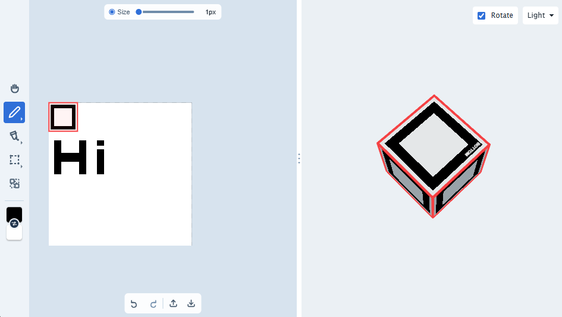

<h1 align="center">
  pixel-draw.renderer
</h1>

<p align="center">
  JollyPixel Pixel Art canvas renderer
</p>

<p align="center">

</p>

## 📌 About

Browser-based library for editing pixel-art textures: brush, fill, select, and UV region tools, undo/redo, zoom/pan, and optional real-time multiplayer sync, all behind a single `PixelArtCanvas` API.

## 💡 Features

- **Brush painting**: adjustable size, opacity, and primary/secondary color
- **Paint-bucket fill**: flood-fill a connected region of same-colored pixels
- **Rectangle and shape select**: drag out a rectangle or select a connected region
- **UV regions**: create/move/delete rectangular UV regions independently of painting, via the `uv` value object;
- **Undo/redo**: optional bounded history over strokes, resizes, texture replaces, and UV region changes;
- **Zoom & pan**: wheel-based zoom with configurable sensitivity and range, plus middle-drag and `Space`+left-drag panning;
- **Transparency support**: checkerboard background renders beneath transparent pixels
- **Network sync**: transport-agnostic, server-authoritative multiplayer. Multiple clients can paint the same texture in real time

## 💃 Getting Started

This package is available in the Node Package Repository and can be easily installed with [npm][npm] or [yarn][yarn].

```bash
$ npm i @jolly-pixel/pixel-draw.renderer
# or
$ yarn add @jolly-pixel/pixel-draw.renderer
```

## 👀 Usage Example

```ts
import {
  PixelArtCanvas
} from "@jolly-pixel/pixel-draw.renderer";

const container = document.querySelector<HTMLDivElement>("#editor-container");
if (!container) {
  throw new Error("Missing #editor-container");
}

const manager = new PixelArtCanvas(container, {
  texture: {
    size: { x: 64, y: 64 }
  },
  defaultMode: "paint",
  backgroundColor: "#263238",
  zoom: {
    // No `default`: computed to fit the whole texture inside `container`.
    min: 1,
    max: 32
  },
  brush: {
    size: 3
  },
  history: {
    enabled: true
  }
});

manager.onResize();
manager.centerTexture();

manager.brush.primary.set("#FF6600", 0.8);
manager.brush.secondary.set("#3366FF");
manager.mode = "fill";
```

Loading an existing texture:

```ts
const img = new Image();
img.src = "/assets/sprite.png";
await img.decode();
manager.texture = img;
```

> See [`@jolly-pixel/editor.pixel-art`](../editors/pixel-art) for the UI layer (a Lit-based toolbar panel driving `PixelArtCanvas`) and its `examples/` demo (painting a live Three.js texture).

### Modes

`mode` selects how left-click/drag is interpreted.

- `"paint"`: draw with the brush
- `"move"`: pan the camera
- `"fill"`: flood-fill the clicked region
- `"select"`: select, move, copy, and delete a rectangular or shape-selected region; set `manager.tools.select.shape = true` for connected-region selection
- `"uv"`: select and drag UV regions; regions are created programmatically via `manager.uv.create(...)`, not by clicking

Wheel input zooms from any mode unless it arrives with `Ctrl` in `"paint"` mode. Middle-drag or `Space`+left-drag pans from any mode; a plain left-drag pans only in `"move"` mode. In `"paint"` mode, `Ctrl`+wheel input increases (scroll up) or decreases (scroll down) the brush size. Any trackpad gesture reported as `Ctrl`+wheel input follows the same rule.

> [!TIP]
> Read [PixelArtCanvas.md](./docs/PixelArtCanvas.md#mode) for the full behavior, and the [Keybinds](#keybinds) section below for exact shortcuts.

### Keybinds

`Shift` (line draw) and `Space` (pan) are not **configurable** but everything below is:

| Action | Default |
|---|---|
| Copy | `Ctrl`/`Cmd`+`C` |
| Paste | `Ctrl`/`Cmd`+`V` |
| Undo | `Ctrl`/`Cmd`+`Z` |
| Redo | `Ctrl`/`Cmd`+`Y` or `Ctrl`/`Cmd`+`Shift`+`Z` |
| Delete | `Delete` |
| Rotate selection | `R` |
| Flip selection horizontal | `H` |
| Flip selection vertical | `V` |

Override at construction, or live via `keybindings.patch()`:

```ts
const manager = new PixelArtCanvas(container, {
  keybindings: {
    undo: "alt+u"
  } // unspecified actions keep their default
});

manager.keybindings.patch({
  redo: "alt+shift+u"
});
```

> [!TIP]
> Read [input/Keybindings.md](./docs/input/Keybindings.md) for the combo string format and error handling.

### Undo/redo

Disabled by default. Enable it and (optionally) track button-enabled state:

```ts
const manager = new PixelArtCanvas(container, {
  history: {
    enabled: true,
    // limit defaults to 10
    limit: 20
  },
  onHistoryChange: ({ canUndo, canRedo }) => {
    undoButton.disabled = !canUndo;
    redoButton.disabled = !canRedo;
  }
});

manager.undo(); // false if history is disabled or there's nothing to undo
manager.redo();
```

> [!TIP]
> Read [PixelArtCanvas.md](./docs/PixelArtCanvas.md#undo--redo--canundo--canredo) and [history/HistoryStack.md](./docs/history/HistoryStack.md).

## 📚 API

- [`PixelArtCanvas`](./docs/PixelArtCanvas.md)
  - [`Brush`](./docs/tools/Brush.md)
  - [`BrushTool`](./docs/tools/BrushTool.md)
  - [`FillTool`](./docs/tools/FillTool.md)
  - [`SelectTool`](./docs/tools/SelectTool.md)
- [`PixelBuffer`](./docs/buffer/PixelBuffer.md)
- [`Keybindings`](./docs/input/Keybindings.md)
- [`Network`](./docs/network/index.md)
- [`Asset kind`](./docs/asset/index.md)

### Internal

- UV
  - [`UVMap`](./docs/uv/UVMap.md)
  - [`UVRegion`](./docs/uv/UVRegion.md)
- [`HistoryStack`](./docs/history/HistoryStack.md)

## 🧩 Types

Shared value types used across the public API:

```ts
type Vec2 = {
  x: number;
  y: number;
};

type Mode = "paint" | "move" | "fill" | "select" | "uv";
type ColorInput = string | Color;

interface SelectionRect {
  x: number;
  y: number;
  width: number;
  height: number;
}

export interface RGBA {
  r: number;
  g: number;
  b: number;
  a: number;
}
```

## 🧪 Benchmarks

The default command measures `PixelBuffer`, editing tools, history, networking,
and color conversion without a DOM. The browser command starts Vite and
Chromium to measure canvas synchronization and frame rendering.

```bash
npm run bench -w @jolly-pixel/pixel-draw.renderer
npm run bench:browser -w @jolly-pixel/pixel-draw.renderer
```

Use `-- --list` to inspect the headless suites. Filtering and measurement rules
are documented by [`@jolly-pixel/bench`](../bench/README.md).

## Contributors Guide

If you are a developer **looking to contribute** to the project, you must first read the [CONTRIBUTING][contributing] guide.

Once you have finished your development, check that the tests (and linter) are still good by running the following script:

```bash
$ npm run test
$ npm run lint
```

> [!CAUTION]
> In case you introduce a new feature or fix a bug, make sure to include tests for it as well.

## License

MIT

<!-- Reference-style links for DRYness -->

[npm]: https://docs.npmjs.com/getting-started/what-is-npm
[yarn]: https://yarnpkg.com
[contributing]: ../../CONTRIBUTING.md
[colorjs]: https://colorjs.io
