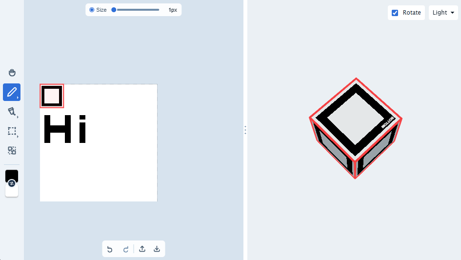

<h1 align="center">
  pixel-draw.renderer
</h1>

<p align="center">
  JollyPixel Pixel Art canvas renderer
</p>

<p align="center">

</p>

## 📌 About

Browser-based library for editing pixel-art textures: brush, fill, select, and
UV region tools, undo/redo, and zoom/pan behind one `PixelArtCanvas` API.

## 💡 Features

- **Brush painting**: adjustable size, opacity, and primary/secondary color, plus an erase mode clearing pixels with the same brush
- **Paint-bucket fill**: flood-fill a connected region of same-colored pixels
- **Rectangle and shape select**: drag out a rectangle or select a connected region
- **UV regions**: create/move/delete rectangular UV regions independently of painting, via the `uv` value object;
- **Undo/redo**: every edit is emitted with the commands that undo it, and a canvas binds to the undo history its host passes in;
- **Zoom & pan**: wheel-based zoom with configurable sensitivity and range, plus middle-drag panning and left-drag panning while a pan modifier is held;
- **Transparency support**: checkerboard background renders beneath transparent pixels

## 💃 Getting Started

This package is available in the Node Package Repository and can be easily installed with [npm][npm] or [yarn][yarn].

```bash
$ npm i @jolly-pixel/pixel-draw.renderer
# or
$ yarn add @jolly-pixel/pixel-draw.renderer
```

## 👀 Usage Example

```ts
import {
  PixelArtCanvas
} from "@jolly-pixel/pixel-draw.renderer";

const container = document.querySelector<HTMLDivElement>("#editor-container");
if (!container) {
  throw new Error("Missing #editor-container");
}

const manager = new PixelArtCanvas(container, {
  texture: {
    size: { x: 64, y: 64 }
  },
  defaultMode: "paint",
  backgroundColor: "#263238",
  zoom: {
    // No `default`: computed to fit the whole texture inside `container`.
    min: 1,
    max: 32
  },
  brush: {
    size: 3
  }
});

manager.onResize();
manager.centerTexture();

manager.brush.primary.set("#FF6600", 0.8);
manager.brush.secondary.set("#3366FF");
manager.mode = "fill";
```

Loading an existing texture:

```ts
const img = new Image();
img.src = "/assets/sprite.png";
await img.decode();
manager.texture = img;
```

> See [`@jolly-pixel/editor.pixel-art`](../editors/pixel-art) for the UI layer (a Lit-based toolbar panel driving `PixelArtCanvas`) and its `examples/` demo (painting a live Three.js texture).

### Modes

`mode` selects how left-click/drag is interpreted.

- `"paint"`: draw with the brush
- `"erase"`: draw with the brush, writing `brush.erase` (transparent by default)
- `"move"`: pan the camera
- `"fill"`: flood-fill the clicked region
- `"select"`: select, move, copy, and delete a rectangular or shape-selected region; set `manager.tools.select.shape = true` for connected-region selection
- `"uv"`: select and drag UV regions; regions are created programmatically via `manager.uv.create(...)`, not by clicking

Wheel input zooms from any mode unless it arrives with a held `Ctrl` key in `"paint"` or `"erase"` mode. Middle-drag, or left-drag while `shortcuts.panHeld` is set, pans from any mode; a plain left-drag pans only in `"move"` mode. In `"paint"` and `"erase"` modes, `Ctrl`+wheel input increases (scroll up) or decreases (scroll down) the brush size, except while `shortcuts.panHeld` is set. A touchpad pinch, which browsers report as `Ctrl`+wheel input without a held `Ctrl` key, always zooms.

> [!TIP]
> Read [PixelArtCanvas.md](./docs/PixelArtCanvas.md#mode) for the full behavior, and the [Keyboard shortcuts](#keyboard-shortcuts) section below.

### Keyboard shortcuts

The canvas does not listen to the keyboard and ships no default keys. The host binds its own keys to `manager.shortcuts`, which routes each intent to the current mode:

| Intent | Member |
|---|---|
| Copy, paste | `copy()`, `paste()` |
| Undo, redo | `undo()`, `redo()` |
| Delete the selection or UV region | `delete()` |
| Rotate the selection or UV region | `rotate("cw")`, `rotate("ccw")` |
| Flip the selection | `flipHorizontal()`, `flipVertical()` |
| Pan with a left-drag | `panHeld = true` while the key is down |
| Draw a straight line | `lineHeld = true` while the key is down |

```ts
keyboard.bind("Mod+z", () => manager.shortcuts.undo());
keyboard.bind("r", () => manager.shortcuts.rotate("cw"));
```

Each method returns `true` when it handled the intent, so the host knows whether to prevent the browser default.

> [!TIP]
> Read [input/CanvasShortcuts.md](./docs/input/CanvasShortcuts.md) for the full behavior.

### Undo/redo

Disabled by default. Pass a `PixelArtCanvasHistory`, such as `StandalonePixelHistory` from `@jolly-pixel/asset.pixel-art`, and (optionally) track button-enabled state:

```ts
import { StandalonePixelHistory } from "@jolly-pixel/asset.pixel-art/client";

const manager = new PixelArtCanvas(container, {
  history: new StandalonePixelHistory({ limit: 20 }),
  onHistoryChange: ({ canUndo, canRedo }) => {
    undoButton.disabled = !canUndo;
    redoButton.disabled = !canRedo;
  }
});

manager.undo(); // false without a history or with nothing to undo
manager.redo();
```

> [!TIP]
> Read [PixelArtCanvas.md](./docs/PixelArtCanvas.md#undo--redo--canundo--canredo) and [history/PixelHistory.md](./docs/history/PixelHistory.md).

## 📚 API

- [`PixelArtCanvas`](./docs/PixelArtCanvas.md)
  - [`PixelDocument`](./docs/PixelDocument.md)
  - [`Brush`](./docs/tools/Brush.md)
  - [`BrushTool`](./docs/tools/BrushTool.md)
  - [`FillTool`](./docs/tools/FillTool.md)
  - [`SelectTool`](./docs/tools/SelectTool.md)
  - [`CanvasShortcuts`](./docs/input/CanvasShortcuts.md)
- [`PixelBuffer`](./docs/buffer/PixelBuffer.md)
- [`PixelDocumentState`](./docs/PixelDocumentState.md)
- [`ColorPalette`](./docs/ColorPalette.md)
- [`PixelCommand`](./docs/PixelCommand.md)
- [Pixel history](./docs/history/PixelHistory.md)
- Normal map
  - [`NormalMap`](./docs/normal/NormalMap.md)
  - [`NormalMapConfig`](./docs/normal/NormalMapConfig.md)
  - [`IslandMap`](./docs/normal/IslandMap.md)
- [`Serialization`](./docs/serialization/index.md)
- [Integration primitives](./docs/IntegrationPrimitives.md)

### Internal

- UV
  - [`UVMap`](./docs/uv/UVMap.md)
  - [`UVRegion`](./docs/uv/UVRegion.md)

## 🧩 Types

Shared value types used across the public API:

```ts
type Vec2 = {
  x: number;
  y: number;
};

type Mode = "paint" | "erase" | "move" | "fill" | "select" | "uv";
type ColorInput = string | Color;

interface SelectionRect {
  x: number;
  y: number;
  width: number;
  height: number;
}

export interface RGBA {
  r: number;
  g: number;
  b: number;
  a: number;
}
```

## 🧪 Benchmarks

The default command measures `PixelBuffer`, editing tools, undo grouping, color
conversion, and normal map generation without a DOM. The browser command starts Vite and
Chromium to measure canvas synchronization and frame rendering.

```bash
pnpm --filter @jolly-pixel/pixel-draw.renderer bench
pnpm --filter @jolly-pixel/pixel-draw.renderer bench:browser
```

Use `-- --list` to inspect the headless suites. Filtering and measurement rules
are documented by [`@jolly-pixel/bench`](../bench/README.md).

## Contributors Guide

If you are a developer **looking to contribute** to the project, you must first read the [CONTRIBUTING][contributing] guide.

Once you have finished your development, check that the tests (and linter) are still good by running the following script:

```bash
$ pnpm run test
$ pnpm run lint
```

> [!CAUTION]
> In case you introduce a new feature or fix a bug, make sure to include tests for it as well.

## License

MIT

<!-- Reference-style links for DRYness -->

[npm]: https://docs.npmjs.com/getting-started/what-is-npm
[yarn]: https://yarnpkg.com
[contributing]: ../../CONTRIBUTING.md
[colorjs]: https://colorjs.io
