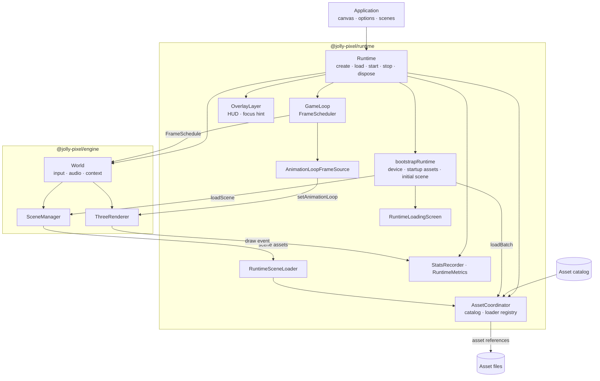
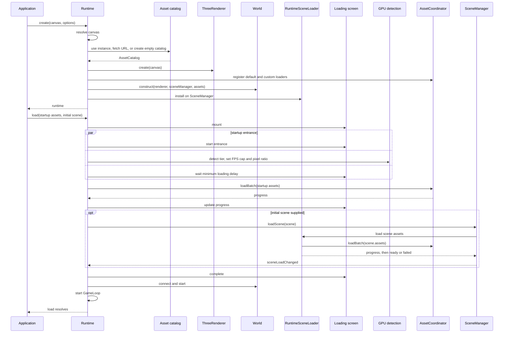
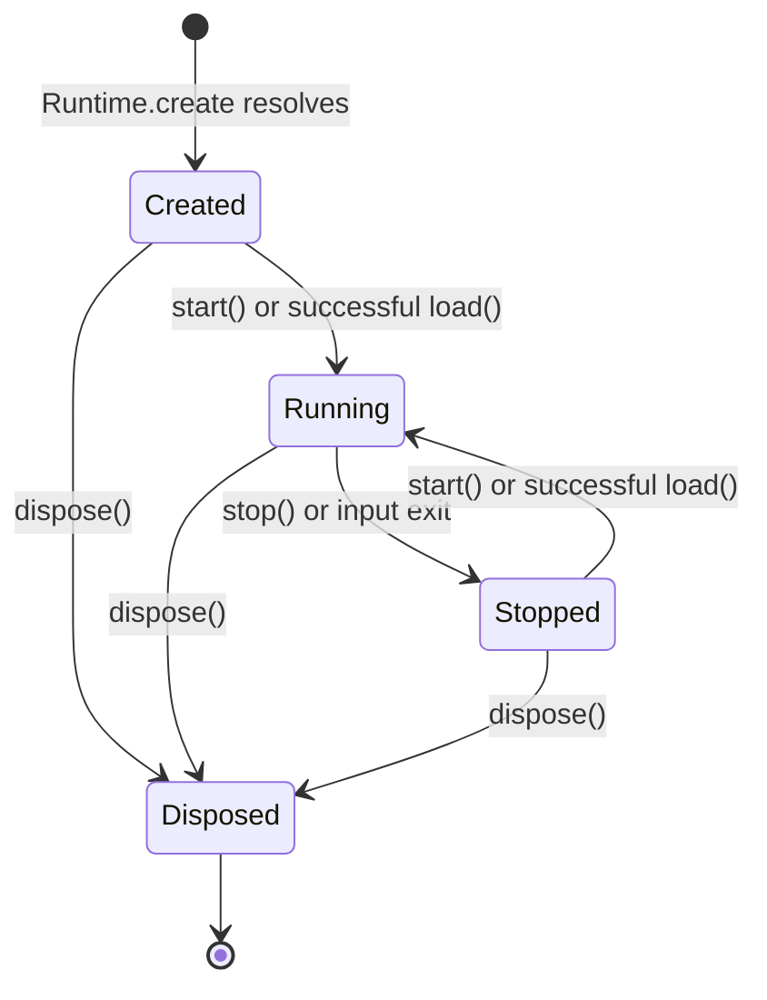

# Runtime architecture

`Runtime` is the browser-facing composition layer for the engine. It creates a
renderer and world for a canvas, connects asset loading to scene loading, and
drives the world through a scheduled game loop. The web and Electron guides use
the same runtime code.

## Workspace map



The package owns the wiring. `World` owns engine services, `SceneManager` owns
scene state, `AssetCoordinator` owns catalog-based loading, and `GameLoop` owns
frame scheduling. Runtime also creates a shared Three.js `LoadingManager` for
its default and custom asset loaders.

| Boundary | Runtime's role | Owner of the underlying behavior |
|---|---|---|
| Canvas and renderer | Resolve the canvas and create `ThreeRenderer` | Engine renderer |
| Assets | Resolve a catalog, register loaders, and install `RuntimeSceneLoader` | `@jolly-pixel/asset` and `SceneManager` |
| Frames | Adapt renderer animation callbacks and pass schedules to `world.tick()` | `@jolly-pixel/loop` and `World` |
| Browser UI | Mount the loading screen, overlays, and optional readouts | Runtime and `@jolly-pixel/ui` |

## Creation and startup



The screen entrance, GPU detection, and minimum delay run together. Startup
assets load next; the optional initial scene's assets load after them. With
`skipLoadingScreen`, the canvas is shown immediately and device configuration,
assets, and scene preparation run in the same order without a screen or delay.
An asset or scene failure rejects `load()` and prevents `start()`. When a screen
is mounted, it displays the error.

The initial scene can be `ready` when `load()` resolves without yet being
active. `SceneManager` activates ready scenes in `beginFrame()` on the next
world tick. Its progress and status are reported through `sceneLoadChanged`;
`RuntimeSceneLoader` forwards batch progress from `AssetCoordinator`.

## Frame path

```mermaid
sequenceDiagram
    participant Renderer as Three.js renderer
    participant Source as AnimationLoopFrameSource
    participant Loop as GameLoop / FrameScheduler
    participant Runtime
    participant Stats as StatsRecorder
    participant World
    participant Scenes as SceneManager

    Renderer->>Source: animation callback(time)
    Source->>Loop: frame time
    Loop->>Loop: advance schedule
    Loop->>Runtime: frame(schedule)
    Runtime->>Stats: begin()
    Runtime->>World: tick(schedule)
    World->>Scenes: beginFrame() / activate ready scenes
    loop scheduled fixed steps
        World->>World: update input
        World->>Scenes: fixedUpdate(fixedDelta)
    end
    opt schedule.render
        World->>Scenes: update(frameDelta, alpha)
        World->>Renderer: draw(scene)
        Renderer-->>Runtime: draw event / capture renderer counters
    end
    World->>Scenes: endFrame()
    World-->>Runtime: exit requested?
    Runtime->>Stats: end()
    opt exit requested
        Runtime->>Runtime: stop()
    end
```

The loop uses the renderer's `setAnimationLoop()` through
`AnimationLoopFrameSource`. `FrameScheduler` decides the fixed step count and
whether to render. `World.tick()` updates input even when there are no fixed
steps, and draws only when `schedule.render` is true. Runtime records each
scheduled frame; the renderer's draw event captures draw calls and triangle
counts for `RuntimeMetrics`.

## Lifetime and browser surfaces



`start()` focuses the canvas, mounts enabled focus and view helpers, connects
the world, and starts the loop. `stop()` stops the world and loop, disconnects
input and resize observation, and removes running-only helpers and focus
listeners. Both methods are idempotent. `dispose()` also removes the HUD,
metrics panel, overlay layer, and renderer resources; the instance must not be
reused.

The overlay layer follows the canvas by default or fills a supplied container.
It holds the optional performance HUD and focus hint. The view helper draws
inside the renderer's canvas after frames. `StatsRecorder` and `RuntimeMetrics`
exist even when no HUD or panel is mounted.

Details: [runtime API](./docs/api/Runtime.md),
[asset options](./docs/api/runtime-assets.md),
[scenes and assets](./docs/guides/scenes-and-assets.md),
[loading screen](./docs/guides/loading-screen.md), and
[frame scheduling and performance](./docs/guides/frame-scheduling-and-performance.md).
