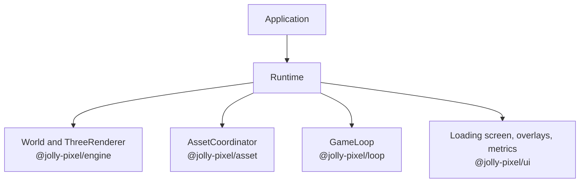
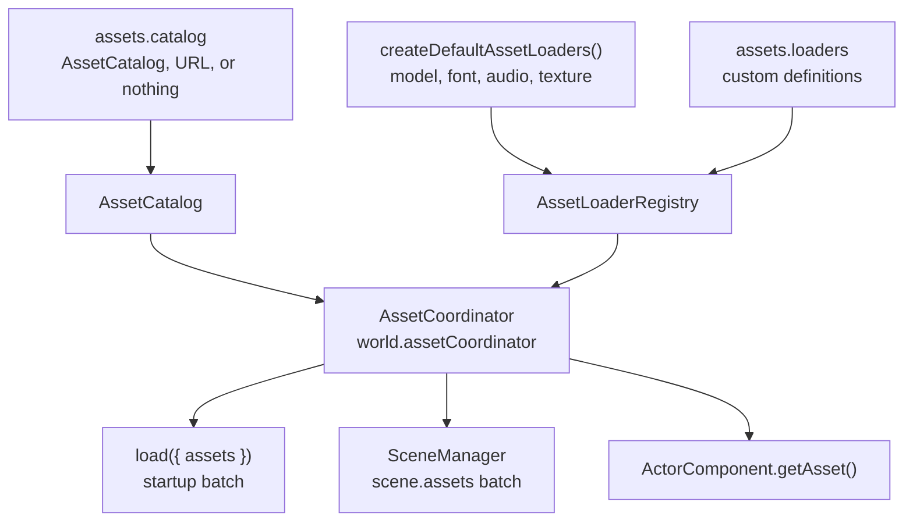
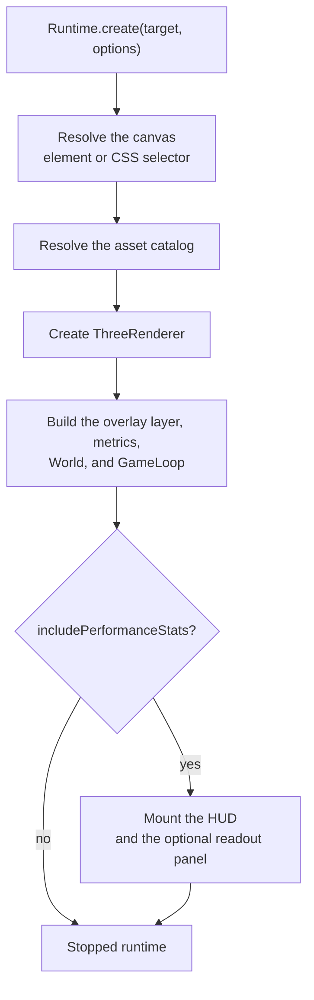
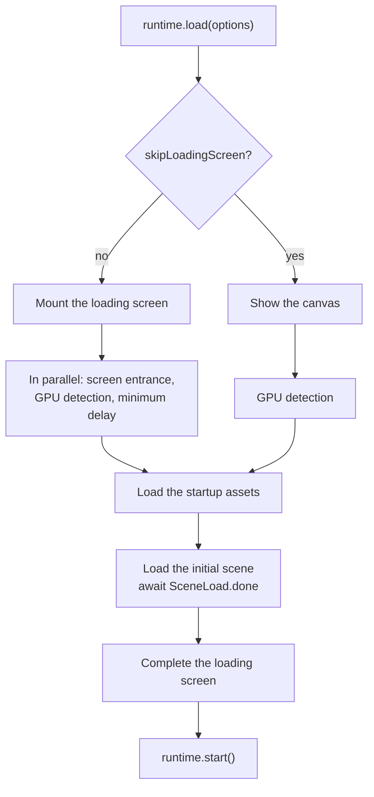
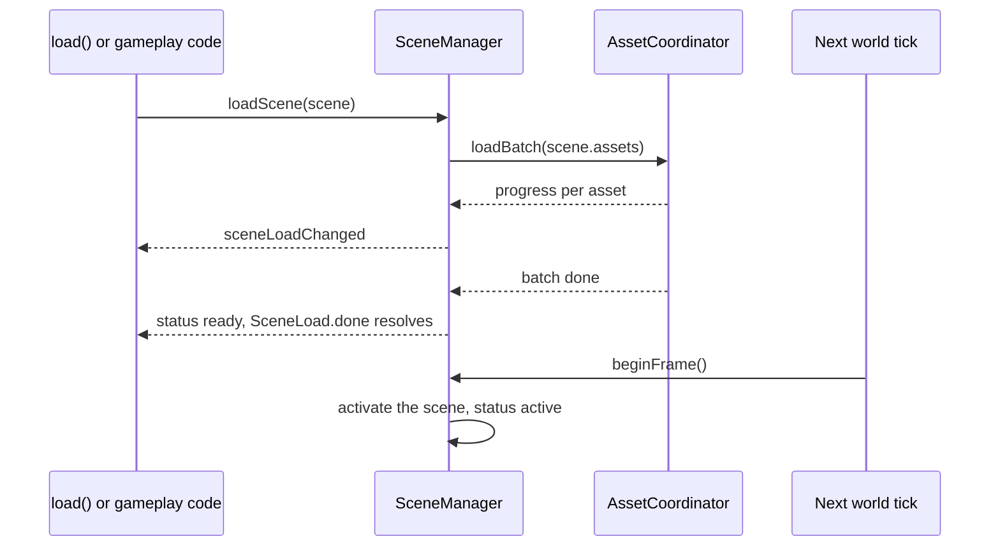
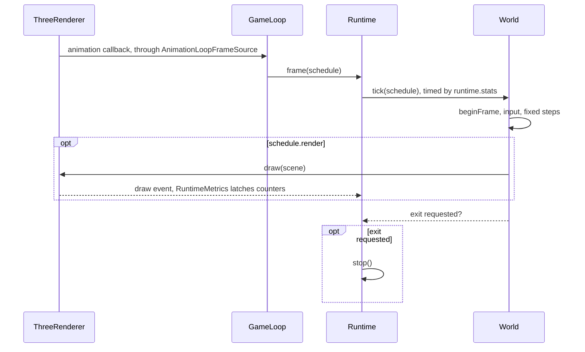
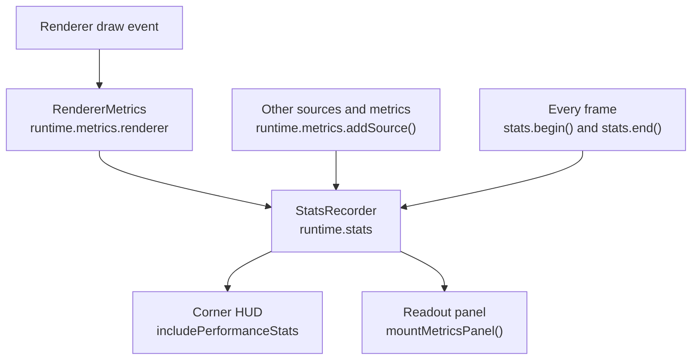
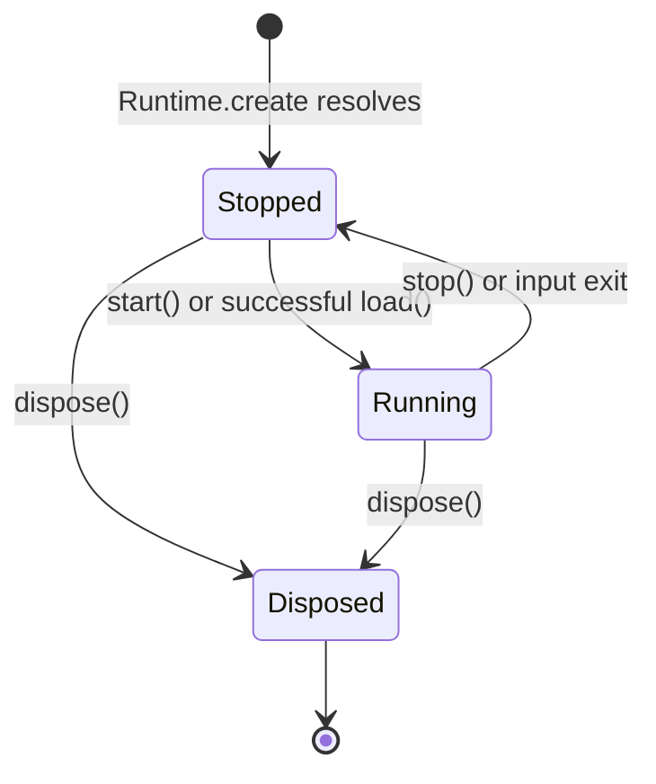
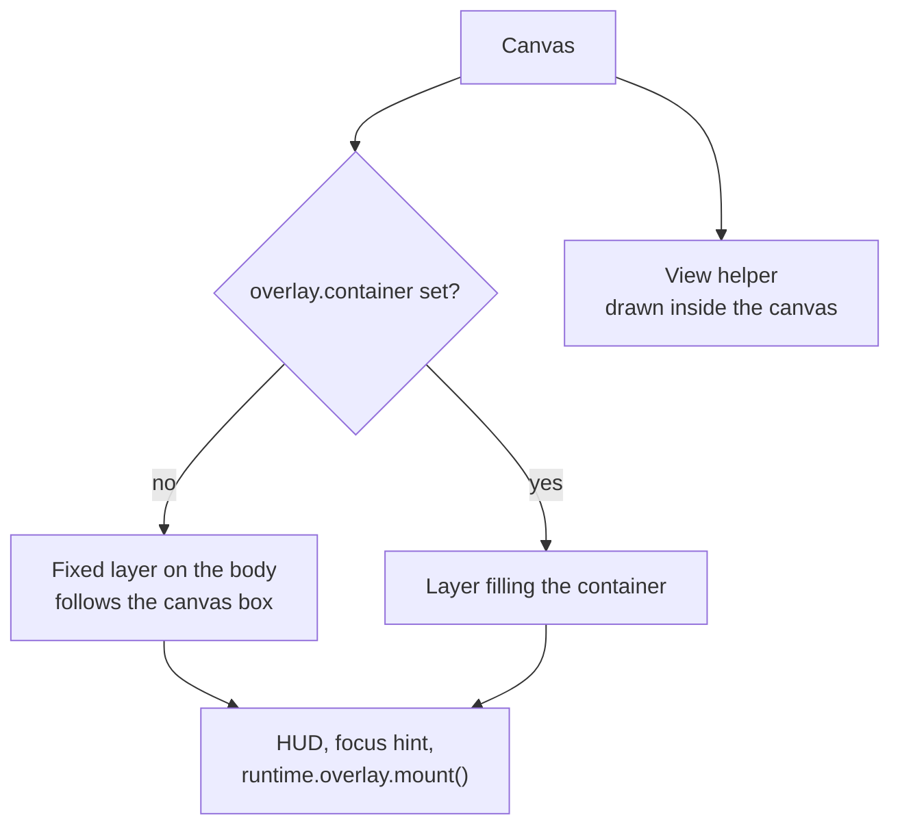

# Runtime architecture

`Runtime` puts the engine in a browser page. It creates the renderer and world
for a canvas, prepares assets, and drives the world from a scheduled game loop.
The web and Electron guides use the same runtime code.

## What the runtime composes

```mermaid
flowchart TB
    App["Application"] --> Runtime["Runtime"]
    Runtime --> Engine["World and ThreeRenderer<br/>@jolly-pixel/engine"]
    Runtime --> Assets["AssetCoordinator<br/>@jolly-pixel/asset"]
    Runtime --> Loop["GameLoop<br/>@jolly-pixel/loop"]
    Runtime --> UI["Loading screen, overlays, metrics<br/>@jolly-pixel/ui"]
```

Runtime owns the wiring; each part keeps its behavior in its own package. The
sections below follow one part at a time.

| Part | Runtime's role | Owner of the behavior |
|---|---|---|
| Canvas and renderer | Resolve the canvas and create `ThreeRenderer` | Engine renderer |
| Assets | Resolve the catalog and add custom loaders to the engine defaults | `@jolly-pixel/asset` and the engine loaders |
| Scenes | Await the initial scene during `load()` | Engine `SceneManager` |
| Frames | Feed renderer animation callbacks to `world.tick()` | `@jolly-pixel/loop` and `World` |
| Browser UI | Mount the loading screen, overlays, and readouts | Runtime and `@jolly-pixel/ui` |

## Assets

```mermaid
flowchart TB
    Option["assets.catalog<br/>AssetCatalog, URL, or nothing"] --> Catalog["AssetCatalog"]
    Defaults["createDefaultAssetLoaders()<br/>model, font, audio, texture"] --> Registry["AssetLoaderRegistry"]
    Custom["assets.loaders<br/>custom definitions"] --> Registry
    Catalog --> Coordinator["AssetCoordinator<br/>world.assetCoordinator"]
    Registry --> Coordinator
    Coordinator --> Startup["load({ assets })<br/>startup batch"]
    Coordinator --> Scenes["SceneManager<br/>scene.assets batch"]
    Coordinator --> Components["ActorComponent.getAsset()"]
```

`Runtime.create()` fetches and parses a catalog URL once; no catalog means an
empty one. Every loader shares the Three.js `LoadingManager` exposed as
`runtime.manager`. Runtime loads the startup batch itself; the engine loads
scene assets.

## Creation

```mermaid
flowchart TB
    Create["Runtime.create(target, options)"] --> Canvas["Resolve the canvas<br/>element or CSS selector"]
    Canvas --> Catalog["Resolve the asset catalog"]
    Catalog --> Renderer["Create ThreeRenderer"]
    Renderer --> Build["Build the overlay layer, metrics,<br/>World, and GameLoop"]
    Build --> Stats{"includePerformanceStats?"}
    Stats -->|"yes"| Mount["Mount the HUD<br/>and the optional readout panel"]
    Stats -->|"no"| Created["Stopped runtime"]
    Mount --> Created
```

`create()` rejects on an invalid canvas target, a failed catalog request or
manifest, or a renderer failure. The catalog resolves first, so a failed
request rejects before any renderer exists. Nothing runs until `load()` or
`start()`.

## Startup

```mermaid
flowchart TB
    Load["runtime.load(options)"] --> Skip{"skipLoadingScreen?"}
    Skip -->|"no"| Screen["Mount the loading screen"]
    Skip -->|"yes"| Show["Show the canvas"]
    Screen --> Prepare["In parallel: screen entrance,<br/>GPU detection, minimum delay"]
    Show --> Device["GPU detection"]
    Prepare --> Batch["Load the startup assets"]
    Device --> Batch
    Batch --> Scene["Load the initial scene<br/>await SceneLoad.done"]
    Scene --> Complete["Complete the loading screen"]
    Complete --> Start["runtime.start()"]
```

GPU detection sets the FPS cap and, unless the renderer options fix it, the
pixel ratio. Without a screen, the entrance, delay, and completion steps do
nothing. Any failure rejects `load()`, leaves the runtime stopped, and is shown
on the screen when one is mounted.

## Scene loading

```mermaid
sequenceDiagram
    participant Caller as load() or gameplay code
    participant Scenes as SceneManager
    participant Assets as AssetCoordinator
    participant Tick as Next world tick

    Caller->>Scenes: loadScene(scene)
    Scenes->>Assets: loadBatch(scene.assets)
    Assets-->>Scenes: progress per asset
    Scenes-->>Caller: sceneLoadChanged
    Assets-->>Scenes: batch done
    Scenes-->>Caller: status ready, SceneLoad.done resolves
    Tick->>Scenes: beginFrame()
    Scenes->>Scenes: activate the scene, status active
```

The engine owns this flow. Runtime awaits it for the initial scene and forwards
its progress to the loading screen. A ready scene becomes active on the next
`beginFrame()`, so `load()` can resolve before the scene's `awake()` runs.

## Frame path

```mermaid
sequenceDiagram
    participant Renderer as ThreeRenderer
    participant Scheduler as GameLoop
    participant Runtime
    participant World

    Renderer->>Scheduler: animation callback, through AnimationLoopFrameSource
    Scheduler->>Runtime: frame(schedule)
    Runtime->>World: tick(schedule), timed by runtime.stats
    World->>World: beginFrame, input, fixed steps
    opt schedule.render
        World->>Renderer: draw(scene)
        Renderer-->>Runtime: draw event, RuntimeMetrics latches counters
    end
    World-->>Runtime: exit requested?
    opt exit requested
        Runtime->>Runtime: stop()
    end
```

`FrameScheduler`, inside `GameLoop`, decides the fixed step count and whether
to render; the `maxFps` cap skips rendering while fixed steps still run.
`World.tick()` updates input even when no fixed step is due.

## Metrics

```mermaid
flowchart TB
    Draw["Renderer draw event"] --> Renderer["RendererMetrics<br/>runtime.metrics.renderer"]
    Renderer --> Recorder["StatsRecorder<br/>runtime.stats"]
    Sources["Other sources and metrics<br/>runtime.metrics.addSource()"] --> Recorder
    Frames["Every frame<br/>stats.begin() and stats.end()"] --> Recorder
    Recorder --> HUD["Corner HUD<br/>includePerformanceStats"]
    Recorder --> Panel["Readout panel<br/>mountMetricsPanel()"]
```

One recorder feeds every display. `RuntimeMetrics` registers the renderer
counters, latches them on each draw, and owns the readout panel. The recorder
and the counters exist even when nothing is mounted.

## Lifecycle

```mermaid
stateDiagram-v2
    [*] --> Stopped: Runtime.create resolves
    Stopped --> Running: start() or successful load()
    Running --> Stopped: stop() or input exit
    Stopped --> Disposed: dispose()
    Running --> Disposed: dispose()
    Disposed --> [*]
```

`start()` focuses the canvas, attaches the focus listeners, focus hint, and view
helper, then connects the world and starts the loop. `stop()` stops the world
and loop and releases everything `start()` attached. Both are idempotent;
`dispose()` also removes the HUD, readout panel, overlay layer, and renderer
resources.

## Browser surfaces

```mermaid
flowchart TB
    Canvas["Canvas"] --> Container{"overlay.container set?"}
    Container -->|"no"| Tracked["Fixed layer on the body<br/>follows the canvas box"]
    Container -->|"yes"| Contained["Layer filling the container"]
    Tracked --> Content["HUD, focus hint,<br/>runtime.overlay.mount()"]
    Contained --> Content
    Canvas --> ViewHelper["View helper<br/>drawn inside the canvas"]
```

The overlay layer holds what is drawn above the canvas and never takes pointer
events itself. The view helper renders into the canvas after each draw. The
loading screen mounts in `loadingContainer`, outside the overlay.

Details: [runtime API](./docs/api/Runtime.md),
[metrics](./docs/api/RuntimeMetrics.md),
[overlay layer](./docs/api/OverlayLayer.md),
[asset options](./docs/api/runtime-assets.md),
[scenes and assets](./docs/guides/scenes-and-assets.md),
[loading screen](./docs/guides/loading-screen.md), and
[frame scheduling and performance](./docs/guides/frame-scheduling-and-performance.md).
