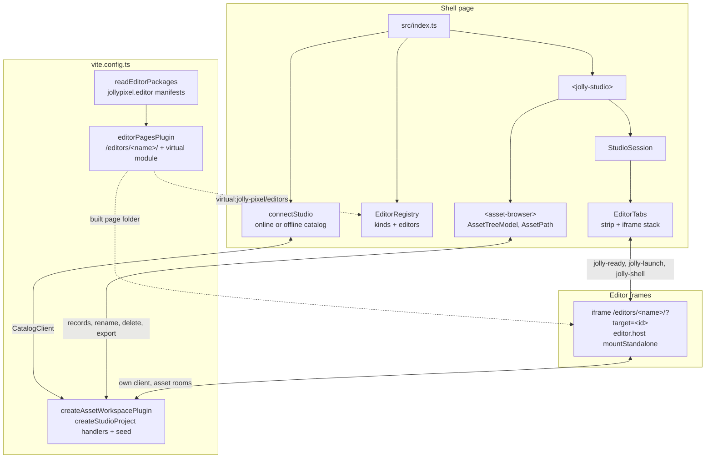
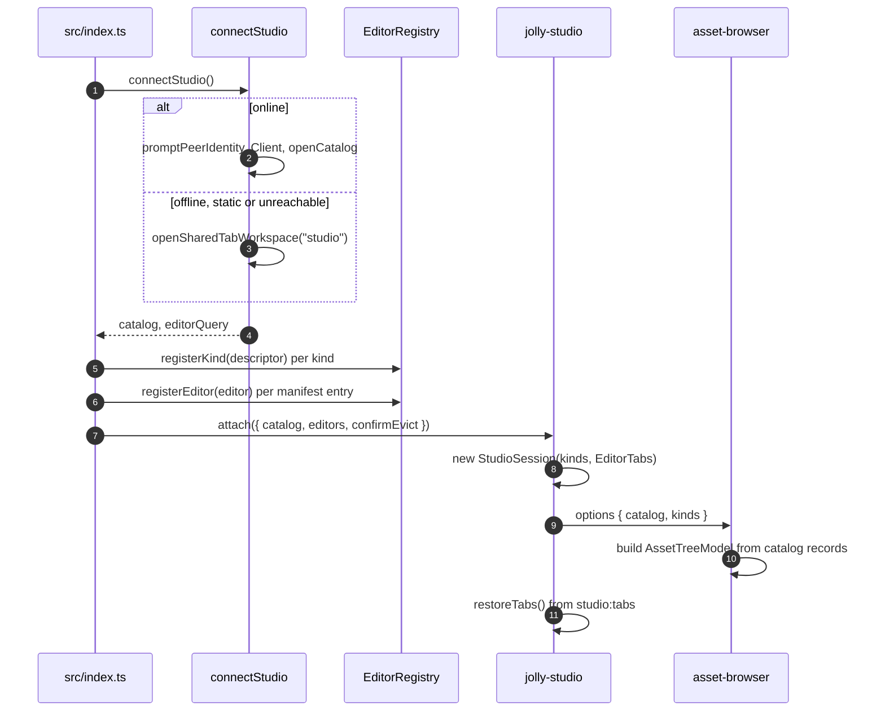
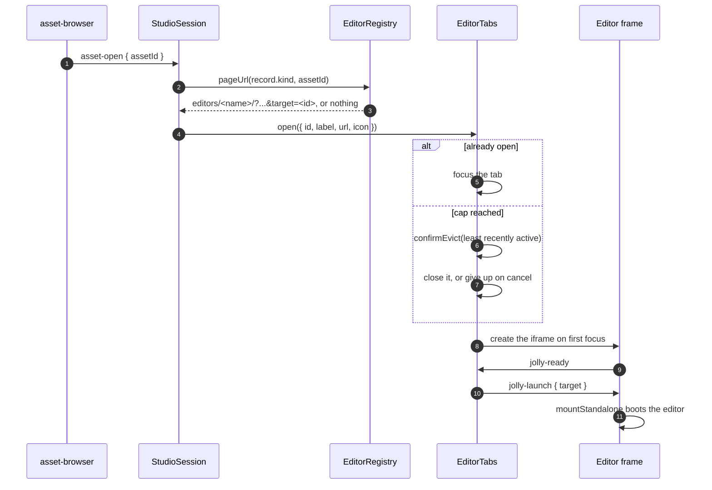

# Architecture

`@jolly-pixel/studio` opens one project: it runs one asset back-end, lists
the project's assets in a tree and opens one editor page per tab. Design
decisions live in the [ADRs](./docs/adr/README.md), open work in the
[roadmap](./ROADMAP.md); the words used here are defined in the
[glossary](./GLOSSARY.md).

## System map

The shell holds data only: kind descriptors, editor names and kinds, catalog
records. Kind code runs in the back-end handlers and editor code runs in the
frames. The shell and the frames talk through `postMessage` on one origin and
never share objects.

## Server side

`vite.config.ts` reads the `jollypixel.editor` manifest of each listed
editor package. `editorPagesPlugin` serves each editor's built page folder at
`/editors/<name>/`, answers `404` for any other path under that prefix, and
exposes `{ name, kinds }[]` as `virtual:jolly-pixel/editors`. A build copies
the page folders into `dist/editors/`.

`createAssetWorkspacePlugin` runs the catalog and the asset rooms on the
project root. `createStudioProject` (`src/seed.ts`) supplies the handlers and
the seed; the shell's offline workspace calls the same function, so both
back-ends know the same kinds.

| Mode | Back-end | Editor pages |
|---|---|---|
| `dev` | project root on disk | each editor's page folder |
| `e2e` | in memory, fixed port | same |
| `static` | none, the shell starts offline | copied into `dist/editors/`, built offline-only |

## Boot

An unreachable catalog offers Retry or the offline workspace. Offline,
`editorQuery` is `{ offline, workspace: "studio" }`, added to every editor
page URL so the frames join the same browser workspace.

## Opening an asset

A kind without an editor returns no URL and opens nothing; its rows show
`no editor`. Tabs are keyed by asset id, so a second activation focuses the
open tab. Closing a tab removes its iframe, which ends the editor's session.
A tab creates its iframe when first focused, and inactive frames stay
mounted with `display: none`.

`EditorTabs` stays an imperative controller beside the Lit elements: moving
or re-creating an iframe reloads it, so no template owns the frames.

## Tab persistence

Every open, close, move or focus makes `StudioSession` write the tab ids, in
strip order, and the active id to `studio:tabs` in `localStorage`, through
the `SavedTabs` value object. `restoreTabs` reopens them in the background,
skips assets that are gone or have no editor, stops at the cap and focuses
the saved active tab, which is the only one to load its frame.

## Shell commands

A frame launched through `jolly-launch` gets a `ShellChannel` and may post
`{ type: "jolly-shell", command, target }`. `EditorTabs` accepts messages
only from its own frames and hands commands to `StudioSession`, which runs
`open-asset` exactly like a tree activation. The shell never replies on the
channel.

## Asset browser

`<asset-browser>` holds a kind filter, a toolbar and a `jolly-tree` bound to
the `CatalogClient`. Folders start expanded, and the user's toggles survive
catalog changes.

- The kind filter is a `jolly-button-group`: All, then one button per
  registered kind. The choice is kept under `studio:asset-kind`.
- Double-click or Enter opens an asset. F2 or the Rename action edits the
  name in place; an asset keeps its extension, since reconciliation infers
  the kind from it. A name holding a separator is refused: moving is a drag.
- Delete opens `<asset-delete-dialog>`, listing the live assets outside the
  deleted set that still reference it, from `dependentsOf`. Confirming forces
  each command.
- New asset lists one item per registered kind, labelled and iconed from
  its descriptor. It sends `CatalogClient.create` with no content, the path
  `New <label><extension>` in the selected folder and `onConflict: "suffix"`.
  The back-end writes the kind's default state and its companions, so the
  shell never loads a handler. Once the record reaches the tree, the row is
  selected and its name edited in place, as with New folder.
- Export downloads the selected asset and its dependencies as `<stem>.zip`
  from `CatalogClient.exportArchive`. It is disabled on a folder: an archive
  has a single root.
- A right-click, Shift+F10 or the menu key opens a `jolly-context-menu` with
  the same actions, plus Open on a single asset. Below the rows it only
  offers New folder and New asset, created at the root. The toolbar and the menu read
  which actions apply from `AssetSelection`, and an action re-checks it
  against the current tree before it runs.
- Failures go to the `jolly-log` over the workbench.

The shell prompts for a username once with `promptPeerIdentity`, under the
host's `jolly-pixel:username` key. Same-origin frames in the same browser
tab share `sessionStorage`, so the editor pages find the name and do not
prompt again.

## Catalog changes

`StudioSession` listens to catalog `change`: a tab whose asset was deleted
closes, a renamed asset relabels its tab. `<asset-browser>` rebuilds its
`AssetTreeModel` on `change` and `dependencies`, from the records, the
dependency edges and its draft folders, and keeps the expanded folders, the
selection and the kind filter. Folders are path prefixes, so a folder
rename or delete sends one catalog command per asset under it; an owner's
rename or move adds one per companion.

## Editor pages

| Editor | Package | Page folder | Kinds |
|---|---|---|---|
| `voxel-map` | `@jolly-pixel/editor.voxel-map` | `dist/` | `voxelmap` |
| `voxel-model` | `@jolly-pixel/editor.voxel-model` | `dist/` | `voxelmodel` |
| `pixel-art` | `@jolly-pixel/editor.pixel-art` | `dist-page/` | `pixelart` |

Each page bundles its own copy of `editor.host` and `@jolly-pixel/ui`, so a
change to either reaches a tab only after that page is rebuilt. The
pixel-art package builds its library with `tsc`; its page has its own
`build:page` script, which the studio `build` script runs.

`dev:editors` runs every `build:watch` script in parallel: `tsc` in watch
mode for `ui` and `editor.host`, `vite build --watch` for each page. The dev
server watches the page folders and, once a folder has been quiet for
`EDITOR_PAGE_SETTLE_MS`, sends `studio:editor-page-rebuilt` with the editor
name over the HMR socket. The shell then reloads that editor's tabs: the
active frame at once, the others on their next focus.

## Layout

| Path | Role |
|---|---|
| `vite.config.ts`, `vite/` | back-end plugin, editor manifests, editor pages plugin, project root |
| `src/index.ts` | boot: connection, registry, `<jolly-studio>` |
| `src/connection.ts`, `src/offlineConnection.ts` | online catalog with offline fallback |
| `src/seed.ts` | `createStudioProject`: handlers and seed for both back-ends |
| `src/catalog/` | `AssetPath`, `AssetTreeModel`, `AssetKindSet`, `AssetCompanions`, `AssetDeletion`, `AssetSelection`, `DraftFolders`: pure tree decisions |
| `src/editors/` | `EditorRegistry`, `EditorDescriptor` |
| `src/tabs/` | `EditorTabs`: strip, iframe stack, handshake, tab cap; `SavedTabs` |
| `src/shell/` | `<jolly-studio>`, `StudioSession`, `<asset-browser>`, `AssetCommands`, asset menu, delete dialog |
