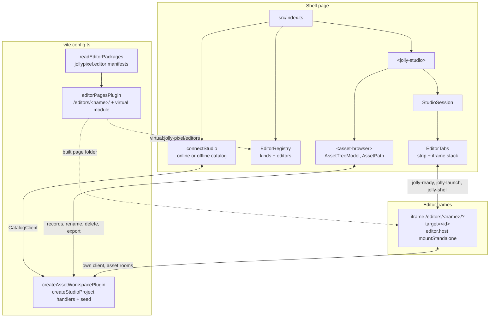
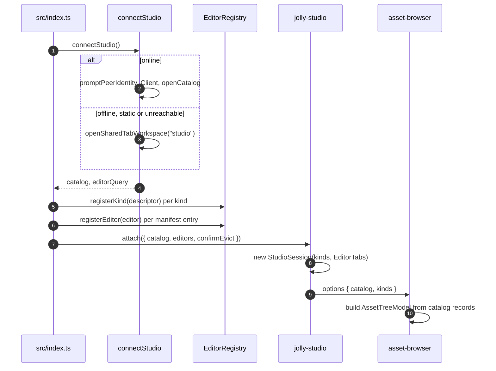
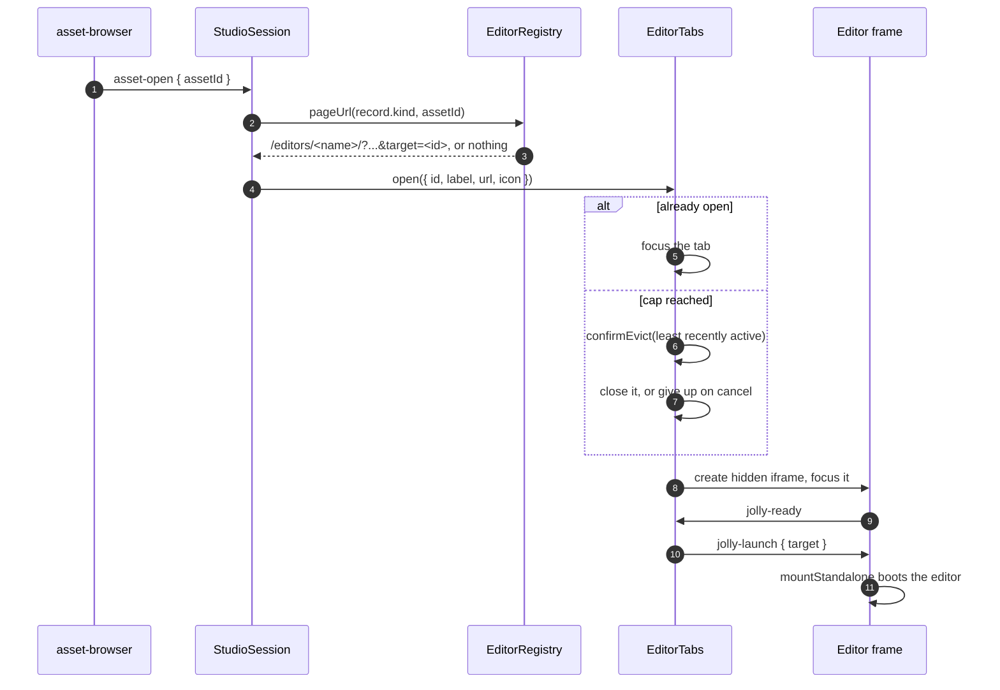

# Architecture

`@jolly-pixel/studio` opens one project: it runs one asset back-end, lists
the project's assets in a tree and opens one editor page per tab. Design
decisions live in [SPEC.md](./SPEC.md); the words used here are defined in
the [glossary](./GLOSSARY.md).

## System map

The shell holds data only: kind descriptors, editor names and kinds, catalog
records. Kind code runs in the back-end handlers and editor code runs in the
frames. The shell and the frames talk through `postMessage` on one origin and
never share objects.

## Server side

`vite.config.ts` reads the `jollypixel.editor` manifest of each listed
editor package. `editorPagesPlugin` serves each editor's built page folder at
`/editors/<name>/`, answers `404` for any other path under that prefix, and
exposes `{ name, kinds }[]` as `virtual:jolly-pixel/editors`. A build copies
the page folders into `dist/editors/`.

`createAssetWorkspacePlugin` runs the catalog and the asset rooms on the
project root. `createStudioProject` (`src/seed.ts`) supplies the handlers and
the seed; the shell's offline workspace calls the same function, so both
back-ends know the same kinds.

| Mode | Back-end | Editor pages |
|---|---|---|
| `dev` | project root on disk | each editor's page folder |
| `e2e` | in memory, fixed port | same |
| `static` | none, the shell starts offline | copied into `dist/editors/`, built offline-only |

## Boot

An unreachable catalog offers Retry or the offline workspace. Offline,
`editorQuery` is `{ offline, workspace: "studio" }`, added to every editor
page URL so the frames join the same browser workspace.

## Opening an asset

A kind without an editor returns no URL and opens nothing; its rows show
`no editor`. Tabs are keyed by asset id, so a second activation focuses the
open tab. Closing a tab removes its iframe, which ends the editor's session.
Inactive frames stay mounted with `display: none`.

`EditorTabs` stays an imperative controller beside the Lit elements: moving
or re-creating an iframe reloads it, so no template owns the frames.

## Shell commands

A frame launched through `jolly-launch` gets a `ShellChannel` and may post
`{ type: "jolly-shell", command, target }`. `EditorTabs` accepts messages
only from its own frames and hands commands to `StudioSession`, which runs
`open-asset` exactly like a tree activation. The shell never replies on the
channel.

## Catalog changes

`StudioSession` listens to catalog `change`: a tab whose asset was deleted
closes, a renamed asset relabels its tab. `<asset-browser>` rebuilds its
`AssetTreeModel` from the records and keeps the expanded folders, the
selection and the kind filter. Folders are path prefixes, so a folder
rename or delete sends one catalog command per asset under it.

## Editor pages

| Editor | Package | Page folder | Kinds |
|---|---|---|---|
| `voxel-map` | `@jolly-pixel/editor.voxel-map` | `dist/` | `voxelmap` |
| `voxel-model` | `@jolly-pixel/editor.voxel-model` | `dist/` | `voxelmodel` |
| `pixel-art` | `@jolly-pixel/editor.pixel-art` | `dist-page/` | `pixelart` |

Each page bundles its own copy of `editor.host` and `@jolly-pixel/ui`, so a
change to either reaches a tab only after that page is rebuilt. The
pixel-art package builds its library with `tsc`; its page has its own
`build:page` script, which the studio `build` script runs.

## Layout

| Path | Role |
|---|---|
| `vite.config.ts`, `vite/` | back-end plugin, editor manifests, editor pages plugin, project root |
| `src/index.ts` | boot: connection, registry, `<jolly-studio>` |
| `src/connection.ts`, `src/offlineConnection.ts` | online catalog with offline fallback |
| `src/seed.ts` | `createStudioProject`: handlers and seed for both back-ends |
| `src/catalog/` | `AssetPath`, `AssetTreeModel`, `AssetKindSet`: pure tree decisions |
| `src/editors/` | `EditorRegistry`, `EditorDescriptor` |
| `src/tabs/` | `EditorTabs`: strip, iframe stack, handshake, tab cap |
| `src/shell/` | `<jolly-studio>`, `StudioSession`, `<asset-browser>`, delete dialog |
