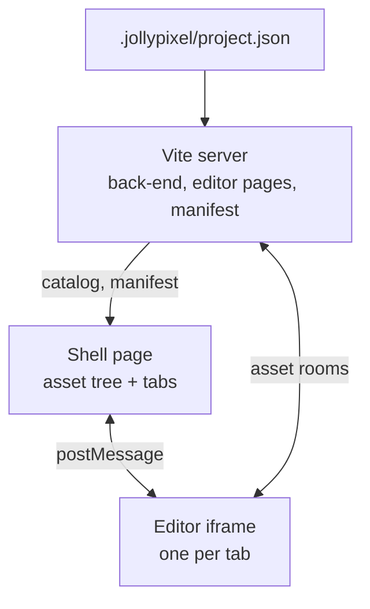
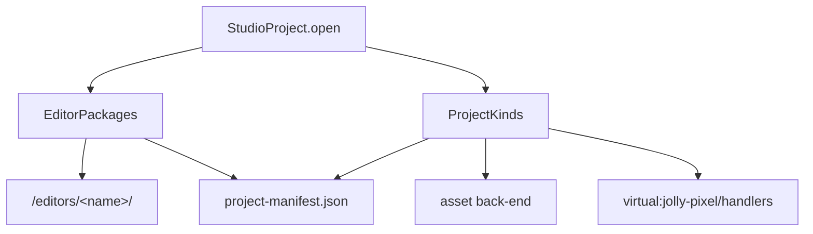
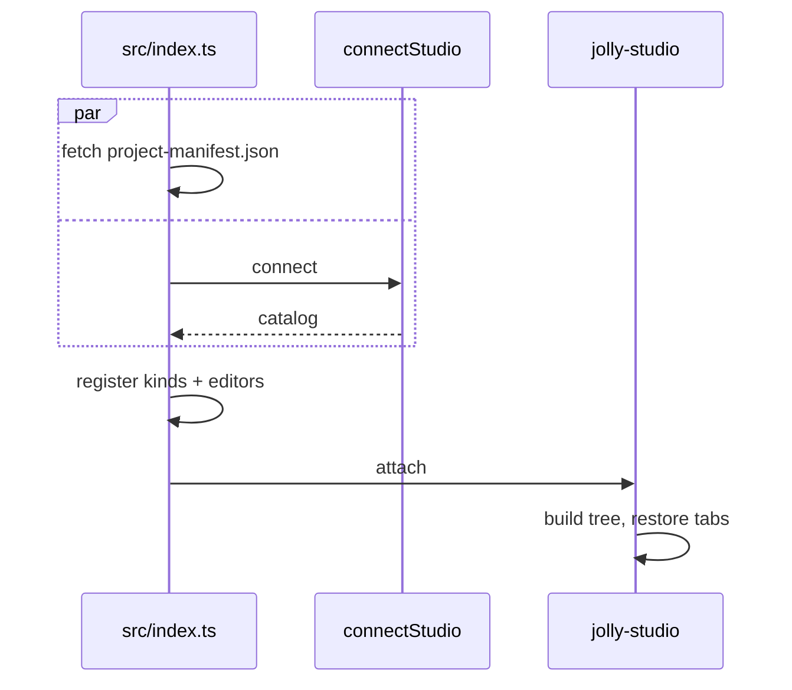
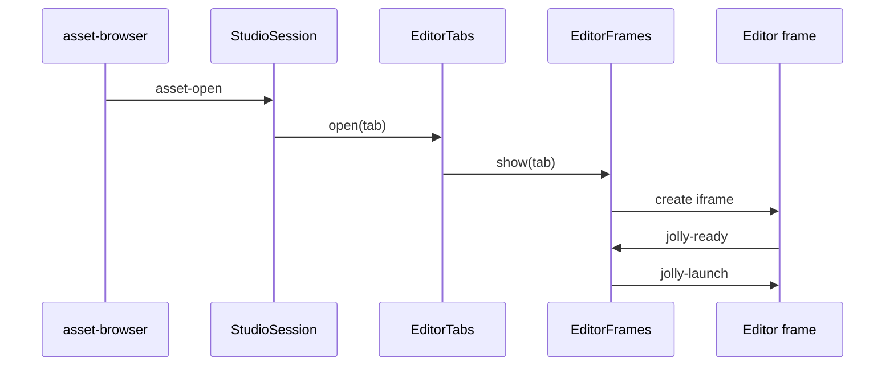
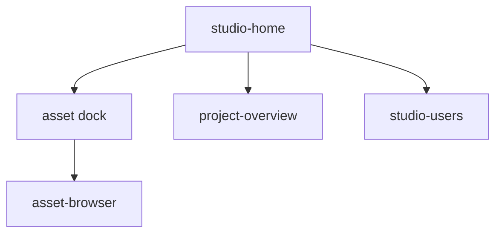
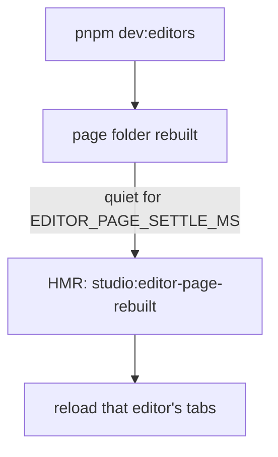

# Architecture

`@jolly-pixel/studio` opens one project: one asset back-end, one asset tree,
one editor page per tab.

See also: [ADRs](./docs/adr/README.md) · [roadmap](./ROADMAP.md) ·
[glossary](./GLOSSARY.md)

## Big picture

- The shell holds **data only**: kind descriptors, editor names, catalog records.
- Kind code runs in the back-end, editor code runs in the frames.
- Shell and frames share one origin but never share objects.

## Server

- `StudioProject.open` writes a default project file when none exists
  ([ADR-0016](./docs/adr/0016-the-project-file-lists-editors-and-kinds.md)).
- Packages resolve through `PackageResolver`: project `node_modules`, then the
  studio's. `./` or `../` means a project folder.
- An editor from `node_modules` is prebuilt and never watched
  ([ADR-0017](./docs/adr/0017-project-packages-are-trusted-code.md)).
- Editing the project file restarts the dev server.
- `server/` knows nothing of Vite; `vite/` only adapts it.
- `StudioAccess` reads the `access` section into a rights table with a
  built-in `admin` and the `AccountRoles`. `server/accounts` opens the
  project's `Accounts` on `.jollypixel/accounts.db`: the network server
  authenticates with it and registers its `accounts` room, and
  `vite/accountsPlugin` serves its `/api/accounts/` handler.
- The session cookie is named after the project root: cookies ignore ports.

| Mode | Project file | Back-end | Editor pages |
|---|---|---|---|
| `dev` | on disk | project root | each page folder |
| `e2e` | in memory | in memory, fixed port, accounts in memory, new accounts are `member` | same |
| `static` | in memory | none, no accounts, shell starts offline | `dist/editors/`, offline-only |

Online and offline back-ends get the same handlers (plus `texture`) and the
same seed (`src/seed.ts`).

## Boot

- The manifest loads while the sign-in dialog is open. A valid session cookie
  skips the dialog (`me`).
- Editor frames connect with the same cookie; `jolly-launch` carries the
  identity only.
- A refused socket (`unauthorized`) signs out and reloads to the dialog.
- Catalog unreachable: Retry, or go offline.
- Offline adds `{ offline, workspace: "studio" }` to every editor URL, so the
  frames join the same browser workspace.

## Opening an asset

- Kind without an editor: nothing opens, the row shows `no editor`.
- Already open: the tab gets focus.
- Tab cap reached: confirm closing the least recently used tab.
- The iframe is created on first focus. Hidden tabs keep theirs
  (`display: none`). Closing a tab removes it.
- `EditorTabs` and `EditorFrames` are plain controllers, not Lit templates:
  moving an iframe reloads it.

## Frame messages

| Message | Direction | Carries |
|---|---|---|
| `jolly-ready` | frame → shell | nothing |
| `jolly-launch` | shell → frame | target asset, theme, density, the shell's peer identity, a port to the shell catalog and a port for the frame's console |
| `jolly-catalog-open` | frame → shell, on the launch port | a port for one catalog |
| `jolly-shell` | frame → shell | `open-asset` or `toggle-console` |
| `jolly-appearance` | shell → frame | new theme or density |

- `EditorFrames` ignores messages from any other window.
- Frames open their catalog on the launch port, served by the shell's
  `CatalogShare` ([ADR-0018](./docs/adr/0018-frames-read-the-catalog-through-the-shell.md)).
- The shell never answers a `jolly-shell` command.
- Online, every frame joins as the shell's peer (`username`, `peerId`), so one
  user has one presence color across tabs. Offline frames stay guests.
- One console for the whole studio: Ctrl+K in a frame posts `toggle-console`
  ([ADR-0015](./docs/adr/0015-the-studio-console-takes-precedence.md)).
- The frame serves its console namespaces on the console port, and
  `FrameConsoles` shows those of the active tab in the studio console
  ([ADR-0019](./docs/adr/0019-the-active-editor-namespaces-join-the-studio-console.md)).

## Saved state

| Key | Storage | Holds |
|---|---|---|
| `studio:tabs` | `localStorage` | open tab ids in order, active id |
| `studio:home-layout` | `localStorage` | asset dock size |
| `studio:asset-kind` | `localStorage` | kind filter |
| `jolly_session_<hash>` | HttpOnly cookie | session token, unreadable from scripts |

Restoring tabs skips missing assets and kinds without an editor, stops at the
cap, and loads only the active frame.

## Home

- Home is a fixed tab. Opening an editor hides it, so the tree keeps its state
  ([ADR-0014](./docs/adr/0014-the-asset-browser-lives-on-home.md)).
- `project-overview` counts assets per kind (`AssetTally`) and lists open
  editors.
- `studio-users`, in the right dock when online, draws the `accounts` room
  roster through `UsersTreeModel`; admins get a role menu.

## Asset browser

| Action | Trigger | Rule |
|---|---|---|
| Open | double-click, Enter | |
| Rename | F2 | keeps the extension, no `/` (moving is a drag) |
| Delete | Delete | dialog lists the assets that still reference it |
| New asset | toolbar, menu | back-end writes the default content, then rename starts |
| New folder | toolbar, menu | created in the project, then rename starts |
| Export | toolbar, menu | `<stem>.zip` with dependencies, not on folders |

- Context menu: right-click, Shift+F10 or the menu key.
- Folders start collapsed; the expanded ones are kept in `localStorage`
  (`studio:asset-expanded`), like the kind filter.
- The tree is `virtual` and scrolls inside the pane, under the toolbar.
- `AssetSelection` decides which actions apply, and re-checks before running.
- Errors go to the `jolly-log`.

## Catalog changes

- Asset deleted: its tab closes.
- Asset renamed: its tab label and tooltip update.
- The tree rebuilds but keeps expanded folders, selection and filter. It
  rebuilds only when an asset's kind, path or dependencies change, or a folder
  comes or goes (`CatalogLayout`): saving content changes only the revision.
- Folders live in the asset source: renaming one sends one command per asset
  inside, plus one per companion, then one `catalog:move-folder` that carries
  its empty folders over and deletes the old one.

## Editor pages

| Editor | Package | Page folder | Kinds |
|---|---|---|---|
| `voxel-map` | `@jolly-pixel/editor.voxel-map` | `dist/` | `voxelmap` |
| `voxel-model` | `@jolly-pixel/editor.voxel-model` | `dist/` | `voxelmodel` |
| `pixel-art` | `@jolly-pixel/editor.pixel-art` | `dist-page/` | `pixelart` |

- Each page bundles its own `editor.host` and `@jolly-pixel/ui`: change
  either, rebuild the page.
- Reload hits the active tab now, the others on next focus.
- `pixel-art` builds its page with `build:page`, which the studio `build`
  runs.

## Layout

| Path | Role |
|---|---|
| `server/` | project file, editor packages and pages, no Vite |
| `vite.config.ts`, `vite/` | Vite plugins |
| `src/index.ts` | boot |
| `src/connection.ts`, `src/offlineConnection.ts` | online catalog, offline fallback |
| `src/seed.ts` | seed for both back-ends |
| `src/catalog/` | pure tree logic (`AssetTreeModel`, `AssetPath`, …) |
| `src/accounts/` | `StudioSignedIn`, `UsersTreeModel`, `/users` console |
| `src/editors/` | `EditorRegistry`, `ProjectManifest` |
| `src/tabs/` | `EditorTabs`, `EditorFrames`, `SavedTabs` |
| `src/shell/` | `<jolly-studio>`, `StudioSession`, Home, asset browser, sign-in dialog, Users pane |
