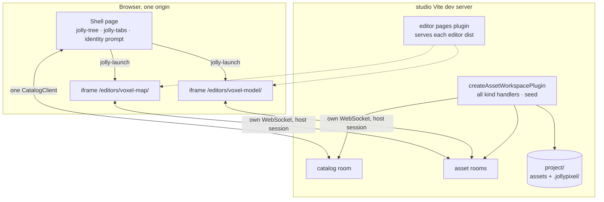

# @jolly-pixel/studio — SPEC

Status: P1 and P2 built on 2026-09-22, P3 on 2026-09-24. P4 is next.

## Goal

One workspace that assembles the front-end shell and the back-end for a
single JollyPixel **project**: an asset root, its configuration and, later,
its users. The studio opens a project, shows its assets in a tree and opens
one editor per tab. Today three editors each run their own back-end from
their own Vite config; the studio runs one back-end for all of them.

## Non-goals for the first cut

- Mounting editors in-process. Editors are page-scoped today (they query
  `document`, own the dock layout, boot at module top level). The shell
  launches pages. The `EditorDefinition` revisit in `editors/host/ROADMAP.md`
  happens after the shell exists, not before.
- Authentication, user persistence, a settings panel, a runtime tab to play a
  game, registering custom asset kinds. Each gets a reserved place below and
  nothing more.
- Creating new assets from the shell. The catalog `create` command needs
  inline content and no kind exposes a default document to the client yet.
- Production serving. The first cut is a Vite dev app, like the editors.

## Vocabulary

| Word | Meaning |
|---|---|
| studio | The app. Opens exactly one project per process. |
| project | An asset root plus its configuration. Lives on disk. |
| workspace | The back-end term for the project's assets behind one catalog. Unchanged, see `asset-server/docs/Workspace.md`. |
| shell | The studio page: tree, tabs, identity. |
| tab | One open editor page inside the shell. |
| editor page | An editor's built `index.html`, served by the studio under `/editors/<name>/`. |

"workspace" already names four things in this repository. The studio never
introduces a fifth meaning and never exports a type with that word.

## System map



Every URL an editor uses is origin-absolute: the WebSocket path, the catalog
path and the `/assets/` prefix. A page served from `/editors/<name>/` on the
studio origin therefore reaches the studio back-end without any editor change.

## Server side

`vite.config.ts` calls `createAssetWorkspacePlugin` once with:

- `root`: the `JOLLY_PROJECT` environment variable, resolved against the
  package, defaulting to `packages/studio/project`, which is gitignored like
  the editors' roots. The seed applies only to paths the root lacks, so
  pointing at a real project directory is safe.
- `handlers` and `seed` from `createStudioProject` in `src/seed.ts`, which the
  offline workspace shares. Handlers: pixel-art, voxel-map, voxel-model,
  texture. Seed: one tileset, one map referencing it, one model with its
  texture, so the tree is never empty. Documents come from the asset packages'
  builders (`createTilesetDocument`, `createVoxelMapDocument`,
  `createPixelArtDocument`, `createVoxelModelDocument`) and the studio's copy of
  the tileset PNG. A seed entry without `content` gets its handler's blank
  document. It imports nothing from the editors' private `vite/` folders.

A second plugin, `editorPagesPlugin`, serves each registered editor's `dist/`
directory at `/editors/<name>/` with `index.html` as the directory index.
`vite.config.ts` lists editor package names only; `readEditorPackages` reads
each one's `package.json`:

```json
"jollypixel": {
  "editor": {
    "name": "voxel-map",
    "kinds": ["voxelmap"],
    "dist": "dist"
  }
}
```

`dist` is optional. The plugin also serves the `name` and `kinds` of every
editor as the `virtual:jolly-pixel/editors` module the shell boots from. The
studio lists each editor package as a `devDependency` so `pnpm -r build` runs
the editors' existing `build` scripts first. Editors set `base: "./"` so their bundles work under that
prefix and stop colliding with the asset-server's `/assets/` route.

Two constraints on editor pages surfaced while building this:

- An editor entry must not top-level-await its mount. The bundle puts
  `editor.host`, the runtime and `@jolly-pixel/ui` into the entry chunk, and
  the runtime lazily imports chunks (performance stats, metrics panel,
  offline workspace) that import from that entry chunk. A top-level `await`
  in the entry makes those imports wait for the entry and the entry wait for
  them: the page hangs with nothing logged. Vite dev never bundles, so it
  never showed. Entries call `void boot()`.
- The pages bundle `editor.host`, so a host change needs the editors rebuilt
  before the studio sees it.

## Shell

Built with `@jolly-pixel/ui`, in one `jolly-scope`: a header row above one
`jolly-dock-layout`.

- **Header**: spans the whole width, above the asset dock and the workbench.
  It holds the editor tabs and, on the far right, a `jolly-toolbar` reserved
  for project actions (settings, run). It is plain markup in `Studio`, not an
  element of its own.
- **Left dock**: `<asset-browser>` in a pane whose header is hidden, with a
  wider resize handle (`--jolly-dock-handle-size: 8px`). It holds a kind
  filter, a toolbar and a `jolly-tree` bound to a `CatalogClient`. Folders are
  path prefixes, leaves are assets, icon by kind. Folder node ids are
  `folder:<path>`, asset node ids `asset:<id>`, so a rename keeps the node.
  Folders start expanded and the user's toggles are kept across catalog
  changes.
  - The kind filter is a `jolly-button-group`: All, then one button per
    registered kind, iconed and labelled from its descriptor. A kind shows
    only its assets and the folders holding them; renaming, moving or
    deleting a folder still covers every asset under it. The choice is kept
    in `localStorage` under `studio:asset-kind`.
  - Double-click or Enter opens an asset. F2 or the Rename action edits the
    name in place; an asset keeps its extension, since reconciliation infers
    the kind from it. A name holding a separator is refused: moving is a drag.
  - Renaming or dragging a folder sends one catalog rename per asset under
    it. The new label shows while the commands run and reverts on a
    rejection. Commands already applied are not rolled back; the log says how
    many went through.
  - Delete (key or action) opens `<asset-delete-dialog>`, listing the live
    assets outside the deleted set that still reference it, from
    `dependentsOf`. Confirming forces each command.
  - Export downloads the selected asset and its dependencies as
    `<stem>.zip`, from `CatalogClient.exportArchive`. It is disabled on a
    folder: an archive has a single root.
  - Failures go to a `jolly-log` over the workbench, never to the console
    only.
- **Tabs**: a reorderable `jolly-tabs` in the header. The first tab is Home,
  a `fixed`, icon-only tab that cannot be closed or moved; it shows the
  in-page `#studio-home` view (empty for now), does not count toward the tab
  cap and is shown at boot and whenever the last editor tab closes. Editor
  tabs carry their kind icon and can be dragged among themselves.
- **Workbench**: a stack of iframes, one per open asset, keyed by asset id,
  next to the home view. Activating a tree row focuses the existing tab or
  opens a new one. Closing a tab removes the iframe, which disposes the
  editor, its session and its contexts.
- **Identity**: the shell prompts once with `promptPeerIdentity` under the
  host's `jolly-pixel:username` key. Same-origin iframes in the same browser
  tab share `sessionStorage`, so editor pages find the stored name and do not
  prompt again. Each page still mints its own peer id.

### Editor registry

`EditorRegistry` (`src/editors/EditorRegistry.ts`) resolves a kind's icon and
editor page from data only, so the shell never loads a kind's handler or an
editor's code:

- `registerKind(descriptor)` takes an `AssetKindDescriptor` exported by the
  asset package (`PIXEL_ART_ASSET`, `VOXEL_MAP_ASSET`, `VOXEL_MODEL_ASSET`) and
  registers its SVG icon as `kind:<kind>`. A kind without an icon, or an
  unregistered one, shows `file`.
- `registerEditor({ name, kinds })` takes the entries of
  `virtual:jolly-pixel/editors`. A kind opened by two editors throws.
- `pageUrl(kind, target)` builds `/editors/<name>/?<query>&target=<id>`; the
  offline shell passes `{ offline: "", workspace: "studio" }` as `query`.

A kind with no editor, such as `texture`, opens nothing and the row shows a
`no editor` detail. `pixelart` gets an editor in P4, when its page declares
the manifest.

### Pixel-art page

Pixel-art has a library and a host-mounted demo under `examples/`, not an
editor page. The studio plan adds one in `packages/editors/pixel-art`:

- A `PixelArtEditor` class accepting `pixelart`, mounting `pixel-draw-panel`
  over the target's synced document, with presence. No runtime preview,
  rotation toggle or demo query parameters.
- Its own `index.html` and boot module, reusing the demo's boot pieces that
  are not demo-specific. The demo stays unchanged for its e2e suite.
- Built with Vite to `dist-page/`, so the `tsc` library `dist/` is untouched
  and the studio's pages plugin resolves that folder for this editor.

The voxel-map Paint tab opening its tileset through `context.shell` is the
first shell-channel consumer, once this page exists.

### Launch handshake

Today `HostMessageLaunchSource` waits one second for `jolly-launch` from the
parent, then falls back to the query string. The shell replaces the race:

1. The editor page posts `{ type: "jolly-ready" }` to its parent as soon as
   the launch source starts reading, once per allowed origin (the page's own
   origin by default), so another origin never learns the page is framed.
   A `jolly-launch` from an origin outside the list is ignored.
2. The shell answers with `{ type: "jolly-launch", target }`, addressed to
   its own origin.
3. The timeout stays as a fallback for a page framed by something else. The
   iframe URL also carries `?target=`, so a shell too slow to answer still
   opens the right asset, without a shell channel.

The message carries the target id only. Identity, tokens and settings are
added to it later, in that order, when each exists.

### Shell channel

The reverse direction exists from the first cut, with one command:

```ts
{ type: "jolly-shell", command: "open-asset", target: string }
```

- `editor.host` exposes it as `context.shell`, a `ShellChannel` with
  `openAsset(id: AssetId)`. It is `null` unless the launch came from the
  parent's answer to `jolly-ready`, so a page framed by something else, or
  not framed at all, never posts into the void. The channel is bound to the
  origin of the parent's answer and posts only there. `isReadyMessage` and
  `isShellCommand` narrow messages on the shell side.
- The shell handles `open-asset` exactly like a tree activation: focus the
  existing tab or open one, subject to the registry and the tab cap.
- New commands are new members of the command union. Title and dirty state
  are the expected next two. Nothing is reserved by name.
- The channel is one-way per command: the shell never replies on it. A
  command that needs an answer gets its own message type when it appears.

The voxel-map Paint tab is the first caller, in the pixel-art page phase.

### Tab cap

Four open editor tabs. Each editor holds several WebGL contexts and Chrome
caps a page at sixteen shared across same-origin frames. Opening a fifth
asks to close the least recently activated tab, and cancelling leaves the
request unopened.

## Reserved places

| Later feature | Where it lands |
|---|---|
| Authentication | Shell logs in once; the launch message carries a token; the network `AuthenticationProvider` checks it on upgrade. Editors never learn how identity was obtained. |
| Project configuration | `project/.jollypixel/project.json` beside the event log. The editor package list and the kind descriptors move there; the registry and the manifests keep their shapes. |
| User preferences | A per-user store the shell owns; layout keys stay in `localStorage` until then. |
| Runtime tab | Another page in another iframe. No editor contract involved. |
| In-process editors | The `EditorDefinition` revisit: `mount` takes a container, not `document`. |
| New asset | The server builds the blank document from the kind's handler, as seed entries without `content` do; the tree action sends only a path and a kind. |

## Limits

- Each tab is a full editor: its own WebSocket, runtime and WebGL contexts,
  hence the tab cap above.
- Editor code has no HMR inside the studio. Editors keep their own Vite
  config and back-end for standalone development and e2e.
- Handler registration is duplicated between the studio and each editor's
  Vite config until `project.json` owns it; within the studio,
  `createStudioProject` is the single list.
- The same user has a different presence color in each tab, since color
  derives from the per-page peer id. Fixed when identity rides the launch
  message.

## Docs site

`studio/**` joins `editors/**` in the VitePress `srcExclude`. It is an app,
not a library; its `README.md` and `ARCHITECTURE.md` are read in the repo.

## Decisions log

Grilled 2026-09-22, one per turn:

- Serve built editor `dist/` folders, no dev-server proxy, no multi-page
  Vite root.
- Reverse channel from the first cut, one command.
- A dedicated pixel-art editor page joins the plan, built from the demo's
  generic pieces, demo left untouched.
- Settled without grilling: tab cap of four, `JOLLY_PROJECT` root with a
  default, editors keep their existing `build` scripts, studio excluded from
  the docs site.

Settled while building P1 and P2, 2026-09-22:

- Editor entries drop their top-level `await` (see the server-side section).
- The shell is plain DOM over `@jolly-pixel/ui` elements, no Lit component
  of its own: a `StudioShell` wires a `CatalogClient`, the tree and an
  `EditorTabs` controller. Fine while the shell has one screen. Superseded
  in P3, below.
- Inactive editor frames are `display: none`. Their sockets stay open; their
  render loops pause with the frame, which is the cheap side of the tab cap.
- Seeded ids are fixed (`map-overworld`, `tileset-default`, `model-default`,
  `model-texture`) so the README and the tests can name them.

Settled while building P3, 2026-09-24:

- The shell is Lit, one element per panel, like the editors: `<jolly-studio>`
  owns layout, tabs and routing; `<asset-browser>` owns the tree, its state
  and the catalog commands. Each later panel gets its own folder under
  `src/shell/`. Pure decisions live in `AssetPath` and `AssetTreeModel`,
  which are the only unit-tested parts; element flows are e2e.
- `EditorTabs` stays an imperative controller: an iframe reloads when it is
  moved or re-created, so a template must never own the frames.
- Partial folder renames and deletes are reported, not rolled back.
