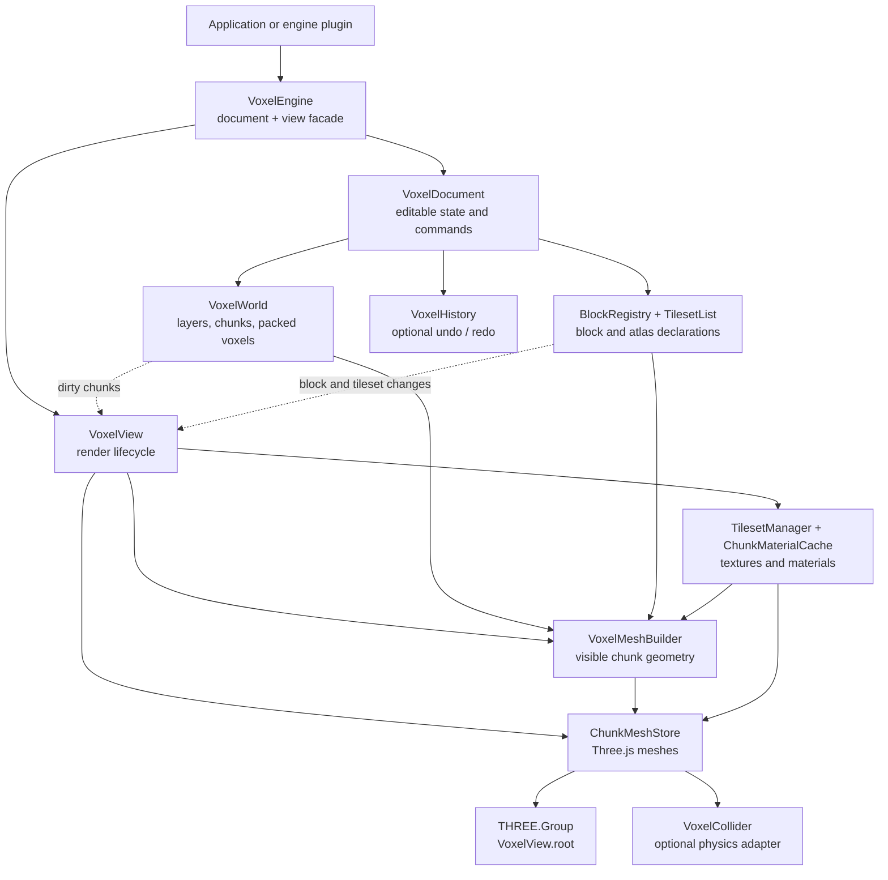
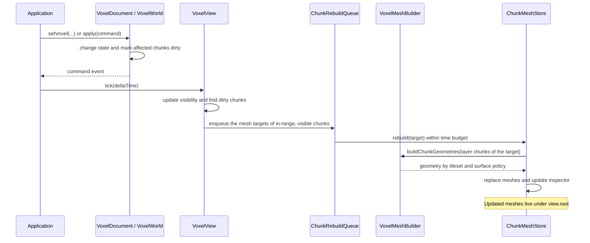
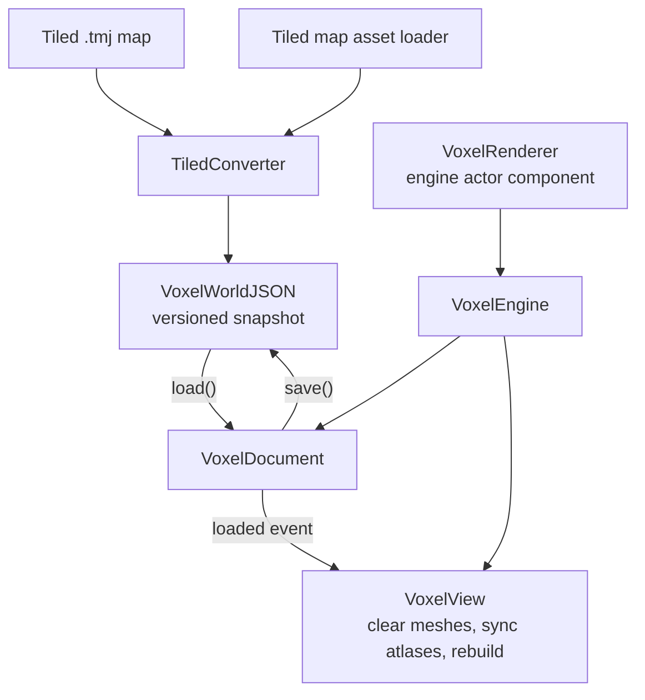

# Voxel renderer architecture

`VoxelEngine` composes a headless `VoxelDocument` with a Three.js `VoxelView`.
Applications can use the document alone to edit, serialize, or synchronize voxel
state. The view observes that state and owns the meshes, materials, and optional
collision adapter needed to draw it.

## Workspace map

The document owns `VoxelWorld`, block definitions, tileset declarations, and
history. A world contains ordered `VoxelLayer` instances; each layer stores
voxels in `VoxelChunk` instances backed by a sparse `VoxelStore`. The view owns
the Three.js root, shape registry, loaded atlas textures, rebuild queue, mesh
store, materials, inspector, and optional collider. `VoxelEngine` forwards the
common operations and exposes `document` and `view` for callers that need them.

| Concern | Owner | Boundary |
|---|---|---|
| Voxel and layer edits | `VoxelWorld` | Marks affected chunks dirty and emits layer commands |
| Block and tileset edits | `VoxelDocument` | Applies commands and emits invalidation events |
| Geometry | `VoxelMeshBuilder` | Reads world, block, shape, and atlas data; returns chunk geometries |
| Scene objects | `ChunkMeshStore` | Creates and disposes chunk meshes under `VoxelView.root` |
| Physics | `VoxelCollider` | Optional adapter receives rebuilt chunk geometry |

## Edit to rendered chunk

Voxel writes dirty the affected chunk and boundary neighbours across layers,
because an edit can expose or cover their faces. Block definition or tileset
changes invalidate all chunks. On each `tick()`, the view removes deleted chunks,
updates view-distance visibility, queues eligible dirty chunks, and drains the
queue within `rebuildBudgetMs` (8 ms by default). `flush()` drains the eligible
queue immediately. `init()` and document loads mark the whole world dirty and
flush chunks eligible for the current view distance.

`ChunkMeshLayout` maps each dirty layer chunk to a mesh target. Visible layers
at opacity `1` whose position is a multiple of the chunk size share one target
per chunk cell, so overlapping layers cost one set of meshes and draw calls.
Faded layers and layers off the chunk grid keep one target per layer chunk.
When a chunk moves to another target, the view rebuilds or removes the one it
left.

`VoxelMeshBuilder` resolves block shapes, textures, and neighbouring cells,
then runs the naive mesher or optional greedy mesher. The resulting geometries
are grouped by tileset and surface policy. `ChunkMeshStore` replaces the old
meshes, gets materials from `ChunkMaterialCache`, registers inspector metrics,
and passes the geometry to a configured `VoxelCollider`. The collider interface
keeps physics backend selection outside the core; a Rapier implementation is
provided in `plugins/rapier`.

When `focus` and a finite `viewDistance` are set, chunks outside the range stay
dirty until they enter it. Previously built chunks are hidden or unloaded by
`viewDistancePolicy`; unloading a visual mesh retains its collider. Layer
visibility and opacity also affect which meshes are built and drawn.

## Save, load, and integrations

`save()` serializes the world's layers and object layers together with block
and tileset definitions. `load()` validates the snapshot, replaces document
state, clears history, and emits `loaded`; the view then clears old meshes,
syncs atlases, and rebuilds. Texture objects are supplied separately when
loading a snapshot. `TiledConverter` produces the same snapshot format from a
Tiled map, and the Tiled asset loader packages it for `@jolly-pixel/asset`.

`plugins/engine/VoxelRenderer` attaches the root to an engine actor, samples an
optional focus object, calls `tick()` on update, and disposes the engine when
the component is destroyed. Direct Three.js users can instead add
`engine.root` to a scene and drive `init()`, `tick()`, and `dispose()` themselves.

Details: [world model](./docs/concepts/world-model.md),
[rendering and meshing](./docs/concepts/rendering-and-meshing.md),
[`VoxelDocument`](./docs/api/core/VoxelDocument.md),
[`VoxelView`](./docs/api/core/VoxelView.md),
[`VoxelEngine`](./docs/api/core/VoxelEngine.md),
[serialization](./docs/api/serialization/serialization.md), and
[physics integration](./docs/guides/adding-physics.md).
