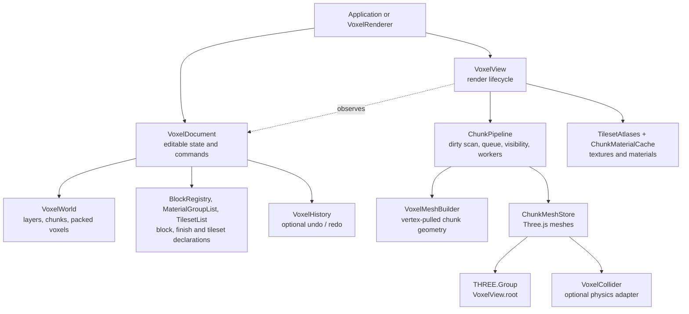
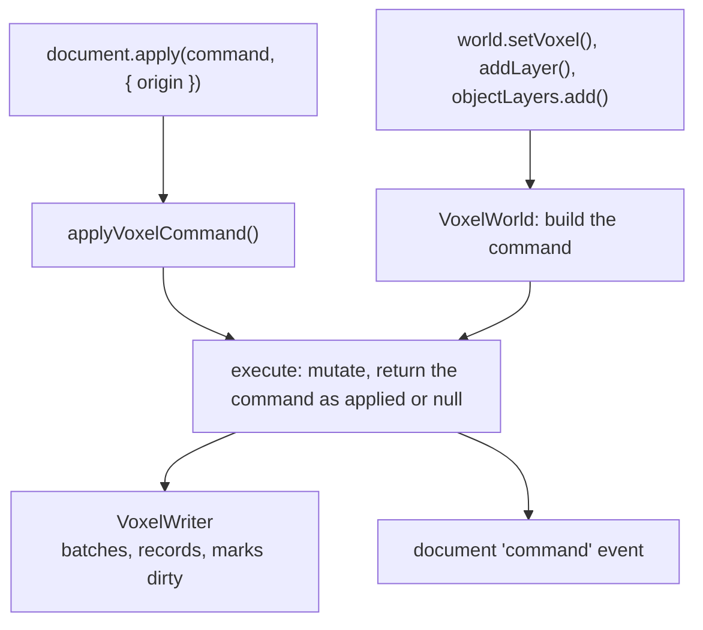
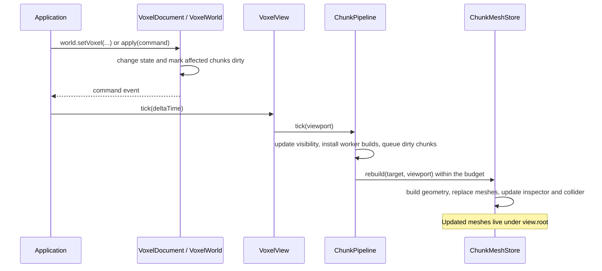
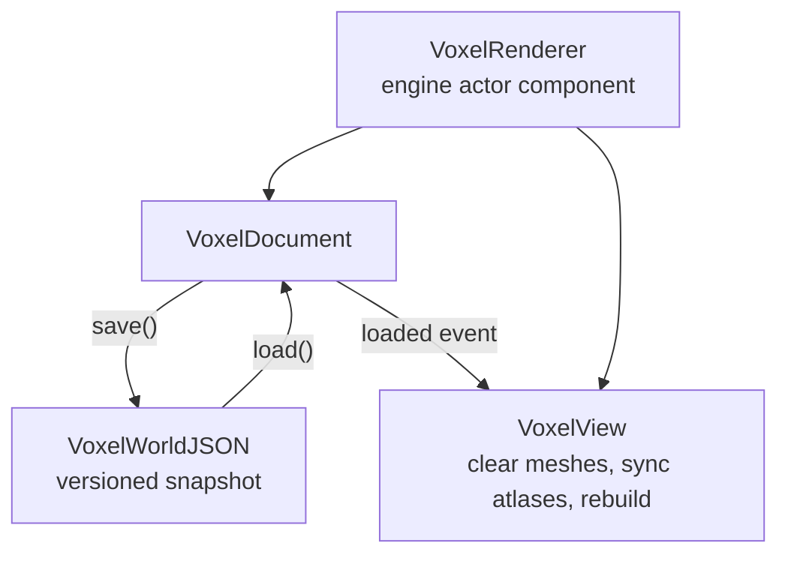

# Voxel renderer architecture

The package has two layers. `src/document` is the headless `VoxelDocument`:
world, blocks, tilesets, materials, history, commands and serialization. It
never imports the view, which a lint rule enforces. `src/view` is the Three.js
`VoxelView` that observes a document and owns the meshes, materials, atlases,
workers and optional collision adapter needed to draw it. `plugins/engine`
wraps both in a JollyPixel actor component.

## Workspace map

```mermaid
flowchart TB
    App["Application or VoxelRenderer"] --> Document["VoxelDocument<br/>editable state and commands"]
    App --> View["VoxelView<br/>render lifecycle"]
    View -. "observes" .-> Document

    Document --> World["VoxelWorld<br/>layers, chunks, packed voxels"]
    Document --> Definitions["BlockRegistry, MaterialGroupList, TilesetList<br/>block, finish and tileset declarations"]
    Document --> History["VoxelHistory<br/>optional undo / redo"]

    View --> Pipeline["ChunkPipeline<br/>dirty scan, queue, visibility, workers"]
    View --> Atlases["TilesetAtlases + ChunkMaterialCache<br/>textures and materials"]
    Pipeline --> Builder["VoxelMeshBuilder<br/>vertex-pulled chunk geometry"]
    Pipeline --> Store["ChunkMeshStore<br/>Three.js meshes"]
    Store --> Root["THREE.Group<br/>VoxelView.root"]
    Store --> Collider["VoxelCollider<br/>optional physics adapter"]
```

| Folder | Holds |
|---|---|
| `document/world` | `VoxelWorld`, `VoxelLayer`, chunk `storage/`, the `editing/` write path, object layers |
| `document/blocks`, `tilesets`, `materials` | Definitions, tileset links and documents, projection between tileset and world ids |
| `document/commands`, `serialization` | Command types and appliers, the `VoxelWorldJSON` codec |
| `document/geometry` | Face directions, `VoxelTransform`, rotations, voxel picking helpers |
| `view/chunks` | `ChunkPipeline`, mesh targets, rebuild queue, viewport, visibility, mesh store |
| `view/meshing`, `shading` | CPU face emission and the pulled face format, TSL nodes and chunk materials |
| `view/workers`, `atlases`, `options` | Mesh workers, atlas textures, `rendering` / `lighting` / `range` settings |

## Commands

```mermaid
flowchart TB
    Edit["world.setVoxel(), addLayer(), objectLayers.add()"] --> Dispatch["VoxelWorld: build the command"]
    Remote["document.apply(command, { origin })"] --> Apply["applyVoxelCommand()"]
    Apply --> Execute
    Dispatch --> Execute["execute: mutate, return the command as applied or null"]
    Execute --> Writer["VoxelWriter<br/>batches, records, marks dirty"]
    Execute --> Event["document 'command' event"]
```

Every aggregate applies its own commands and returns them as applied:
`VoxelWorld` (layers, voxels, object layers), `BlockRegistry`,
`MaterialGroupList` and `TilesetList`. `VoxelDocument` and `TilesetDocument`
share `BlockDocument`, which emits an applied command once with its origin.
A local world edit is emitted as `"local"`; `apply()` replays a peer command
without the world re-emitting it.

## Edit to rendered chunk

```mermaid
sequenceDiagram
    participant App as Application
    participant Document as VoxelDocument / VoxelWorld
    participant View as VoxelView
    participant Pipeline as ChunkPipeline
    participant Store as ChunkMeshStore

    App->>Document: world.setVoxel(...) or apply(command)
    Document->>Document: change state and mark affected chunks dirty
    Document-->>App: command event
    App->>View: tick(deltaTime)
    View->>Pipeline: tick(viewport)
    Pipeline->>Pipeline: update visibility, install worker builds, queue dirty chunks
    Pipeline->>Store: rebuild(target, viewport) within the budget
    Store->>Store: build geometry, replace meshes, update inspector and collider
    Note over Store: Updated meshes live under view.root
```

Voxel writes dirty the affected chunk and boundary neighbours across layers,
because an edit can expose or cover their faces. Block definition or tileset
changes invalidate all chunks. `flush()` drains the queue at once; `init()` and
a document load mark the whole world dirty and flush it unless mesh workers are
running.

`ChunkMeshLayout` maps each dirty layer chunk to a mesh target: a `"cell"`
target shared by the aligned opaque layers of one chunk cell, or a `"layer"`
target for an off-grid layer chunk. When a chunk moves to another
target, the pipeline rebuilds or removes the one it left.

## Save, load, and integrations

```mermaid
flowchart TB
    Document["VoxelDocument"] -->|"save()"| Snapshot["VoxelWorldJSON<br/>versioned snapshot"]
    Snapshot -->|"load()"| Document
    Document -->|"loaded event"| View["VoxelView<br/>clear meshes, sync atlases, rebuild"]
    Plugin["VoxelRenderer<br/>engine actor component"] --> Document
    Plugin --> View
```

`save()` serializes the world's layers, object layers and tileset links.
The snapshot stores each layer as a palette plus run-length encoded chunks
(see [serialization](./docs/api/serialization/serialization.md)). Saving
captures chunks as sorted cells and packed voxels, and loading writes them back
chunk by chunk when the chunk sizes match.
`load()` validates the snapshot, replaces document state, clears history, and
emits `loaded`; the view then clears old meshes, syncs atlases, and rebuilds.
`view.load()` registers the textures of the snapshot's tilesets before the
document loads it.

`plugins/engine/VoxelRenderer` attaches `view.root` to an actor, samples an
optional focus object, ticks the view on update, and on destroy disposes the
view and, when it built it, the document. Direct Three.js users add
`view.root` to a scene and drive `init()`, `tick()` and `dispose()` themselves.

Details: [world model](./docs/concepts/world-model.md),
[rendering and meshing](./docs/concepts/rendering-and-meshing.md),
[`VoxelDocument`](./docs/api/core/VoxelDocument.md),
[`VoxelView`](./docs/api/core/VoxelView.md),
[`VoxelRenderer`](./docs/api/engine/VoxelRenderer.md),
[serialization](./docs/api/serialization/serialization.md), and
[physics integration](./docs/guides/adding-physics.md).
