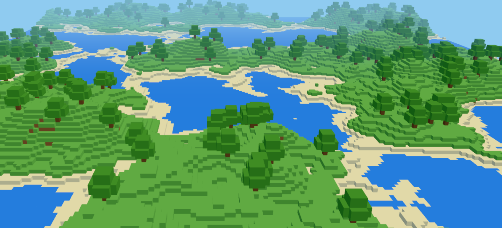

<h1 align="center">
  Voxel.Renderer
</h1>

<p align="center">
  JollyPixel Voxel Engine and Renderer
</p>

<p align="center">
  
</p>

## 📌 About

Chunked voxel engine and Three.js renderer. Use `VoxelEngine` directly, or `VoxelRenderer` to plug it into a JollyPixel [engine][engine] (ECS) scene.

## 💡 Features

- Chunked world (default 16³) - only dirty chunks are rebuilt each frame, the rest are left alone
- Named layers composited top-down; decorative layers override base terrain without Z-fighting
- Toggle visibility, reorder, add/remove layers, and move them in world space
- Face culling between adjacent solid voxels to keep triangle counts low
- Optional greedy meshing (`greedy: true`) merging coplanar identical faces - about 3x fewer triangles on terrain
- Many built-in block shapes (cube, slabs, ramp, corners, pole, stairs) and a `BlockShape` interface for custom geometry
- Per-block transforms via a packed byte - 90° Y rotations and X/Z flips without duplicating definitions
- Multiple tilesets at different resolutions; tiles referenced by `{ tilesetId, col, row }`
- Per-face texture overrides on any block definition
- `"lambert"` (default) or `"standard"` (PBR) material modes
- Configurable `alphaTest` for foliage and sprite-style cutout blocks
- `save()` / `load()` round-trips the full world state as plain JSON
- `TiledConverter` to import Tiled `.tmj` maps in `"stacked"` or `"flat"` layer modes
- Optional physics through the backend-agnostic `VoxelCollider` interface, with `"box"` or `"trimesh"` colliders rebuilt per dirty chunk and a Rapier3D plugin included; zero extra dependency if omitted
- Compatible with JollyPixel engine logger
- Debug mode (`engine.debug`) exposing live face/triangle counts and a wireframe view of the meshed chunks

## 💃 Getting Started

This package is available in the Node Package Repository and can be easily installed with [npm][npm] or [yarn][yarn].

```bash
$ npm i @jolly-pixel/voxel.renderer
# or
$ yarn add @jolly-pixel/voxel.renderer
```

## 👀 Usage example

### Basic - place voxels manually

```ts
const blocks: BlockDefinition[] = [
  {
    id: 1,
    name: "Dirt",
    shapeId: "cube",
    collidable: true,
    faceTextures: {
      [Face.PosY]: {
        tilesetId: "default",
        col: 0,
        row: 2
      },
      [Face.NegX]: {
        tilesetId: "default",
        col: 0,
        row: 1
      },
      [Face.NegZ]: {
        tilesetId: "default",
        col: 0,
        row: 1
      },
      [Face.PosX]: {
        tilesetId: "default",
        col: 0,
        row: 1
      },
      [Face.PosZ]: {
        tilesetId: "default",
        col: 0,
        row: 1
      }
    },
    defaultTexture: {
      tilesetId: "default",
      col: 2,
      row: 0
    }
  }
];

const voxelMap = world.createActor("map")
  .addComponentAndGet(VoxelRenderer, {
    chunkSize: 16,
    layers: ["Ground"],
    blocks
  });

voxelMap.engine.loadTileset({
  id: "default",
  src: "tileset/UV_cube.png",
  tileSize: 32
});

// Place a flat 8×8 ground plane
for (let x = 0; x < 8; x++) {
  for (let z = 0; z < 8; z++) {
    voxelMap.engine.setVoxel("Ground", {
      position: { x, y: 0, z },
      blockId: 1
    });
  }
}
```

### Rapier3D physics

Physics is plugged in through the backend-agnostic `VoxelCollider` interface

```ts
import Rapier from "@dimforge/rapier3d-compat";
import { RapierVoxelCollider } from "@jolly-pixel/voxel.renderer/plugins/rapier/index.js";

await Rapier.init();
const rapierWorld = new Rapier.World({
  x: 0,
  y: -9.81,
  z: 0
});

// Step physics once per fixed tick, before the scene update
world.on("beforeFixedUpdate", () => rapierWorld.step());

const voxelMap = world.createActor("map")
  .addComponentAndGet(VoxelRenderer, {
    chunkSize: 16,
    layers: ["Ground"],
    blocks,
    collider: (context) => new RapierVoxelCollider({
      api: Rapier,
      world: rapierWorld,
      ...context
    })
  });
```

## 📚 API

- [VoxelEngine](docs/VoxelEngine.md) - Engine-agnostic core - options, voxel placement, tileset loading, save/load. Usable standalone or via `VoxelRenderer`.
- [VoxelRenderer](docs/VoxelRenderer.md) - `ActorComponent` wrapper around `VoxelEngine` for JollyPixel scenes.
- [World](docs/World.md) - `VoxelWorld`, `VoxelLayer`, `VoxelChunk`, and related types.
- [Blocks](docs/Blocks.md) - `BlockDefinition`, `ResolvedBlockDefinition`, `BlockShape`, `BlockRegistry`, `BlockShapeRegistry`, and `Face`.
- [Tileset](docs/Tileset.md) - `TilesetManager`, `TilesetDefinition`, `TileRef`, UV regions.
- [Serialization](docs/Serialization.md) - world serialization and JSON snapshot types.
- [Collision](docs/Collision.md) - The `VoxelCollider` contract and the bundled `RapierVoxelCollider` plugin.
- [Debug](docs/Debug.md) - `engine.debug`: live face/triangle statistics and wireframe visualization.
- [Built-In Shapes](docs/BuiltInShapes.md) - All built-in block shapes and custom shape authoring.
- [TiledConverter](docs/TiledConverter.md) - Converting Tiled `.tmj` exports to `VoxelWorldJSON`.
- [Asset kind](docs/AssetKind.md) - Persisting a voxel map as an event-sourced `@jolly-pixel/asset-server` asset.

## 🚀 Running the examples

Seven interactive examples live in the `examples/` directory and are served by Vite. Start the dev server from the package root:

```bash
npm run dev -w @jolly-pixel/voxel.renderer
```

Then open one of these URLs in your browser:

| URL | Script | What it shows |
|---|---|---|
| `http://localhost:5173/` | `demo-physics.ts` | A 32×32 voxel terrain with a raised platform and a Rapier3D physics sphere you can roll around with arrow keys |
| `http://localhost:5173/tileset.html` | `demo-tileset.ts` | Every tile in `Tileset001.png` laid out as UV-mapped quads with col/row labels, plus a rotating textured cube |
| `http://localhost:5173/shapes.html` | `demo-shapes.ts` | All 19 built-in block shapes rendered as coloured meshes with a wireframe overlay and labelled name |
| `http://localhost:5173/tiled.html` | `demo-tiled.ts` | A multi-layer Tiled `.tmj` map imported via `TiledConverter` in `"stacked"` mode with WASD camera navigation |
| `http://localhost:5173/noise-world.html` | `demo-noise-world.ts` | A Minecraft-like world generated from simplex noise, with live renderer and mesh counters - the benchmark example |
| `http://localhost:5173/flat-world.html` | `demo-flat-world.ts` | A server-authoritative flat world edited by several browsers at once, with peer brushes over the room's presence channel |
| `http://localhost:5173/transparency.html` | `demo-transparency.ts` | A diorama for checking transparency and lighting: blended water and glass, cutout leaves/grates/windows with and without `transparent: true`, an alpha-gradient probe for `alphaTest`, and live light, material and layer controls |

## 🧪 Benchmarks

### Noise-world benchmark

Use `noise-world.html` to measure the renderer under load. It builds a heightmap world from simplex noise and reports two separate costs: voxel writes via `setVoxel` and chunk meshing for dirty chunks.

It is configurable from the query string:

```text
/noise-world.html?size=512&chunk=32&seed=42
```

| Param | Default | Effect |
|---|---:|---|
| `size` | `256` | World width/depth in voxels (`size²` columns) |
| `chunk` | `16` | `chunkSize`; trades draw calls against rebuild cost |
| `seed` | `1337` | Terrain seed; the same seed always yields the same world |

### Headless benchmark

The browser HUD is only a sanity check; Vite's checker inflates timings. Run headless instead:

```bash
npm run bench
npm run bench -- --greedy
npm run bench:compare
```

Use the minimum of three runs when comparing numbers, since single runs can drift a lot on a throttled machine.

## 🔥 Troubleshooting

If something isn't working as expected, enable verbose logging to get detailed runtime output:

```ts
// Enable debug logs for the entire runtime
const { world } = runtime;
world.logger.setLevel("debug");
world.logger.enableNamespace("*");
```

Alternatively, pass a custom `Logger` instance to `VoxelRenderer`:

```ts
import { Systems } from "@jolly-pixel/engine";
import { VoxelRenderer } from "@jolly-pixel/voxel.renderer";

const vr = new VoxelRenderer({
  logger: new Systems.Logger({
    level: "trace",
    namespaces: ["*"]
  })
});
```

## Contributors guide

If you are a developer **looking to contribute** to the project, you must first read the [CONTRIBUTING][contributing] guide.

Once you have finished your development, check that the tests (and linter) are still good by running the following script:

```bash
$ npm run test
$ npm run lint
```

> [!CAUTION]
> In case you introduce a new feature or fix a bug, make sure to include tests for it as well.

## License

MIT

<!-- Reference-style links for DRYness -->

[npm]: https://docs.npmjs.com/getting-started/what-is-npm
[yarn]: https://yarnpkg.com
[contributing]: ../../CONTRIBUTING.md
[engine]: https://github.com/JollyPixel/editor/tree/main/packages/engine
