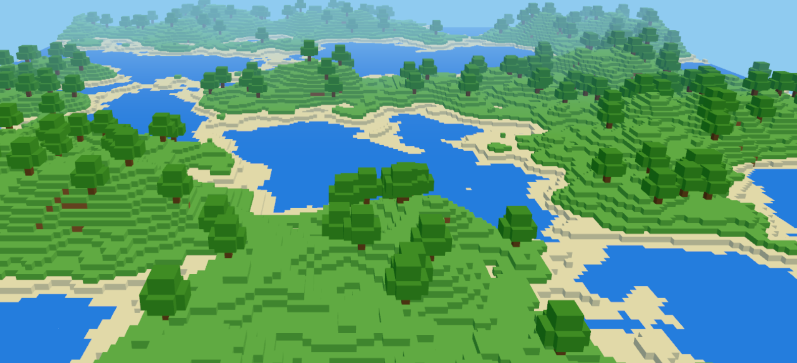

<h1 align="center">
  Voxel.Renderer
</h1>

<p align="center">
  Three.js Voxel Engine
</p>

<p align="center">
  
</p>

## 💡 Features

- Chunked world (default 16³) - only dirty chunks are rebuilt each frame, the rest are left alone
- Named layers with explicit visual compositing or cell replacement
- Toggle visibility, reorder, add/remove layers, and move them in world space
- Face culling between adjacent solid voxels to keep triangle counts low
- Vertex pulling: 8 bytes per face, vertices rebuilt in the shader - about 17x less chunk geometry memory than per-vertex attributes
- Many built-in block shapes (cube, slabs, ramp, corners, pole, stairs) and a `BlockShape` interface for custom geometry
- Per-block transforms via a packed byte - 90° Y rotations and X/Z flips without duplicating definitions
- Multiple blocksets at different resolutions; tiles referenced by `{ blocksetId, col, row }`
- Per-face texture overrides on any block definition
- `"lambert"` (default) or `"standard"` (PBR) material modes
- Opaque, masked, and blended block surfaces with configurable sides and mask cutoff
- `save()` / `load()` round-trips the full world state as plain JSON
- Undo/redo of voxel edits on a `CommandHistory` from `@jolly-pixel/history`, refusing a step a peer changed since
- Optional physics through the backend-agnostic `VoxelCollider` interface, with `"box"` or `"trimesh"` colliders rebuilt per dirty chunk and a Rapier3D plugin included; zero extra dependency if omitted
- Compatible with JollyPixel engine logger
- Inspector (`view.inspector`) exposing live face/triangle counts and a wireframe view of the meshed chunks

## 💃 Getting Started

This package is available in the Node Package Repository and can be easily installed with [npm][npm] or [yarn][yarn].

```bash
$ npm install @jolly-pixel/voxel.renderer
# or
$ yarn add @jolly-pixel/voxel.renderer
```

## 👀 Usage example

Load atlas textures before creating the view:

```ts
import {
  Face,
  VoxelDocument,
  VoxelView,
  loadBlocksets,
  type BlockDefinition
} from "@jolly-pixel/voxel.renderer";

const blocksets = await loadBlocksets([
  {
    id: "default",
    src: "blockset/UV_cube.png",
    tileSize: 32
  }
]);

const blocks: BlockDefinition[] = [
  {
    id: 1,
    name: "Dirt",
    shapeId: "cube",
    collidable: true,
    defaultTexture: {
      blocksetId: "default",
      col: 2,
      row: 0
    },
    faceTextures: {
      [Face.PosY]: {
        blocksetId: "default",
        col: 0,
        row: 2
      }
    }
  }
];

const document = new VoxelDocument({
  layers: ["Ground"],
  blocks
});
const view = new VoxelView(document, {
  blocksets
});

scene.add(view.root);
view.init();
```

Place voxels through the document; the view picks the edits up:

```ts
for (let x = 0; x < 8; x++) {
  for (let z = 0; z < 8; z++) {
    document.world.setVoxel("Ground", {
      position: {
        x,
        y: 0,
        z
      },
      blockId: 1
    });
  }
}
```

Call `view.tick(deltaTime)` from the application's frame loop. Remove
`view.root` and call `view.dispose()` during teardown; `view.dispose()` leaves
the document alone, so call `document.dispose()` once nothing else uses it.
ECS applications can wrap these calls in a component local to the application;
the renderer package does not depend on an ECS runtime.

## 📚 Documentation

### Concepts and guides

- [Glossary](GLOSSARY.md): shared vocabulary for worlds, blocks, layers, and
  meshing.
- [Architecture](ARCHITECTURE.md): the document and view layers and the
  source layout.
- [World model](docs/concepts/world-model.md): layers, chunks, compositing, and
  ownership.
- [Transparency](docs/api/core/VoxelTransparencyPassNode.md): scene compositing, setup, and limitations.
- [Rendering and meshing](docs/concepts/rendering-and-meshing.md): what each
  rendering feature does and what it costs.
- [Saving and loading worlds](docs/guides/saving-and-loading-worlds.md) and
  [creating custom shapes](docs/guides/creating-custom-shapes.md).
- [Adding physics](docs/guides/adding-physics.md).

### Core and world API

- [`VoxelDocument`](docs/api/core/VoxelDocument.md) (voxel data, headless) and
  [`VoxelView`](docs/api/core/VoxelView.md) (the meshes drawn from it).
- [`VoxelInspector`, mesh and block statistics](docs/api/core/VoxelInspector.md),
  [`VoxelEdits` undo source](docs/api/core/VoxelEdits.md), and
  [commands](docs/api/core/commands.md).
- [`VoxelWorld`](docs/api/world/VoxelWorld.md),
  [`VoxelLayer`](docs/api/world/VoxelLayer.md),
  [`VoxelTemplates`](docs/api/world/VoxelTemplates.md),
  [`VoxelChunk` and packed voxels](docs/api/world/VoxelChunk.md),
  [`VoxelTransform`](docs/api/world/VoxelTransform.md), and
  [`ViewDistance`](docs/api/world/ViewDistance.md).

### Blocks, blocksets, and rendering API

- [`BlockDefinition`](docs/api/blocks/BlockDefinition.md),
  [`BlockRegistry`](docs/api/blocks/BlockRegistry.md),
  [`BlockShape` and built-in shapes](docs/api/blocks/BlockShape.md),
  [`BlockSurface`](docs/api/blocks/BlockSurface.md),
  [`BlockTextures` and texture slots](docs/api/blocks/BlockTextures.md), and
  [`BlockPieces`](docs/api/blocks/BlockPieces.md).
- [Blocksets](docs/api/blocksets/blocksets.md),
  [`BlocksetDocument`](docs/api/blocksets/BlocksetDocument.md),
  [`BlocksetLink`](docs/api/blocksets/BlocksetLink.md),
  [`BlocksetAtlases`](docs/api/blocksets/BlocksetAtlases.md),
  [`BlocksetAtlas`](docs/api/blocksets/BlocksetAtlas.md),
  [`MaterialGroup`](docs/api/materials/MaterialGroup.md), and
  [`BlendGroup`](docs/api/materials/BlendGroup.md).
- [`VoxelCollider`](docs/api/collision/VoxelCollider.md) and
  [`RapierVoxelCollider`](docs/api/collision/RapierVoxelCollider.md).

### Serialization and integration API

- [Serialization and the world codec](docs/api/serialization/serialization.md).
- [`VoxelRenderer`](docs/api/engine/VoxelRenderer.md), the `@jolly-pixel/engine`
  actor component wrapping a `VoxelDocument` and a `VoxelView`.

## 🚀 Running the examples

Five interactive examples live in the `examples/` directory and are served by Vite. Start the dev server from the package root:

```bash
pnpm --filter @jolly-pixel/voxel.renderer dev
```

Then open one of these URLs in your browser:

| URL | Script | What it shows |
|---|---|---|
| `http://localhost:5173/` | `demo-physics.ts` | A 32×32 voxel terrain with a raised platform and a Rapier3D physics sphere you can roll around with arrow keys |
| `http://localhost:5173/blockset.html` | `demo-blockset.ts` | Every tile in `Blockset001.png` laid out as UV-mapped quads with col/row labels, plus a rotating textured cube |
| `http://localhost:5173/shapes.html` | `demo-shapes.ts` | All 19 built-in block shapes rendered as coloured meshes with a wireframe overlay and labelled name |
| `http://localhost:5173/noise-world.html` | `demo-noise-world.ts` | A Minecraft-like world (oceans, plains, snowy ridged mountains) generated with the `math` noise helpers, with live renderer and mesh counters - the benchmark example |
| `http://localhost:5173/transparency.html` | `demo-transparency.ts` | A diorama for checking transparency and lighting: blended water and glass, cutout leaves/grates/windows with explicit alpha modes, an alpha-gradient probe for `alphaTest`, and live light, material and layer controls |

## 🧪 Benchmarks

### Noise-world benchmark

Use `noise-world.html` to measure the renderer under load. It builds a heightmap world from layered simplex noise (continents, ridged mountains, domain warp) and reports two separate costs: voxel writes via `setVoxel` and chunk meshing for dirty chunks.

It is configurable from the query string:

```text
/noise-world.html?size=1024&chunk=32&seed=42
```

| Param | Default | Effect |
|---|---:|---|
| `size` | `512` | World width/depth in voxels (`size²` columns) |
| `chunk` | `32` | `chunkSize`; trades draw calls against rebuild cost |
| `seed` | `1337` | Terrain seed; the same seed always yields the same world |
| `workers` | `1` up to 512, `2` up to 1024, `4` above | Mesh workers, capped at `hardwareConcurrency - 1`; `0` meshes on the main thread |

The examples dev server sends `Cross-Origin-Opener-Policy` and `Cross-Origin-Embedder-Policy` headers, which mesh workers need for `SharedArrayBuffer`.

### Headless benchmark

The browser HUD is only a sanity check; Vite's checker inflates timings. Run headless instead:

```bash
pnpm run bench
pnpm run bench --workers 8
pnpm run bench:compare
```

`--workers N` meshes in N `worker_threads` ticked at 60 fps; `main thread` then reports the event loop busy time instead of the flush duration.

Use the minimum of three runs when comparing numbers, since single runs can drift a lot on a throttled machine.

### Block light and frame benchmarks

```bash
pnpm run bench:light --size 256 --lights 300
pnpm run bench:render --size 256 --lights 400 --resolution 1024
pnpm run bench:render --webgpu
```

`block-light.bench.ts` times the CPU side of block light on a stone floor with scattered lights and pillars: first and full relight, texture fill, falloff switch, single edits and the idle update. `--tint` sets the light colour. A coloured light relights on a falloff switch; a white one only rewrites its textures.

`render.bench.ts` reports the frame time of a lit map in headless Chrome (WebGL by default, `--webgpu` for WebGPU), with and without block light, glass and the glow pass. Three only advances its node frame inside the animation loop, so the bench page swaps `requestAnimationFrame` for an unthrottled one. The numbers are throughput, not latency, and only compare between runs on the same machine.

## 🔥 Troubleshooting

If something isn't working as expected, enable verbose logging to get detailed runtime output:

```ts
// Enable debug logs for the entire runtime
const { world } = runtime;
world.logger.setLevel("debug");
world.logger.enableNamespace("*");
```

Pass a custom logger to `VoxelDocument` and `VoxelView` when they are not
hosted by a runtime:

```ts
import { Systems } from "@jolly-pixel/engine";
import { VoxelDocument, VoxelView } from "@jolly-pixel/voxel.renderer";

const logger = new Systems.Logger({
  level: "trace",
  namespaces: ["*"]
});

const document = new VoxelDocument({ logger });
const view = new VoxelView(document, { logger });
```

## Contributors guide

If you are a developer **looking to contribute** to the project, you must first read the [CONTRIBUTING][contributing] guide.

Once you have finished your development, check that the tests (and linter) are still good by running the following script:

```bash
$ pnpm run test
$ pnpm run lint
```

> [!CAUTION]
> In case you introduce a new feature or fix a bug, make sure to include tests for it as well.

## License

MIT

<!-- Reference-style links for DRYness -->

[npm]: https://docs.npmjs.com/getting-started/what-is-npm
[yarn]: https://yarnpkg.com
[contributing]: ../../CONTRIBUTING.md
