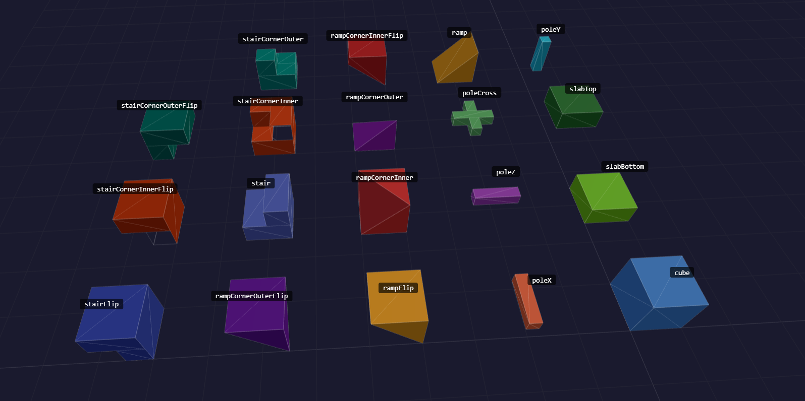

# Blocks

Block definitions, shapes, registries, and the `Face` constant.

## BlockDefinition

Authoring form of a block, accepted by `BlockRegistry.register()` and the
engine's `blocks` option. Only `id`, `name`, and `shapeId` are required.

```ts
export interface BlockDefinition {
  /** Unique numeric identifier, 1 or above. See [Air](#air). */
  id: number;
  /** Human-readable name for editor display. */
  name: string;
  /** ID of the BlockShape to use for geometry generation. */
  shapeId: BlockShapeID;
  /**
   * Per-face tile references.
   * If a face is absent, defaultTexture is used.
   * @default {}
   */
  faceTextures?: Partial<Record<FACE, TileRef>>;
  /** Fallback tile used for any face not listed in faceTextures. */
  defaultTexture?: TileRef;
  /**
   * If false, the mesh builder will not emit
   * collision geometry for this block.
   * @default true
   **/
  collidable?: boolean;
  /**
   * Set it on any block you can see through.
   * A transparent block never hides a neighbouring face.
   * @default false
   */
  transparent?: boolean;
  /** Fills in any tile ref that omits a tileset. Dropped once resolved. */
  defaultTilesetId?: string;
}
```

So a solid untextured block is:

```ts
registry.register({ id: 1, name: "Stone", shapeId: "cube" });
```

A `TileRef` may be a bare `[col, row]` tuple; resolution expands it and applies
`defaultTilesetId` to any ref that omits a tileset.

## Air

```ts
const AIR_BLOCK_ID = 0;
function isAir(blockId: number): boolean;
```

Id `0` is reserved: a cell holding air holds no voxel at all. Nothing stores it,
so both ends of the invariant throw rather than accept it.

- `BlockRegistry.register()` (and the constructor, which routes through it)
  throws an `Error` on a definition with id `0`.
- `packVoxel()` throws a `RangeError`, which takes every write path with it:
  `VoxelChunk.set()`, `VoxelLayer.setVoxelAt()`, `VoxelWorld.setVoxelAt()` and
  `VoxelEngine.setVoxel()`.

Erase a voxel with `removeVoxel()`; setting it to air is not a supported
alternative. On the read side, air is a missing entry: `undefined` from
`getVoxelAt()`, [`VOXEL_ABSENT`](./Chunk.md) from the packed accessors.

## ResolvedBlockDefinition

What `BlockRegistry` stores and every consumer reads: defaults applied, every
tile reference an object, and no `defaultTilesetId`.

```ts
export type ResolvedBlockDefinition =
  & Omit<
    BlockDefinition,
    "faceTextures" | "defaultTexture" | "collidable" | "defaultTilesetId"
  >
  & {
    faceTextures: Partial<Record<FACE, ResolvedTileRef>>;
    defaultTexture?: ResolvedTileRef;
    collidable: boolean;
  };
```

### `resolveBlockDefinition(def: BlockDefinition): ResolvedBlockDefinition`

Returns a new definition; `def` and its tile references are never mutated.
`BlockRegistry.register()` calls it for you.

## BlockShapeID

```ts
type BlockShapeID =
  | "cube"
  | "slabBottom"
  | "slabTop"
  | "poleY"
  | "pole"
  | "ramp"
  | "rampCornerInner"
  | "rampCornerOuter"
  | "stair"
  | "stairCornerInner"
  | "stairCornerOuter"
  | (string & {}); // custom shapes registered at runtime
```

> The `(string & {})` tail means any string compiles, but unknown IDs fail silently at
> runtime — the voxel is skipped. Always use a built-in ID or one registered via
> `BlockShapeRegistry.register()`.




## BlockCollisionHint

```ts
type BlockCollisionHint = "box" | "trimesh" | "none";
```

- `"box"` — compound cuboids; one per solid voxel. Cheapest; best for full-cube worlds.
- `"trimesh"` — exact triangle mesh built from rendered geometry. Accurate for slopes;
  may ghost-collide on shared edges.
- `"none"` — no collision geometry. Use for decorative or trigger blocks.

See [Collision](./Collision.md) for more information.

## FaceDefinition

Geometry descriptor for one polygonal face of a block shape.

```ts
interface FaceDefinition {
  /** Texture slot and default culling direction. */
  face: FACE;
  /** Neighbor to test; omitted uses `face`, while `null` disables culling. */
  cull?: FACE | null;
  /** Outward-pointing surface normal (need not be axis-aligned). */
  normal: Vec3;
  /** 3 (triangle) or 4 (quad) positions in 0-1 block space. */
  vertices: readonly Vec3[];
  /** Same count as vertices; UV coordinates in 0-1 tile space. */
  uvs: readonly Vec2[];
}
```

A quad is triangulated as `[0,1,2]` + `[0,2,3]`.

## BlockShape

Interface implemented by all shape classes.

```ts
interface BlockShape {
  readonly id: BlockShapeID;
  readonly faces: readonly FaceDefinition[];
  readonly collisionHint: BlockCollisionHint;
  occludes(face: Face): boolean;
}
```

`occludes(face)` returns `true` only when the shape fully covers the given face, allowing
the mesh builder to skip the opposite face on the neighbour. Partial shapes (ramps, wedges)
must return `false` to avoid incorrect face culling.

## BlockRegistry

Maps numeric block IDs to `ResolvedBlockDefinition` objects. Accessible via `VoxelEngine.blockRegistry`.

#### `register(def: BlockDefinition): this`

Registers a block definition, filling the defaults documented on
[`BlockDefinition`](#blockdefinition). Throws on `AIR_BLOCK_ID`, see
[Air](#air).

#### `get(id: number): ResolvedBlockDefinition | undefined`

#### `has(id: number): boolean`

#### `getAll(): IterableIterator<ResolvedBlockDefinition>`

#### `[Symbol.iterator](): IterableIterator<ResolvedBlockDefinition>`

Same iterator as `getAll()`, so the registry can be spread or used directly in
a `for...of` loop.

#### `readonly nextId: number`

Identifier to give the next block, one above the highest ever registered. Never
0 (air), and never reuses the gap a removed block left behind, so an id stays
tied to the block it was minted for.

Not clamped to `MAX_BLOCK_ID`; a world
holding that many blocks fails later, when the voxel is packed.

#### `readonly version: number`

Incremented on every `register()`. The mesh builder precompiles geometry per
block and uses this to notice that its cache went stale.

## BlockShapeRegistry

Maps shape IDs to `BlockShape` implementations. Pre-populated with all built-in shapes
by `VoxelEngine`. Accessible via `VoxelEngine.shapeRegistry`.

#### `register(shape: BlockShape): this`

#### `get(id: BlockShapeID): BlockShape | undefined`

#### `has(id: BlockShapeID): boolean`

#### `getAll(): IterableIterator<BlockShape>`

Every registered shape, in registration order.

#### `ids(): IterableIterator<BlockShapeID>`

IDs of every registered shape, in registration order.

#### `[Symbol.iterator](): IterableIterator<BlockShape>`

Same iterator as `getAll()`, so the registry can be spread or used directly in
a `for...of` loop.

#### `readonly version: number`

Incremented on every `register()`; see `BlockRegistry.version`.

#### `static createDefault(): BlockShapeRegistry`

Creates a standalone registry pre-loaded with all built-in shapes.

## blocksFromTileset

```ts
function* blocksFromTileset(
  def: ResolvedTilesetDefinition,
  options?: BlocksFromTilesetOptions
): IterableIterator<ResolvedBlockDefinition>;
```

Generates one cube block per tile of an atlas, numbered from 1 in row-major order,
so a grid can seed a `BlockRegistry` without hand-writing a definition per tile.
Take the definition from [`TilesetManager.atlas()`](./Tileset.md#tilesetmanager).
Generated blocks default to `collidable: false`; override that value in `map` when
the atlas represents solid terrain.

```ts
import { blocksFromTileset } from "@jolly-pixel/voxel.renderer";

const { blockRegistry, tilesetManager } = vr.engine;

const blocks = blocksFromTileset(
  tilesetManager.atlas().def,
  {
    limit: 32,
    map: () => ({ collidable: true })
  }
);
for (const block of blocks) {
  blockRegistry.register(block);
}
```

```ts
interface BlocksFromTilesetOptions {
  /**
   * Maximum block ID to generate (inclusive).
   * @default 255
   */
  limit?: number;
  map?: (blockId: number, col: number, row: number) => BlockOverrides;
}

type BlockOverrides = Partial<
  Pick<ResolvedBlockDefinition, "name" | "shapeId" | "collidable" | "transparent">
>;
```

## Face

Axis-aligned face directions used for culling decisions and per-face texture references.

```ts
const Face = {
  PosX: 0, // +X
  NegX: 1, // -X
  PosY: 2, // +Y (top)
  NegY: 3, // -Y (bottom)
  PosZ: 4, // +Z
  NegZ: 5  // -Z
} as const;

type Face = typeof Face[keyof typeof Face];
```
