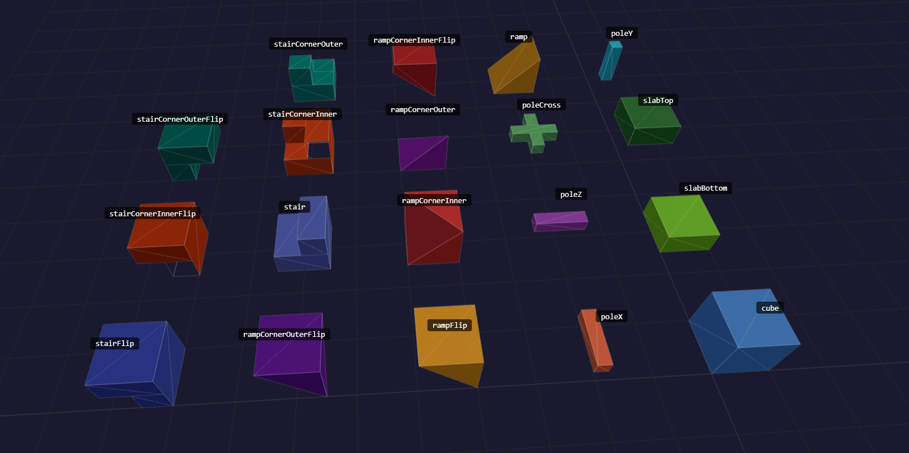

# Built-In Shapes

All shapes below are registered automatically by `VoxelRenderer`. They are also available
standalone via `BlockShapeRegistry.createDefault()`.

---

## Shape Reference



### Solid / Slab

- **`Cube`** — `shapeId: "cube"`, `collisionHint: "box"`.
  Standard 1×1×1 cube. Occludes all 6 faces.

- **`Slab`** — `shapeId: "slabBottom"`, `collisionHint: "box"`.
  Half-height slab occupying the bottom half (`y = 0–0.5`). Occludes `-Y` only.

- **`Slab`** — `shapeId: "slabTop"`, `collisionHint: "box"`.
  Half-height slab occupying the top half (`y = 0.5–1`). Occludes `+Y` only.

### Poles / Beams

All pole shapes use `collisionHint: "trimesh"` and occlude no faces (sub-voxel cross-section).

- **`PoleY`** — `shapeId: "poleY"`.
  Narrow vertical post (3/8–5/8 cross-section) running the full block height.

- **`Pole`** — `shapeId: "poleX"`.
  Narrow horizontal beam running along the X axis (full width, centered on Y/Z).

- **`Pole`** — `shapeId: "poleZ"`.
  Narrow horizontal beam running along the Z axis (full depth, centered on X/Y).

- **`PoleCross`** — `shapeId: "poleCross"`.
  Horizontal plus-connector at mid-height — X and Z beams merged at the centre.
  Internal intersection faces are omitted to avoid overdraw.

### Ramps

All ramp shapes use `collisionHint: "trimesh"`.

- **`Ramp`** — `shapeId: "ramp"`.
  Slope rising from `y = 0` at `-Z` to `y = 1` at `+Z`. Occludes `-Y` and `+Z`.

- **`RampFlip`** — `shapeId: "rampFlip"`.
  Y-flipped ramp: full height at `+Z`, ridge at `y = 1` along `-Z`. Occludes `+Y`, `-Y`, and `+Z`.

- **`RampCornerInner`** — `shapeId: "rampCornerInner"`.
  Concave inner corner where two ramps meet. Full walls at `+Z` and `+X`; diagonal slope toward
  the corner. Occludes `-Y`, `+Z`, and `+X`.

- **`RampCornerOuter`** — `shapeId: "rampCornerOuter"`.
  Convex outer corner (quarter-pyramid). Peaks at `(x=0, z=1)`. Occludes `-Y` only.

- **`RampCornerInnerFlip`** — `shapeId: "rampCornerInnerFlip"`.
  Y-flipped `RampCornerInner` — hangs from the ceiling. Occludes `+Y`, `+Z`, and `+X`.

- **`RampCornerOuterFlip`** — `shapeId: "rampCornerOuterFlip"`.
  Y-flipped `RampCornerOuter` — quarter-pyramid hanging from the ceiling. Occludes `+Y` only.

### Stairs

All stair shapes use `collisionHint: "trimesh"`.

- **`Stair`** — `shapeId: "stair"`.
  L-cross-section stair: full bottom slab + upper half-block at back (`z = 0.5–1`).
  High step at `+Z`. Occludes `-Y` and `+Z`.

- **`StairCornerInner`** — `shapeId: "stairCornerInner"`.
  Concave inner-corner stair. Full bottom slab; upper L-shaped block (3/4 top) with two inner
  risers. Occludes `-Y`, `+Z`, and `+X`.

- **`StairCornerOuter`** — `shapeId: "stairCornerOuter"`.
  Convex outer-corner stair. Full bottom slab; upper quarter-block at front-left only.
  Occludes `-Y` only.

- **`StairFlip`** — `shapeId: "stairFlip"`.
  Y-flipped `Stair` — hangs from the ceiling. Occludes `+Y` and `+Z`.

- **`StairCornerInnerFlip`** — `shapeId: "stairCornerInnerFlip"`.
  Y-flipped `StairCornerInner`. Occludes `+Y`, `+Z`, and `+X`.

- **`StairCornerOuterFlip`** — `shapeId: "stairCornerOuterFlip"`.
  Y-flipped `StairCornerOuter`. Occludes `+Y` only.

---

## Slab — SlabType

```ts
type SlabType = "top" | "bottom";
```

Passed to the `Slab` constructor to select which half of the block space the slab occupies.
The default is `"bottom"`.

---

## Pole — PoleAxis

```ts
type PoleAxis = "x" | "z";
```

Passed to the `Pole` constructor to select the axis along which the beam runs.
The default is `"z"`.

---

## Custom Shapes

Implement `BlockShape` and register the instance via the `shapes` option or `shapeRegistry.register()`:

```ts
import type { BlockShape, FaceDefinition, Face } from "@jolly-pixel/voxel.renderer";

class MyShape implements BlockShape {
  readonly id = "myShape";
  readonly collisionHint = "box" as const;
  readonly faces: readonly FaceDefinition[] = [
    // define triangles/quads in 0–1 block space
  ];

  occludes(_face: Face): boolean {
    return false; // return true only for fully covered faces
  }
}

// Option A — at construction time
const vr = actor.addComponentAndGet(VoxelRenderer, {
  shapes: [new MyShape()]
});

// Option B — at any time before voxels are placed
vr.shapeRegistry.register(new MyShape());
```

Then reference the shape in a `BlockDefinition`:

```ts
vr.blockRegistry.register({
  id: 10,
  name: "Custom",
  shapeId: "myShape",
  collidable: true,
  faceTextures: {},
  defaultTexture: { col: 0, row: 0 }
});
```
