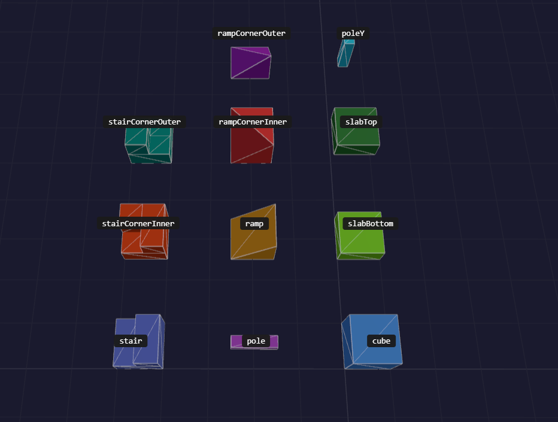

# BlockShape

A shape is the geometry a block draws and collides with, named by
`BlockDefinition.shapeId`. Every `VoxelView` registers the built-in shapes in
`view.shapes`; add your own with the `shapes` view option or
`view.shapes.register()`. See
[creating custom shapes](../../guides/creating-custom-shapes.md) for a full
example.

```ts
interface BlockShape {
  readonly id: BlockShapeID;
  readonly faces: readonly FaceDefinition[];
  readonly collisionHint: BlockCollisionHint;

  occludes(face: Face): boolean;
}

type BlockShapeID = "cube" | "slabBottom" | ... | (string & {});
type BlockCollisionHint = "box" | "trimesh" | "none";
```

`BlockShapeID` lists the built-in ids but accepts any string. A block naming
an unregistered shape is not drawn.

`occludes(face)` returns `true` when the shape covers that whole side of its
cell, which hides the neighbour's face against it. Return `false` for partial
coverage: a wrong `true` removes visible geometry from the neighbour.

`collisionHint` picks the collider a
[`VoxelCollider`](../collision/VoxelCollider.md) builds: a box, a triangle mesh
of the faces, or nothing.

## Built-in shapes



| Shape id | Class | Collision | Occludes | Texture slots |
|---|---|---|---|---|
| `cube` | `new Cube(id?)` | box | all | six faces |
| `slabBottom` | `new Slab("bottom", id?)` | box | `NegY` | six faces |
| `slabTop` | `new Slab("top", id?)` | box | `PosY` | six faces |
| `slabBeam` | `new Slab("beam", id?)` | box | none | six faces |
| `slabCorner` | `new Slab("corner", id?)` | box | none | six faces |
| `slabNotch` | `new Slab("notch", id?)` | trimesh | none | adds `left.1`, `back.1` |
| `wall` | `new Wall("straight", id?)` | box | none | six faces |
| `wallCorner` | `new Wall("corner", id?)` | trimesh | none | adds `right.1`, `front.1` |
| `wallTee` | `new Wall("tee", id?)` | trimesh | none | adds `right.1`, `front.1`, `back.1` |
| `wallCross` | `new Wall("cross", id?)` | trimesh | none | adds a `.1` slot on each side |
| `poleY` | `new PoleY(id?)` | box | none | six faces |
| `pole` | `new Pole("straight", "none", id?)` | box | none | six faces |
| `poleCorner` | `new Pole("corner", "none", id?)` | trimesh | none | adds `right.1`, `front.1` |
| `poleTee` | `new Pole("tee", "none", id?)` | trimesh | none | adds `right.1`, `front.1`, `back.1` |
| `poleCross` | `new Pole("cross", "none", id?)` | trimesh | none | adds a `.1` slot on each side |
| `poleEndUp` | `new Pole("end", "up", id?)` | trimesh | none | adds `top.1`, `front.1` |
| `poleUp` | `new Pole("straight", "up", id?)` | trimesh | none | adds `top.1`, `front.1`, `back.1` |
| `poleCornerUp` | `new Pole("corner", "up", id?)` | trimesh | none | adds `right.1`, `top.1`, `front.1` |
| `poleTeeUp` | `new Pole("tee", "up", id?)` | trimesh | none | adds `right.1`, `top.1`, `front.1`, `back.1` |
| `poleCrossUp` | `new Pole("cross", "up", id?)` | trimesh | none | adds a `.1` slot on each side but `bottom` |
| `poleEndThrough` | `new Pole("end", "through", id?)` | trimesh | none | adds `top.1`, `bottom.1`, `front.1` |
| `poleThrough` | `new Pole("straight", "through", id?)` | trimesh | none | adds `top.1`, `bottom.1`, `front.1`, `back.1` |
| `poleCornerThrough` | `new Pole("corner", "through", id?)` | trimesh | none | adds `right.1`, `top.1`, `bottom.1`, `front.1` |
| `poleTeeThrough` | `new Pole("tee", "through", id?)` | trimesh | none | adds a `.1` slot on each side but `left` |
| `poleCrossThrough` | `new Pole("cross", "through", id?)` | trimesh | none | adds a `.1` slot on each side |
| `ramp` | `new Ramp(id?)` | trimesh | `NegY`, `PosZ` | no `back` |
| `rampCornerInner` | `new RampCornerInner(id?)` | trimesh | `NegY`, `PosZ`, `PosX` | six faces |
| `rampCornerOuter` | `new RampCornerOuter(id?)` | trimesh | `NegY` | no `top` |
| `rampTip` | `new RampTip(id?)` | trimesh | none | no `right`, `front` |
| `rampValley` | `new RampValley(id?)` | trimesh | `PosX`, `PosY`, `NegZ` | no `bottom`; adds `left.1`, `front.1` |
| `stair` | `new Stair(id?)` | trimesh | `NegY`, `PosZ` | adds `top.1`, `back.1` |
| `stairCornerInner` | `new StairCornerInner(id?)` | trimesh | `NegY`, `PosZ`, `PosX` | adds `left.1`, `top.1`, `back.1` |
| `stairCornerOuter` | `new StairCornerOuter(id?)` | trimesh | `NegY` | adds `right.1`, `top.1`, `front.1` |
| `stairCornerPeak` | `new StairCornerPeak(id?)` | trimesh | none | adds `right.1`, `top.1`, `front.1` |

`Slab` takes a `SlabType` (`"bottom" | "top" | "beam" | "corner" | "notch"`,
default `"bottom"`). A beam is half a bottom slab, a corner a quarter, and a
notch three quarters, the missing quarter at the `-X`, `-Z` corner. The six
face slots are `right`, `left`, `top`, `bottom`, `front` and `back`; see
[texture slots](./BlockTextures.md#texture-slots).

`Wall` takes a `WallType` (`"straight" | "corner" | "tee" | "cross"`, default
`"straight"`) and builds a full-height wall a quarter block thick, centered
in the cell. `Pole` takes a `PoleType` with the same values, default
`"straight"`, and a `PoleRise` (`"none" | "up" | "through"`, default
`"none"`) that adds an arm to `+Y`, or arms to both `+Y` and `-Y`. With a
rise, the type may also be `"end"`: a single horizontal arm to `+Z`. Walls
and horizontal poles run along Z: a corner branches to `+Z` and `+X`, a tee
adds a `+X` arm to a straight piece, and a cross runs along both axes. Every
arm ends on the same section as `pole` or `poleY`, so joined blocks hide the
faces they share. A rise placed with `flipY: true` points down.

`stairCornerPeak` is a full-height quarter column standing on an L-shaped
lower step, with the opposite quarter left empty. The column sits where
`stairCornerOuter` puts its upper step.

Ceiling ramps and upside-down stairs are the same shapes placed with
`flipY: true`, see [`VoxelTransform`](../world/VoxelTransform.md).

### Complements

Each shape below has a complement that fills the rest of its cell. Placed
with the original's transform, the pair forms a full cube. A flipped
complement toggles `flipY`; a flipped and turned one also turns `rotation` by
two more quarter turns.

| Shape | Complement |
|---|---|
| `slabBottom` | `slabTop` |
| `stair` | `slabBeam`, flipped |
| `stairCornerInner` | `slabCorner`, flipped |
| `stairCornerOuter` | `slabNotch`, flipped |
| `stairCornerPeak` | `stairCornerPeak`, flipped and turned |
| `ramp` | `ramp`, flipped and turned |
| `rampCornerInner` | `rampTip` |
| `rampCornerOuter` | `rampValley` |

`slabBeam`, `slabCorner` and `slabNotch` rest on the floor like `slabBottom`,
so their stair complement is the flipped piece.

## BlockShapeBase

```ts
abstract class BlockShapeBase implements BlockShape {
  abstract readonly id: BlockShapeID;
  abstract readonly faces: readonly FaceDefinition[];
  abstract readonly collisionHint: BlockCollisionHint;

  occludes(face: Face): boolean;
}

function occlusionMaskOf(faces: readonly FaceDefinition[]): number;
```

Derives `occludes()` from `faces`: a side occludes when the faces lying on its
boundary plane cover the whole unit square. Faces sharing a side must not
overlap, or their areas add up and the side reports covered when it is not.
Override `occludes()` when the geometry does not tell the truth, for example a
full quad drawn through an alpha mask. `occlusionMaskOf()` returns the same
answer as a bitmask indexed by `Face`. Every built-in shape extends this class.

## BlockShapeRegistry

```ts
class BlockShapeRegistry implements Iterable<BlockShape> {
  readonly version: number;

  static createDefault(): BlockShapeRegistry;
  register(shape: BlockShape): this;
  registerMany(shapes: Iterable<BlockShape>): this;
  get(id: BlockShapeID): BlockShape | undefined;
  has(id: BlockShapeID): boolean;
  getAll(): IterableIterator<BlockShape>;
  ids(): IterableIterator<BlockShapeID>;
}
```

`register()` replaces a shape with the same id. Iteration follows registration
order. `version` increases on each registration. `createDefault()` returns a
registry holding the built-in shapes.

## Faces

```ts
interface FaceDescriptor {
  face: Face;
  normal: [number, number, number];
  vertices: readonly [number, number, number][];
  uvs?: readonly [number, number][];
  cull?: Face | null;
  slot?: string;
}

interface FaceDefinition {
  readonly face: Face;
  readonly normal: [number, number, number];
  readonly vertices: readonly [number, number, number][];
  readonly uvs: readonly [number, number][];
  readonly cull: Face | null;
  readonly slot?: string | null;
  readonly span?: Readonly<TileSpan>;
}

function defineFace(descriptor: FaceDescriptor): FaceDefinition;
```

```ts
defineFace({
  face: Face.PosZ,
  normal: [0, 0, 1],
  vertices: [[0, 0, 1], [1, 0, 1], [1, 1, 1], [0, 1, 1]]
});
```

A face has three or four vertices in block space, `0` to `1` on each axis.
`face` is the side it belongs to, which picks its texture slot and its default
culling. `defineFace()` fills in `uvs`, `cull` and `span`. `slot` pins the
face to a named texture slot, see
[pinning a slot](./BlockTextures.md#pinning-a-slot).

```ts
const Face = {
  PosX: 0, NegX: 1, PosY: 2, NegY: 3, PosZ: 4, NegZ: 5
} as const;
```

## Default culling

```ts
interface FacePlacement {
  face: Face;
  vertices: readonly [number, number, number][];
}

function isBoundaryFace(placement: FacePlacement): boolean;
function defaultCullFace(placement: FacePlacement): Face | null;
```

When `cull` is omitted, a face whose vertices all lie on its side's boundary
plane is culled against that side, and any other face is never culled.
`defaultCullFace()` returns that value. Pass `cull: null` to never cull a
face, or another side to cull against it instead.

## Face UV convention

When `uvs` is omitted, each vertex is projected onto its face, seen from
outside the block, with `u` to the right and `v` up:

| Face | `u` | `v` |
|---|---|---|
| `PosX` | `1 - z` | `y` |
| `NegX` | `z` | `y` |
| `PosY` | `1 - x` | `z` |
| `NegY` | `1 - x` | `1 - z` |
| `PosZ` | `x` | `y` |
| `NegZ` | `1 - x` | `y` |

A face samples only the part of the tile it covers: a `pole` side spans `u`
`0.375` to `0.625`, a `slabBottom` side spans `v` `0` to `0.5`. One texture
therefore continues across neighbouring blocks of different shapes.
`projectFaceUv(face, vertex)` and `faceUvs(face, vertices)` compute the
projection. Pass explicit `uvs` to repeat or rotate a tile on purpose.

## Slanted faces

```ts
function faceUvSpan(
  face: Face,
  normal: [number, number, number]
): Readonly<TileSpan>;
```

A ramp slope is `√2` blocks long but its UVs span `0` to `1`. `faceUvSpan()`
returns the tiles the face really covers, `{ u: 1, v: √2 }` for a ramp slope,
and `defineFace()` stores it as `span`. A face given explicit `uvs`, or leaning
along both axes, keeps `{ u: 1, v: 1 }`.
